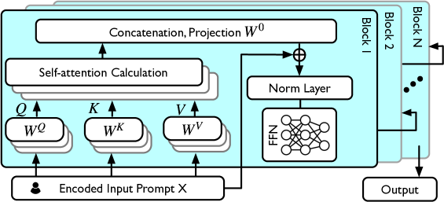
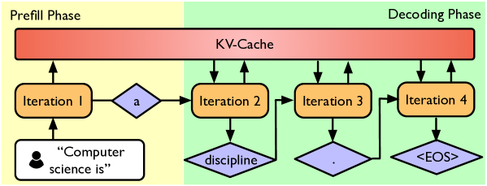

# LLM 推理服务：探索最新进展与未来机遇

发布时间：2024年07月17日

`LLM理论` `机器学习` `系统优化`

> LLM Inference Serving: Survey of Recent Advances and Opportunities

# 摘要

> 本调查深入探讨了2023年后大型语言模型（LLM）服务系统的最新进展，聚焦于在不改动核心解码机制的前提下，如何通过系统级优化提升性能与效率。我们精选并评析了来自顶尖机器学习与系统会议的优质论文，突出了在现实生产环境中部署和扩展LLM的关键创新点及实用考量。这份调查报告是LLM从业者紧跟行业脉搏、掌握前沿动态的宝贵指南。

> This survey offers a comprehensive overview of recent advancements in Large Language Model (LLM) serving systems, focusing on research since the year 2023. We specifically examine system-level enhancements that improve performance and efficiency without altering the core LLM decoding mechanisms. By selecting and reviewing high-quality papers from prestigious ML and system venues, we highlight key innovations and practical considerations for deploying and scaling LLMs in real-world production environments. This survey serves as a valuable resource for LLM practitioners seeking to stay abreast of the latest developments in this rapidly evolving field.

[Arxiv](https://arxiv.org/abs/2407.12391)