# LMMs-Eval：审视大型多模态模型评估的真实性

发布时间：2024年07月17日

`LLM应用` `人工智能` `软件开发`

> LMMs-Eval: Reality Check on the Evaluation of Large Multimodal Models

# 摘要

> 随着大型基础模型的不断进步，我们需要广泛覆盖、低成本且无污染的基准测试。尽管语言模型评估的研究持续推进，但针对大型多模态模型（LMMs）的综合评估研究仍显不足。为此，我们推出了LMMS-EVAL，这是一个集统一性、标准化于一体的多模态基准框架，涵盖50余项任务及10余种模型，旨在推动评估的透明度与可重复性。然而，LMMS-EVAL在实现低成本与零污染方面尚有欠缺。为应对这一评估挑战，我们进一步推出了LMMS-EVAL LITE，一个注重覆盖广度与效率的精简评估工具包。同时，我们还推出了Multimodal LIVEBENCH，该平台通过实时更新的新闻与在线论坛内容，来检验模型在实际环境中的泛化能力，其评估方法兼具低成本与零污染特性。我们的研究凸显了评估难题的重要性，并提供了切实可行的解决方案，以平衡大型多模态模型评估中的各种权衡，为LMMs的更高效、可靠基准测试奠定了基础。我们已在GitHub和Hugging Face平台上开源了相关代码，并维护着LIVEBENCH的实时排行榜。

> The advances of large foundation models necessitate wide-coverage, low-cost, and zero-contamination benchmarks. Despite continuous exploration of language model evaluations, comprehensive studies on the evaluation of Large Multi-modal Models (LMMs) remain limited. In this work, we introduce LMMS-EVAL, a unified and standardized multimodal benchmark framework with over 50 tasks and more than 10 models to promote transparent and reproducible evaluations. Although LMMS-EVAL offers comprehensive coverage, we find it still falls short in achieving low cost and zero contamination. To approach this evaluation trilemma, we further introduce LMMS-EVAL LITE, a pruned evaluation toolkit that emphasizes both coverage and efficiency. Additionally, we present Multimodal LIVEBENCH that utilizes continuously updating news and online forums to assess models' generalization abilities in the wild, featuring a low-cost and zero-contamination evaluation approach. In summary, our work highlights the importance of considering the evaluation trilemma and provides practical solutions to navigate the trade-offs in evaluating large multi-modal models, paving the way for more effective and reliable benchmarking of LMMs. We opensource our codebase and maintain leaderboard of LIVEBENCH at https://github.com/EvolvingLMMs-Lab/lmms-eval and https://huggingface.co/spaces/lmms-lab/LiveBench.

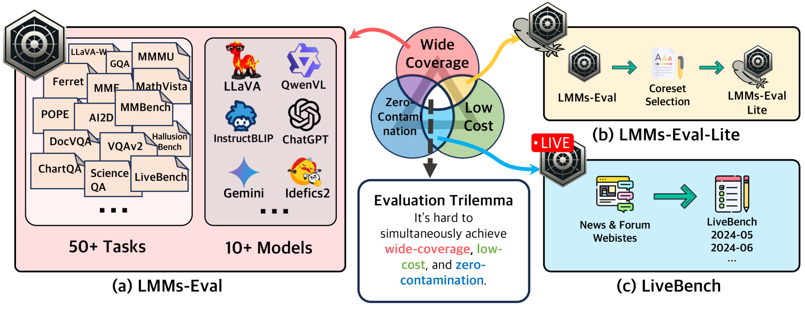

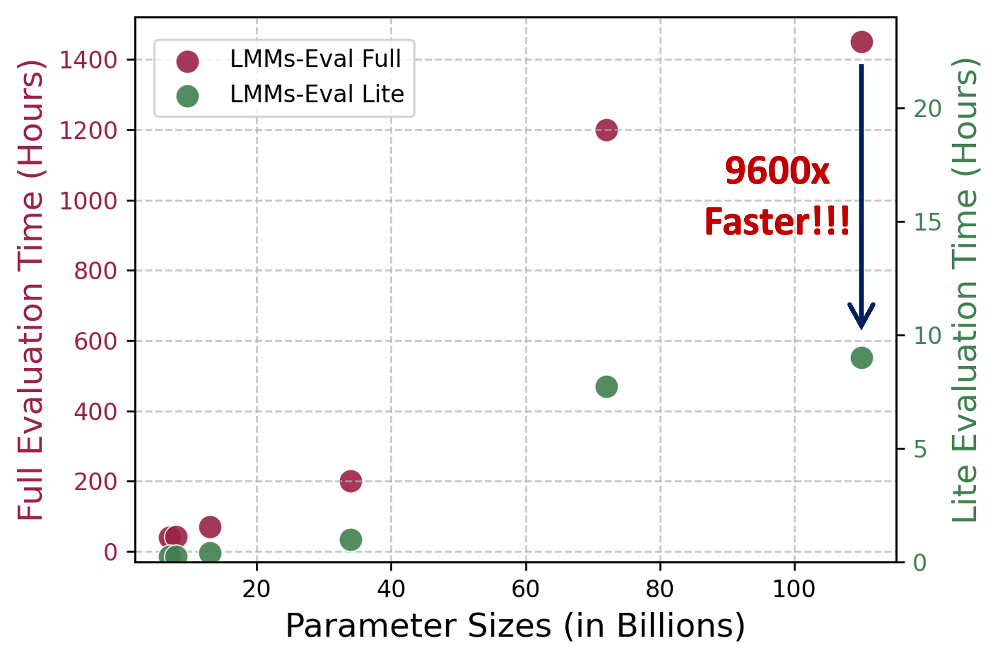

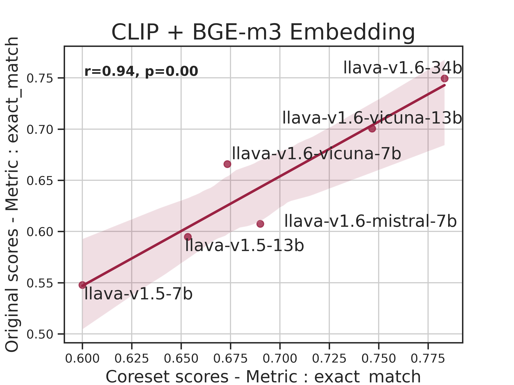

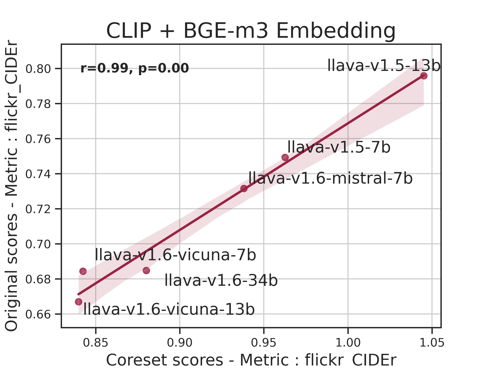

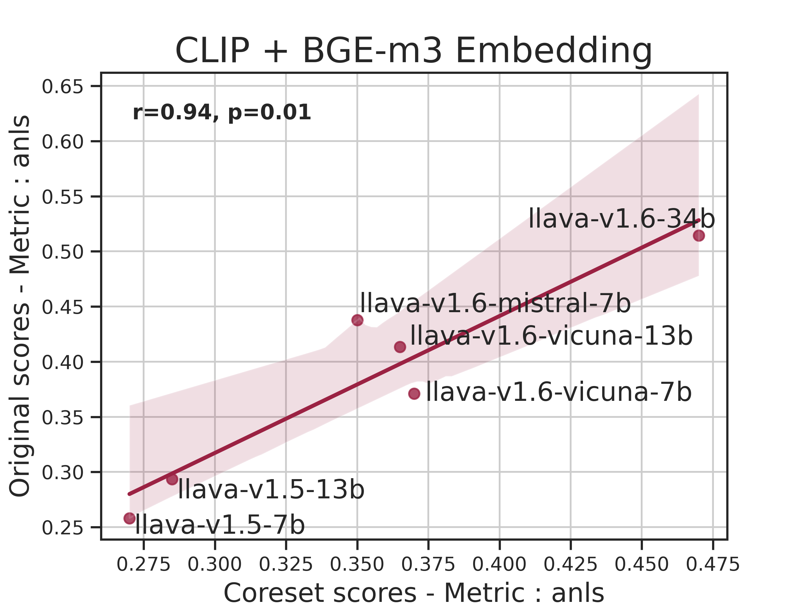

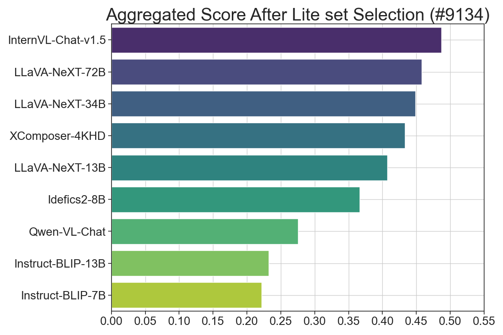

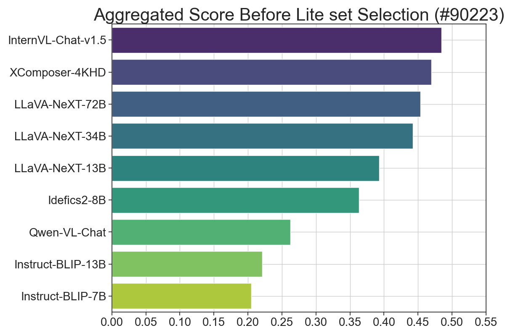

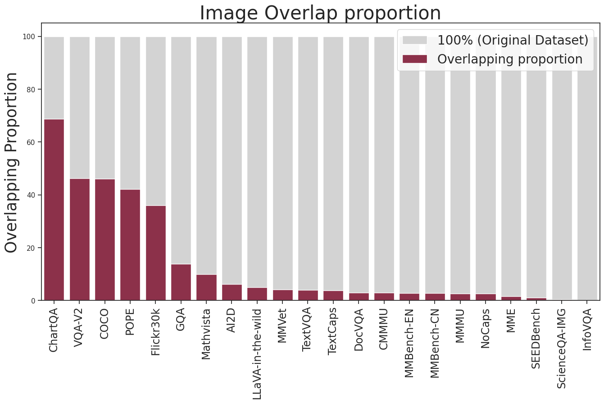

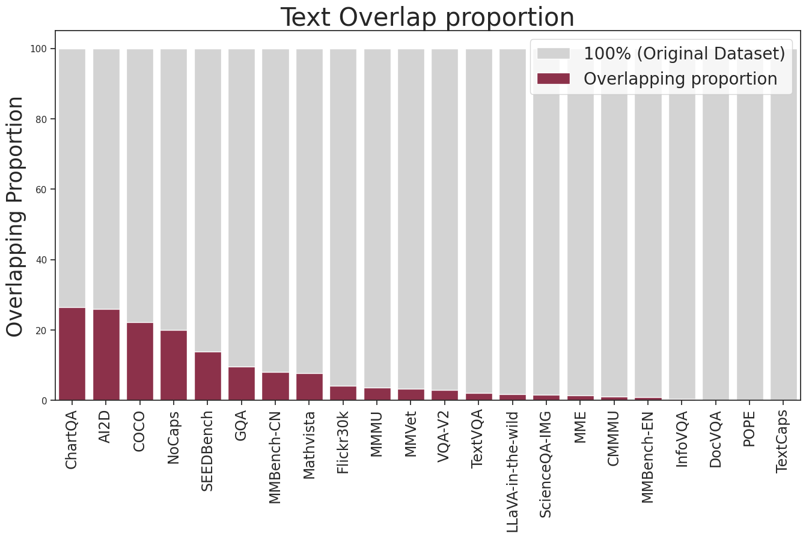

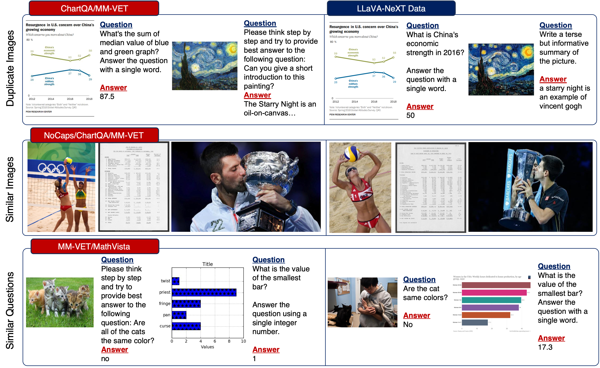

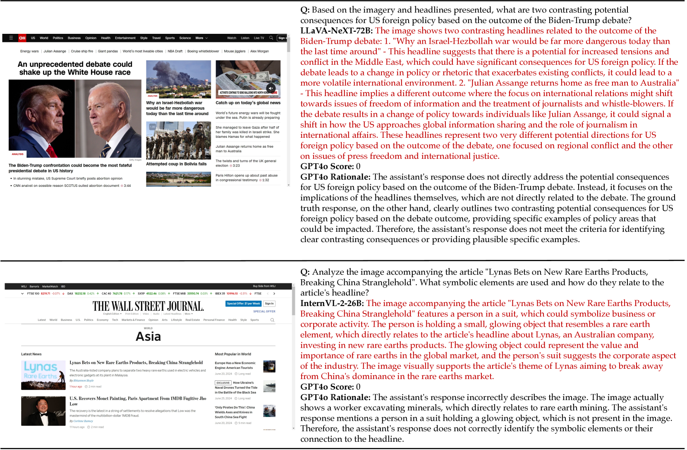

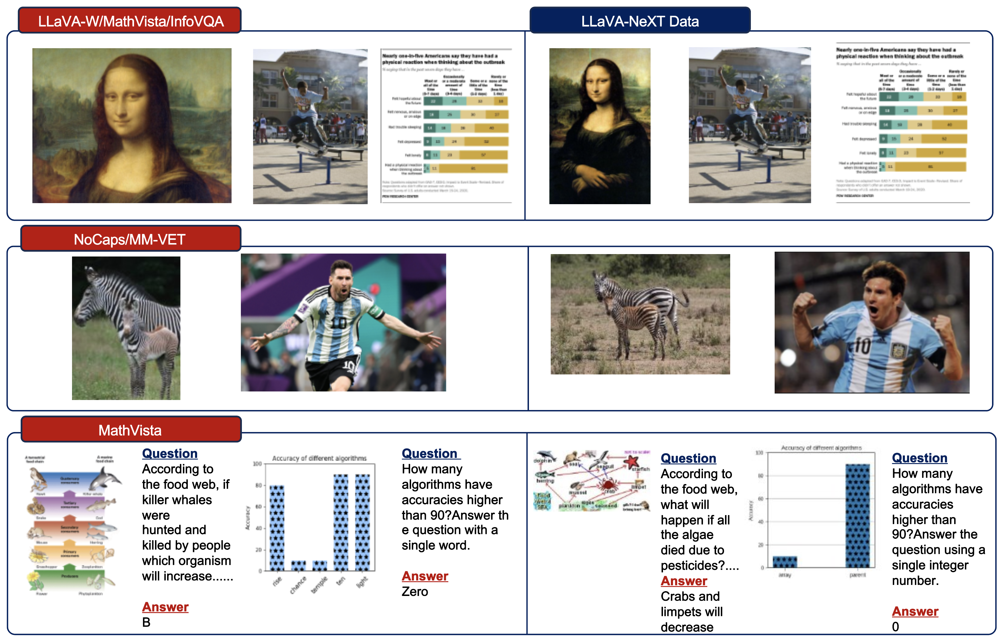

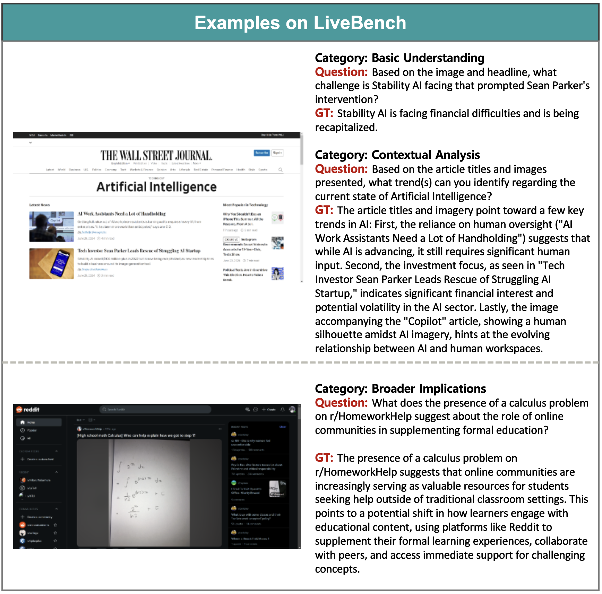

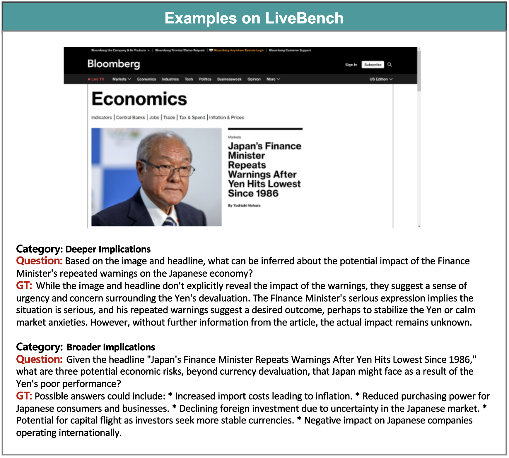

[Arxiv](https://arxiv.org/abs/2407.12772)