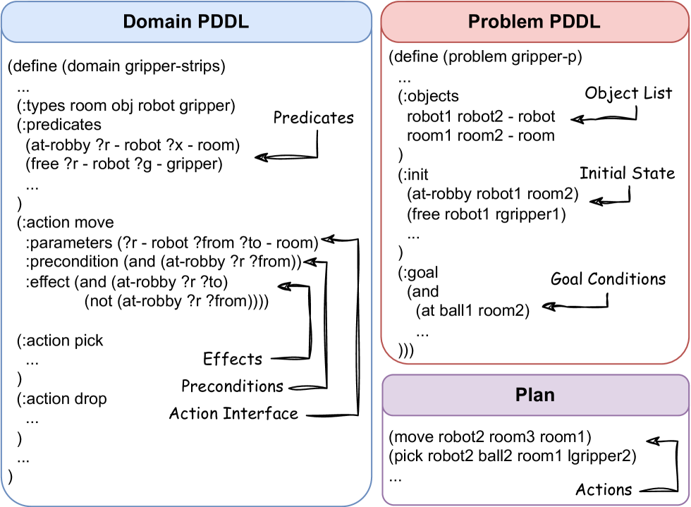
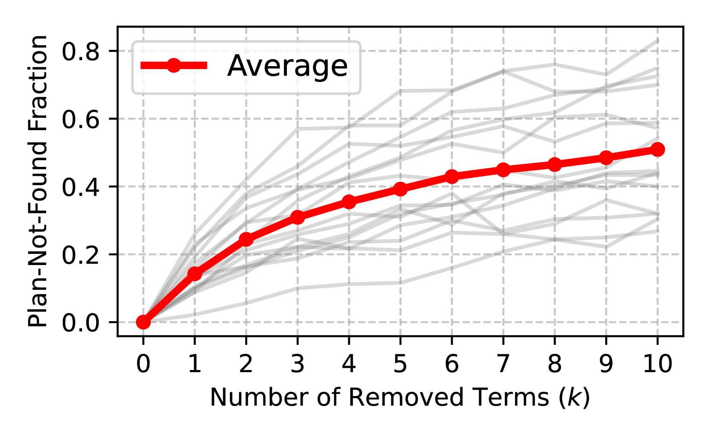
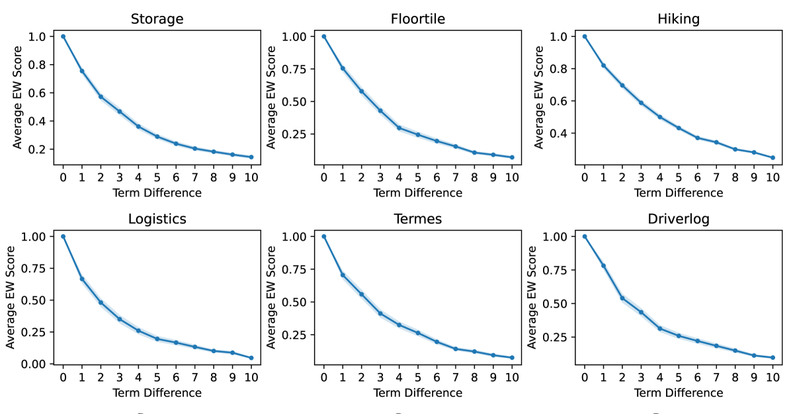
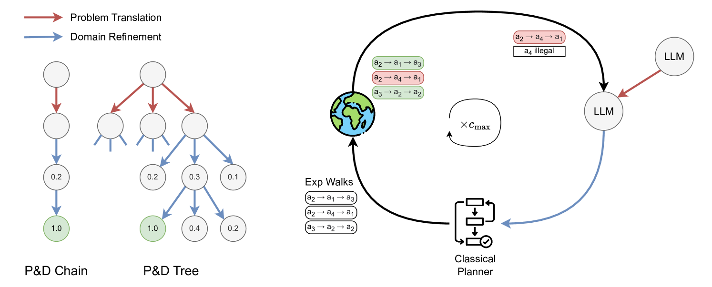
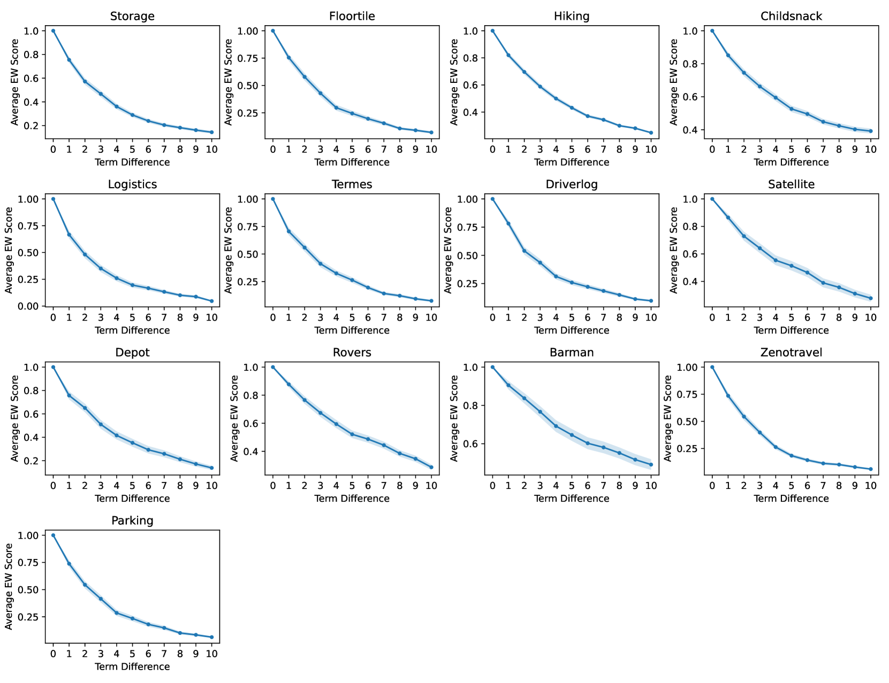
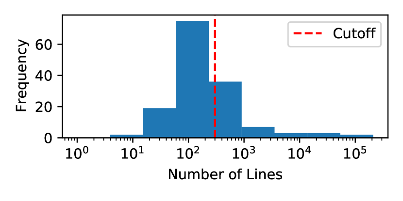
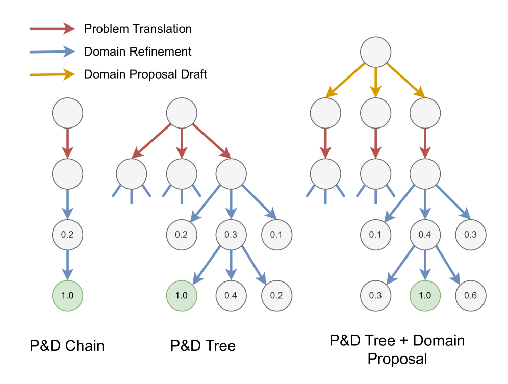

# 通过环境交互，自动化生成 PDDL 并进行规划，借助大型语言模型实现。

发布时间：2024年07月17日

`LLM应用` `自动化` `人工智能`

> Leveraging Environment Interaction for Automated PDDL Generation and Planning with Large Language Models

# 摘要

> 大型语言模型（LLM）在众多自然语言任务中表现卓越，但在涉及结构化推理的规划问题上却常显力不从心。为此，我们提出将规划问题转换为规划域定义语言（PDDL），以利用自动化规划器。然而，精确的PDDL文件生成往往依赖于人工输入或修正，既耗时又成本高昂。本文中，我们创新性地结合LLM与环境反馈，自动生成PDDL文件，无需人工介入。我们采用迭代细化策略，生成多个PDDL候选方案，并依据环境反馈逐步优化域描述。为引导这一过程，我们设计了探索步行（EW）指标，为LLM提供丰富反馈，助力PDDL文件的更新。实验表明，我们的方法在PDDL环境中的任务解决率高达66%，远超GPT-4的29%。这一成果不仅实现了规划环境的自动化建模，更在PDDL生成中摒弃了人工干预，为解决复杂问题中的LLM应用奠定了坚实基础。

> Large Language Models (LLMs) have shown remarkable performance in various natural language tasks, but they often struggle with planning problems that require structured reasoning. To address this limitation, the conversion of planning problems into the Planning Domain Definition Language (PDDL) has been proposed as a potential solution, enabling the use of automated planners. However, generating accurate PDDL files typically demands human inputs or correction, which can be time-consuming and costly. In this paper, we propose a novel approach that leverages LLMs and environment feedback to automatically generate PDDL domain and problem description files without the need for human intervention. Our method introduces an iterative refinement process that generates multiple problem PDDL candidates and progressively refines the domain PDDL based on feedback obtained from interacting with the environment. To guide the refinement process, we develop an Exploration Walk (EW) metric, which provides rich feedback signals for LLMs to update the PDDL file. We evaluate our approach on PDDL environments. We achieve an average task solve rate of 66% compared to a 29% solve rate by GPT-4's intrinsic planning with chain-of-thought prompting. Our work enables the automated modeling of planning environments using LLMs and environment feedback, eliminating the need for human intervention in the PDDL generation process and paving the way for more reliable LLM agents in challenging problems.

[Arxiv](https://arxiv.org/abs/2407.12979)