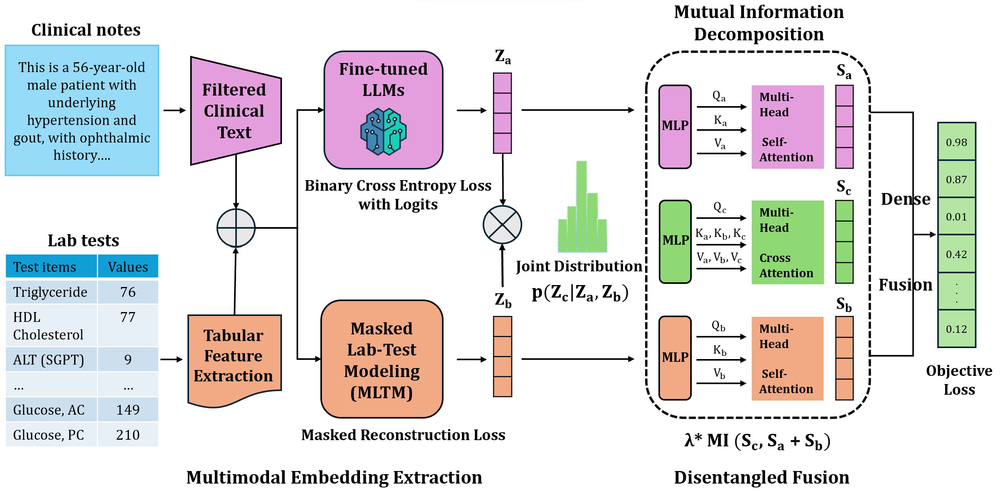

# MEDFuse：结合掩蔽实验室测试建模与大型语言模型，实现多模态电子健康记录数据的高效融合。

发布时间：2024年07月17日

`LLM应用` `电子健康记录`

> MEDFuse: Multimodal EHR Data Fusion with Masked Lab-Test Modeling and Large Language Models

# 摘要

> 电子健康记录 (EHRs) 天然具备多模态特性，涵盖结构化数据如实验室检测和非结构化内容如临床笔记。在临床实践中，医生通过综合多模态 EHR 数据源来更全面地评估患者健康并辅助决策。然而，现有 EHR 预测模型往往忽视了模态间的交互与冗余，或仅聚焦于单一模态。为此，我们研发了 MEDFuse 框架，它融合了掩蔽实验室测试建模与大型语言模型 (LLMs)，有效整合了医疗数据的结构化与非结构化部分。MEDFuse 通过微调的 LLMs 和训练有素的掩蔽表格变换器提取多模态嵌入，并设计了解耦变换器模块，通过互信息损失优化，分离模态特定与共享信息，同时从临床笔记的噪声中提炼有用信息。经 MIMIC-III 和 FEMH 数据集验证，MEDFuse 在提升临床预测准确性方面表现卓越，10 疾病多标签分类任务中 F1 分数超 90%。

> Electronic health records (EHRs) are multimodal by nature, consisting of structured tabular features like lab tests and unstructured clinical notes. In real-life clinical practice, doctors use complementary multimodal EHR data sources to get a clearer picture of patients' health and support clinical decision-making. However, most EHR predictive models do not reflect these procedures, as they either focus on a single modality or overlook the inter-modality interactions/redundancy. In this work, we propose MEDFuse, a Multimodal EHR Data Fusion framework that incorporates masked lab-test modeling and large language models (LLMs) to effectively integrate structured and unstructured medical data. MEDFuse leverages multimodal embeddings extracted from two sources: LLMs fine-tuned on free clinical text and masked tabular transformers trained on structured lab test results. We design a disentangled transformer module, optimized by a mutual information loss to 1) decouple modality-specific and modality-shared information and 2) extract useful joint representation from the noise and redundancy present in clinical notes. Through comprehensive validation on the public MIMIC-III dataset and the in-house FEMH dataset, MEDFuse demonstrates great potential in advancing clinical predictions, achieving over 90% F1 score in the 10-disease multi-label classification task.

[Arxiv](https://arxiv.org/abs/2407.12309)