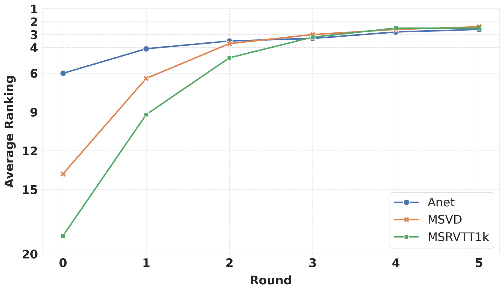
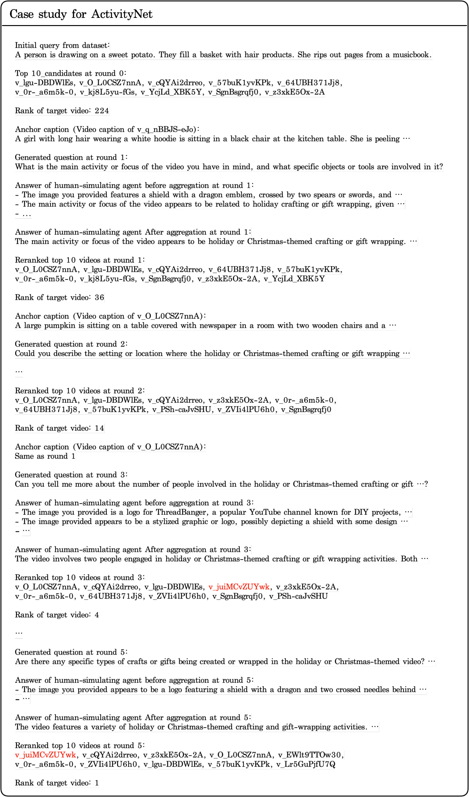

# MERLIN：通过基于 LLM 的迭代导航优化多模态嵌入，专为文本-视频检索重排流程设计

发布时间：2024年07月17日

`LLM应用` `多媒体` `搜索引擎`

> MERLIN: Multimodal Embedding Refinement via LLM-based Iterative Navigation for Text-Video Retrieval-Rerank Pipeline

# 摘要

> 随着多媒体内容的迅猛增长，从庞大的视频库中精准检索相关内容变得愈发困难。尽管当前的文本-视频检索技术在跨模态交互、大规模模型训练等方面取得了进展，但往往忽略了用户视角，使得检索结果与用户需求不符。为此，我们推出了MERLIN系统，该系统无需额外训练，通过大型语言模型进行迭代反馈，从用户角度优化查询嵌入，通过动态问答机制提升查询与视频内容的一致性。实验显示，MERLIN在多个数据集上大幅提升了检索准确率，证明了其在多模态检索领域的优越性，为实现更智能、更贴合用户需求的多媒体检索提供了新思路。

> The rapid expansion of multimedia content has made accurately retrieving relevant videos from large collections increasingly challenging. Recent advancements in text-video retrieval have focused on cross-modal interactions, large-scale foundation model training, and probabilistic modeling, yet often neglect the crucial user perspective, leading to discrepancies between user queries and the content retrieved. To address this, we introduce MERLIN (Multimodal Embedding Refinement via LLM-based Iterative Navigation), a novel, training-free pipeline that leverages Large Language Models (LLMs) for iterative feedback learning. MERLIN refines query embeddings from a user perspective, enhancing alignment between queries and video content through a dynamic question answering process. Experimental results on datasets like MSR-VTT, MSVD, and ActivityNet demonstrate that MERLIN substantially improves Recall@1, outperforming existing systems and confirming the benefits of integrating LLMs into multimodal retrieval systems for more responsive and context-aware multimedia retrieval.

[Arxiv](https://arxiv.org/abs/2407.12508)