# MMAU：跨领域代理能力的全面评估基准

发布时间：2024年07月17日

`Agent` `人工智能`

> MMAU: A Holistic Benchmark of Agent Capabilities Across Diverse Domains

# 摘要

> 随着大型语言模型 (LLM) 的进步，我们急需一套全面基准来评估其类人能力。现有基准虽有用，但多聚焦特定场景，重任务完成而轻技能剖析，导致难以深入分析失败原因。此外，环境设置费时费力，交互任务中常现不可靠与不可重复问题。为此，我们推出大规模多任务代理理解 (MMAU) 基准，通过离线任务简化环境设置，全面评估模型在工具使用、DAG 问答、数据科学编码、竞赛编程及数学五大领域的理解、推理、规划、问题解决与自我修正五大能力。MMAU 包含 20 项精心设计任务，覆盖 3K 余独特提示，为 LLM 代理的优劣提供全面框架。我们通过测试 18 个代表性模型，深入分析其表现。MMAU 不仅揭示 LLM 代理的强弱，更提升其性能透明度。相关数据集与评估脚本已公开于 \url{https://github.com/apple/axlearn/docs/research/mmau}。

> Recent advances in large language models (LLMs) have increased the demand for comprehensive benchmarks to evaluate their capabilities as human-like agents. Existing benchmarks, while useful, often focus on specific application scenarios, emphasizing task completion but failing to dissect the underlying skills that drive these outcomes. This lack of granularity makes it difficult to deeply discern where failures stem from. Additionally, setting up these environments requires considerable effort, and issues of unreliability and reproducibility sometimes arise, especially in interactive tasks. To address these limitations, we introduce the Massive Multitask Agent Understanding (MMAU) benchmark, featuring comprehensive offline tasks that eliminate the need for complex environment setups. It evaluates models across five domains, including \textcolor{teal}{Tool-use}, \textcolor{teal}{Directed Acyclic Graph (DAG) QA}, \textcolor{teal}{Data Science and Machine Learning coding}, \textcolor{teal}{Contest-level programming} and \textcolor{teal}{Mathematics}, and covers five essential capabilities: \textcolor{orange}{Understanding}, \textcolor{orange}{Reasoning}, \textcolor{orange}{Planning}, \textcolor{orange}{Problem-solving}, and \textcolor{orange}{Self-correction}. With a total of 20 meticulously designed tasks encompassing over 3K distinct prompts, MMAU provides a comprehensive framework for evaluating the strengths and limitations of LLM agents. By testing 18 representative models on MMAU, we provide deep and insightful analyses. Ultimately, MMAU not only sheds light on the capabilities and limitations of LLM agents but also enhances the interpretability of their performance. Datasets and evaluation scripts of MMAU are released at \url{https://github.com/apple/axlearn/docs/research/mmau}.

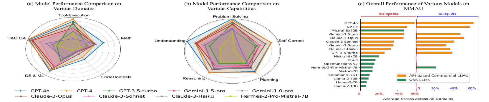

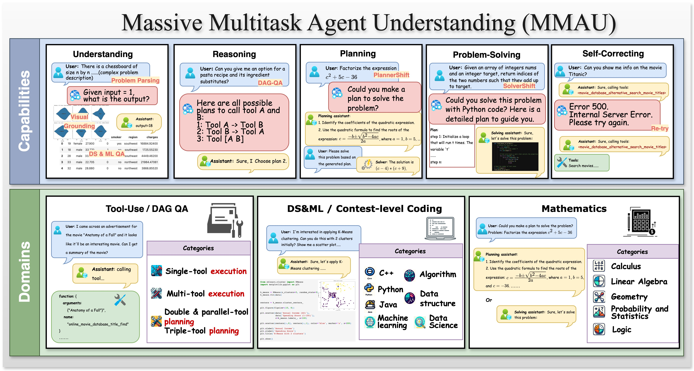

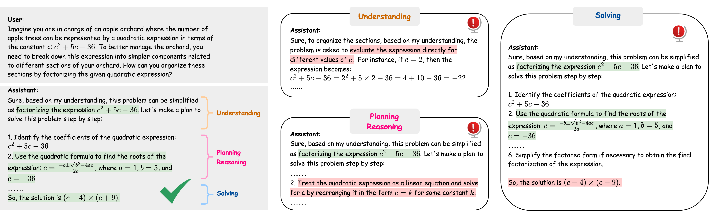

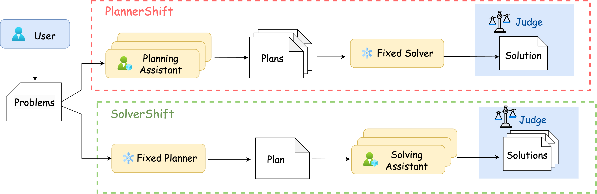

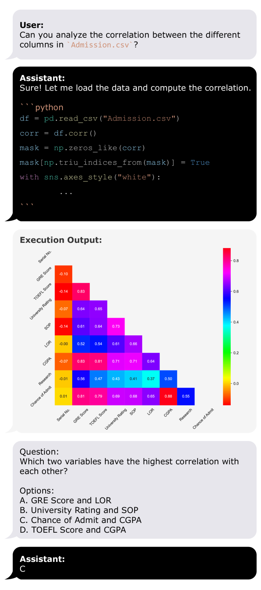

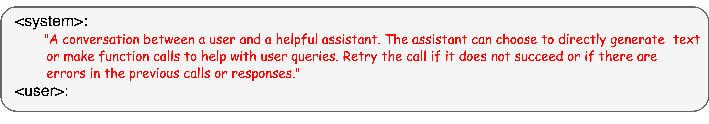

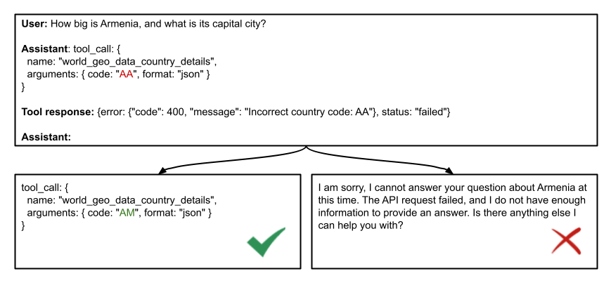

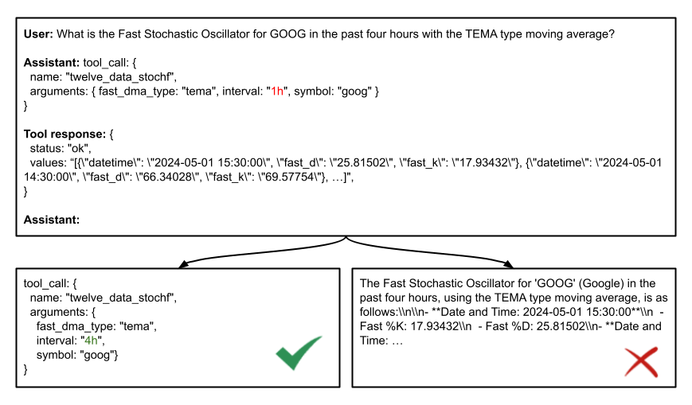

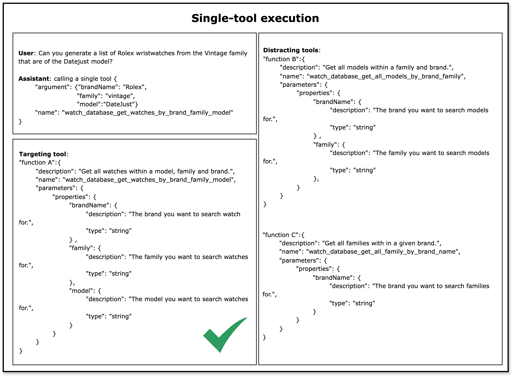

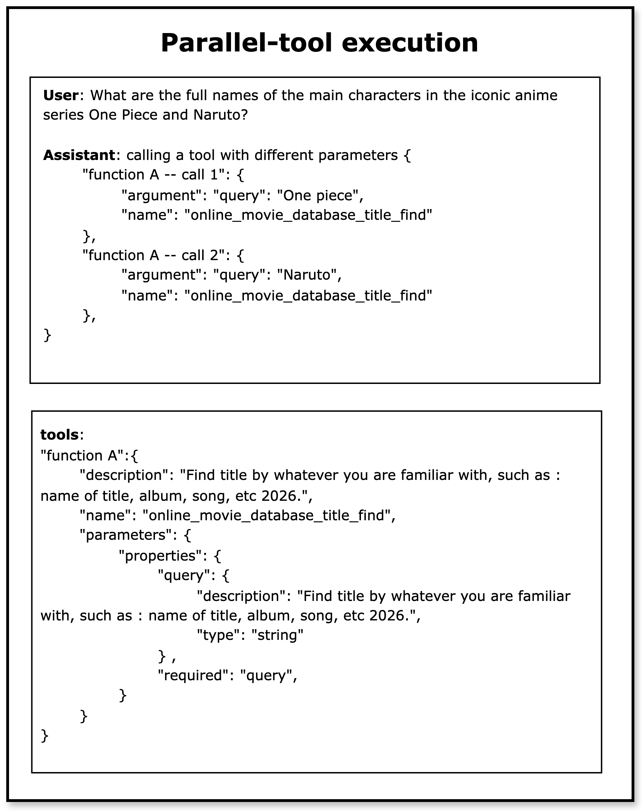

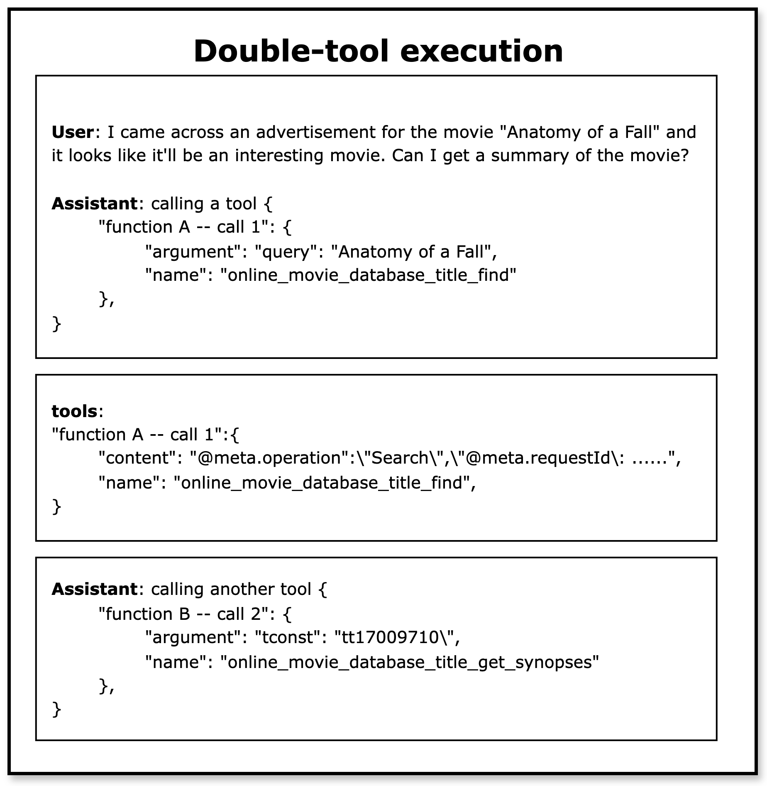

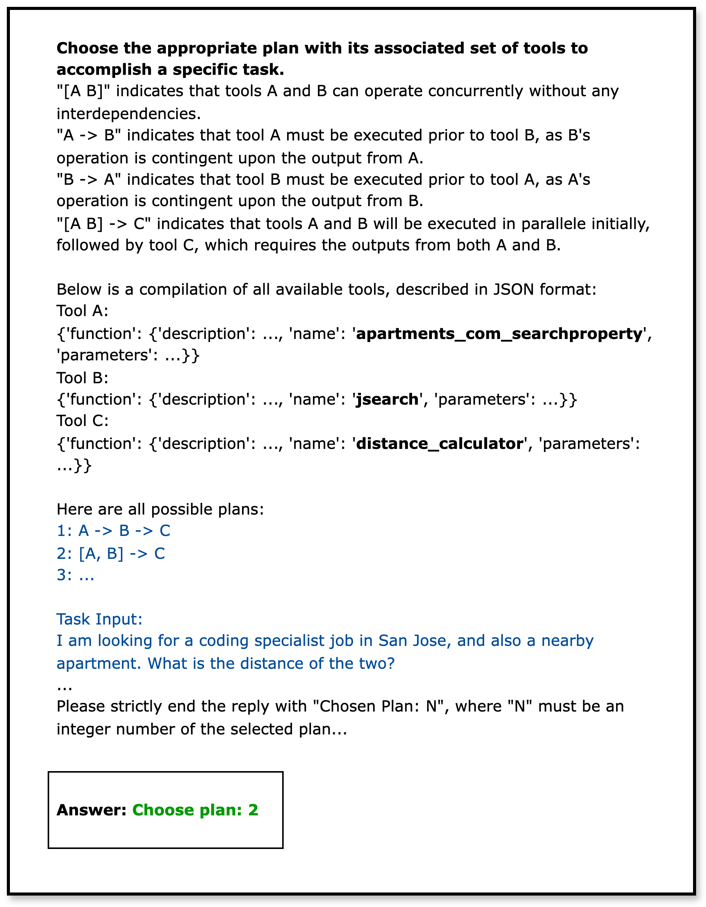

[Arxiv](https://arxiv.org/abs/2407.18961)