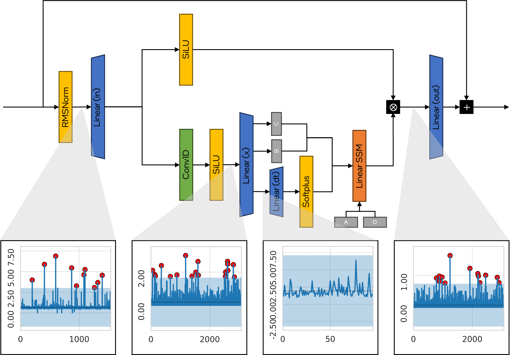
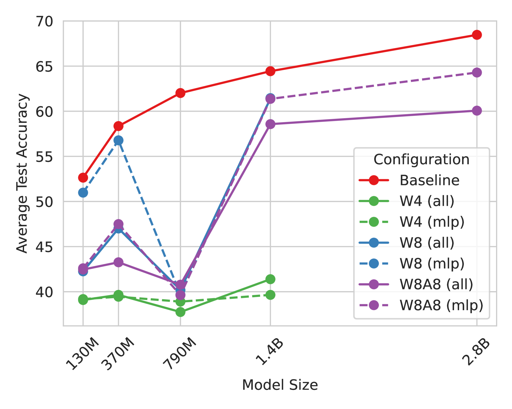

# Mamba-PTQ：探究循环大型语言模型中的异常通道

发布时间：2024年07月17日

`LLM理论` `人工智能` `计算机科学`

> Mamba-PTQ: Outlier Channels in Recurrent Large Language Models

# 摘要

> 现代循环层在大型语言模型（LLM）的边缘部署中展现出巨大潜力。通过有限维表示压缩输入序列，循环层不仅能处理长距离依赖，还能保持推理成本和内存需求的恒定。然而，在资源受限环境中部署LLM时，常需进一步压缩模型，如量化和剪枝。尽管这些技术在基于注意力的模型中已成熟，但对循环层的影响尚待深入研究。  本研究初步探讨了循环LLM的训练后量化，发现Mamba模型中的异常通道现象与基于注意力的LLM相似。我们揭示了量化SSM的难点源于激活异常值，这与transformer模型中的情况类似。我们提供了忽略激活异常值的量化基线结果，并提出了针对异常值的量化初步方案。

> Modern recurrent layers are emerging as a promising path toward edge deployment of foundation models, especially in the context of large language models (LLMs). Compressing the whole input sequence in a finite-dimensional representation enables recurrent layers to model long-range dependencies while maintaining a constant inference cost for each token and a fixed memory requirement. However, the practical deployment of LLMs in resource-limited environments often requires further model compression, such as quantization and pruning. While these techniques are well-established for attention-based models, their effects on recurrent layers remain underexplored.
  In this preliminary work, we focus on post-training quantization for recurrent LLMs and show that Mamba models exhibit the same pattern of outlier channels observed in attention-based LLMs. We show that the reason for the difficulty of quantizing SSMs is caused by activation outliers, similar to those observed in transformer-based LLMs. We report baseline results for post-training quantization of Mamba that do not take into account the activation outliers and suggest first steps for outlier-aware quantization.

[Arxiv](https://arxiv.org/abs/2407.12397)