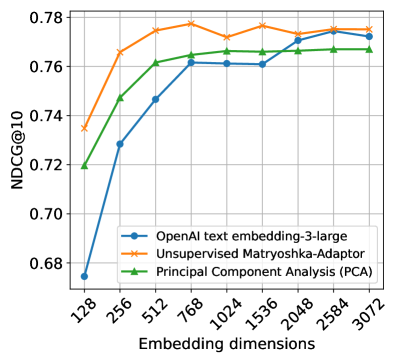
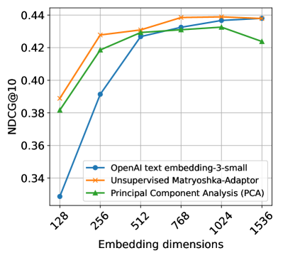
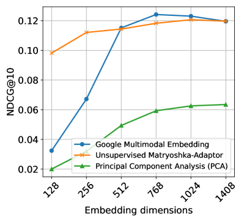
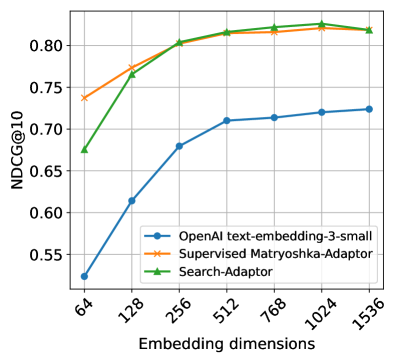
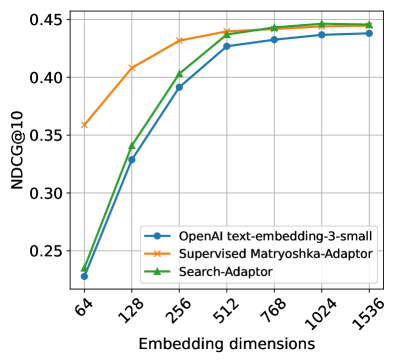

# Matryoshka-Adaptor：实现无监督与有监督的小维度嵌入调整

发布时间：2024年07月17日

`LLM应用` `信息检索` `人工智能`

> Matryoshka-Adaptor: Unsupervised and Supervised Tuning for Smaller Embedding Dimensions

# 摘要

> 大型语言模型中的嵌入技术，在信息检索等应用中扮演着关键角色。尽管高维嵌入因其丰富的信息含量而性能卓越，但其高昂的计算成本和延迟却限制了实际应用。为此，我们创新性地提出了 Matryoshka-Adaptor 框架，专门用于优化 LLM 嵌入。该框架在大幅降低维度的同时，仍保持了相当的性能，显著提升了计算效率和成本效益。Matryoshka-Adaptor 能够直接调整预训练 LLM 的嵌入，并兼容各种 LLM 架构，包括那些仅能通过黑盒 API 访问的模型。无论是在无监督还是监督学习场景中，它都表现出色。在广泛的英语、多语言及多模态数据集上的严格测试表明，Matryoshka-Adaptor 带来了显著的性能提升。尤其在使用 Google 和 OpenAI 的嵌入 API 时，它实现了两到十二倍的维度缩减，且不影响多个 BEIR 数据集的性能。

> Embeddings from Large Language Models (LLMs) have emerged as critical components in various applications, particularly for information retrieval. While high-dimensional embeddings generally demonstrate superior performance as they contain more salient information, their practical application is frequently hindered by elevated computational latency and the associated higher cost. To address these challenges, we propose Matryoshka-Adaptor, a novel tuning framework designed for the customization of LLM embeddings. Matryoshka-Adaptor facilitates substantial dimensionality reduction while maintaining comparable performance levels, thereby achieving a significant enhancement in computational efficiency and cost-effectiveness. Our framework directly modifies the embeddings from pre-trained LLMs which is designed to be seamlessly integrated with any LLM architecture, encompassing those accessible exclusively through black-box APIs. Also, it exhibits efficacy in both unsupervised and supervised learning settings. A rigorous evaluation conducted across a diverse corpus of English, multilingual, and multimodal datasets consistently reveals substantial gains with Matryoshka-Adaptor. Notably, with Google and OpenAI Embedding APIs, Matryoshka-Adaptor achieves a reduction in dimensionality ranging from two- to twelve-fold without compromising performance across multiple BEIR datasets.

[Arxiv](https://arxiv.org/abs/2407.20243)