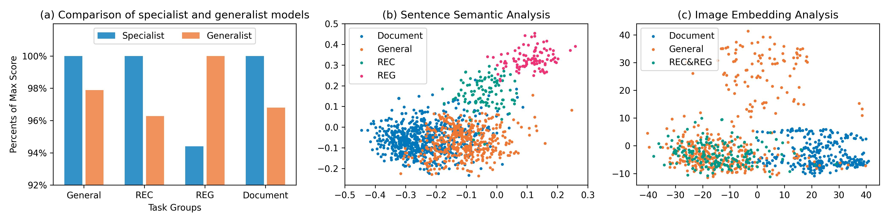
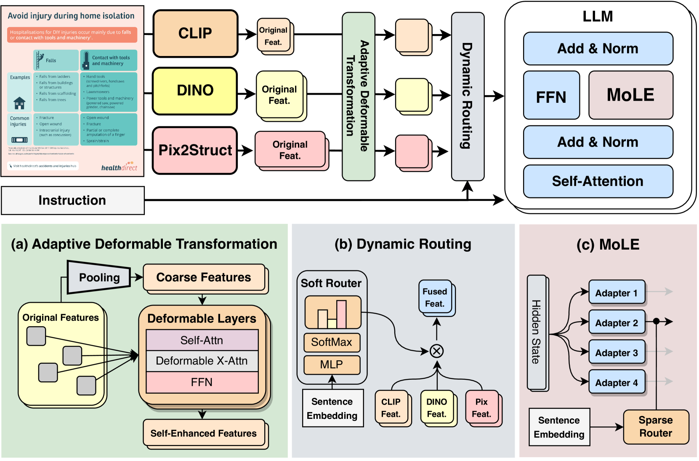
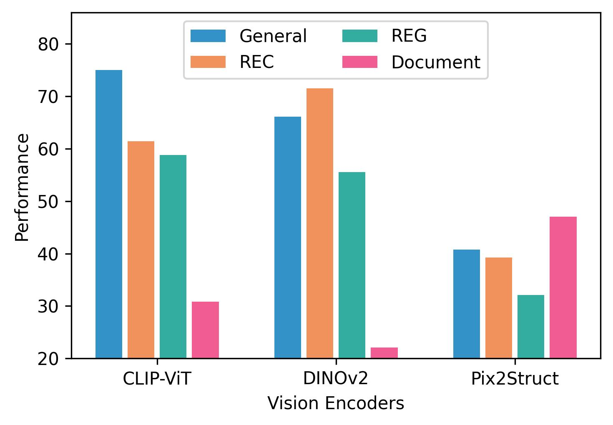
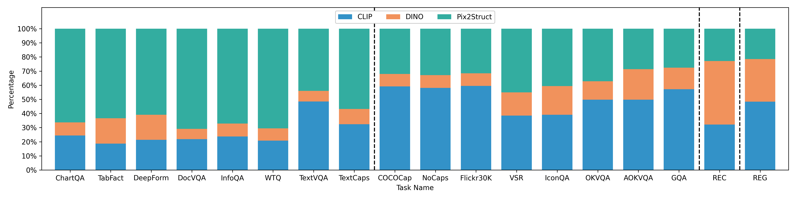
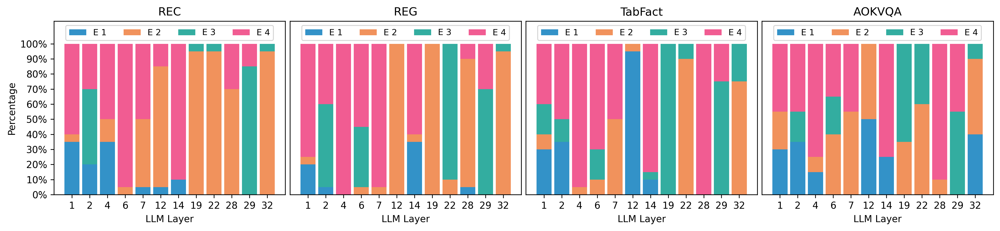
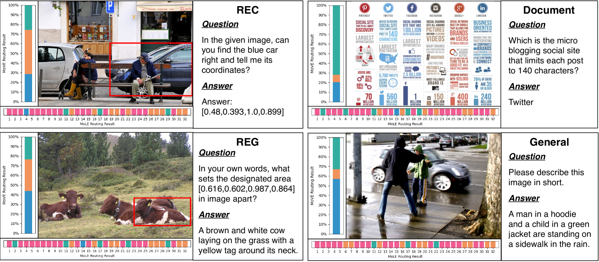
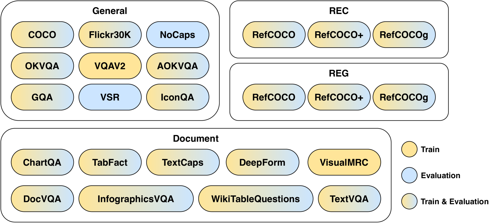
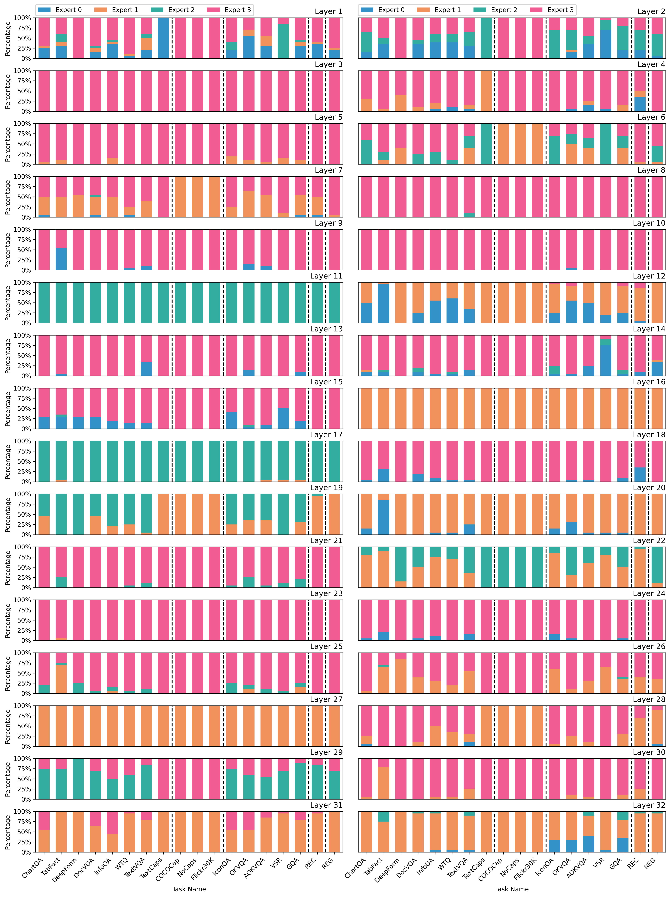

# MoME：多模态专家的融合，打造全能型多模态大型语言模型

发布时间：2024年07月17日

`LLM应用` `计算机视觉`

> MoME: Mixture of Multimodal Experts for Generalist Multimodal Large Language Models

# 摘要

> 多模态大型语言模型 (MLLMs) 在视觉-语言任务中表现出色，但通用 MLLM 在多数任务上仍不及专业模型，主要因任务干扰所致。为此，我们提出多模态专家混合 (MoME)，包含视觉专家混合 (MoVE) 和语言专家混合 (MoLE)，旨在减轻干扰并提升通用 MLLM 性能。MoVE 能自适应调节视觉特征，而 MoLE 则通过稀疏门控专家实现低成本改进。MoME 专为视觉和语言模态设计，以适应任务差异。实验证明，MoME 大幅提升了通用 MLLMs 的性能。源代码已公开于 https://github.com/JiuTian-VL/MoME。

> Multimodal large language models (MLLMs) have demonstrated impressive capabilities across various vision-language tasks. However, a generalist MLLM typically underperforms compared with a specialist MLLM on most VL tasks, which can be attributed to task interference. In this paper, we propose a mixture of multimodal experts (MoME) to mitigate task interference and obtain a generalist MLLM. Our MoME is composed of two key components, a mixture of vision experts (MoVE) and a mixture of language experts (MoLE). MoVE can adaptively modulate the features transformed from various vision encoders, and has a strong compatibility in transformation architecture. MoLE incorporates sparsely gated experts into LLMs to achieve painless improvements with roughly unchanged inference costs. In response to task interference, our MoME specializes in both vision and language modality to adapt to task discrepancies. Extensive experiments show that MoME significantly improves the performance of generalist MLLMs across various VL tasks. The source code is released at https://github.com/JiuTian-VL/MoME

[Arxiv](https://arxiv.org/abs/2407.12709)