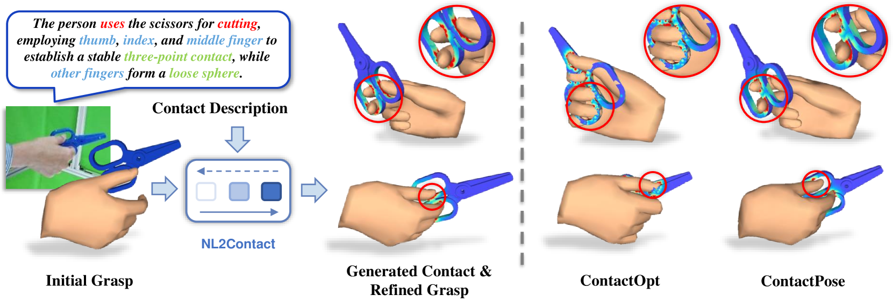
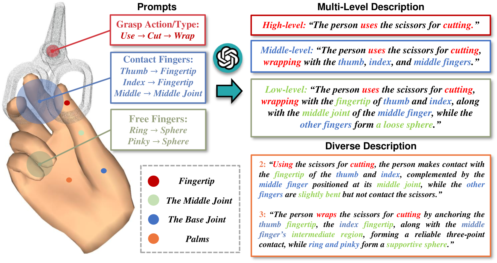
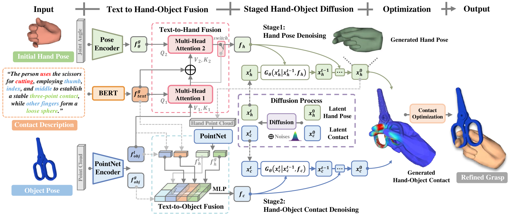
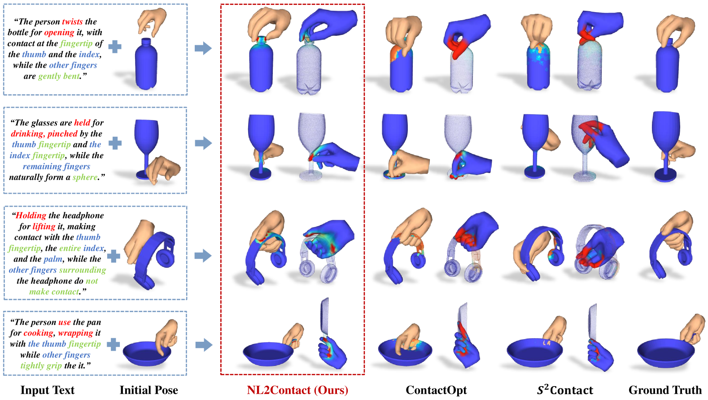
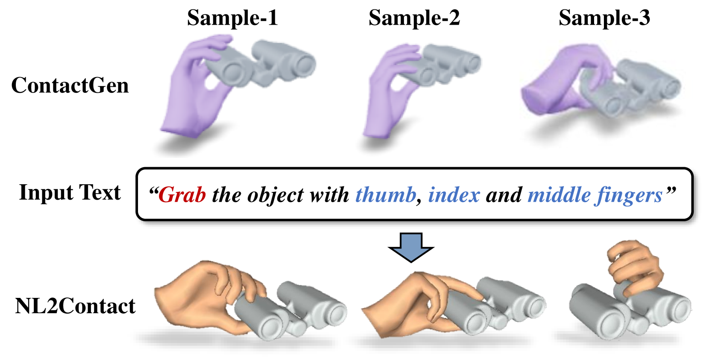
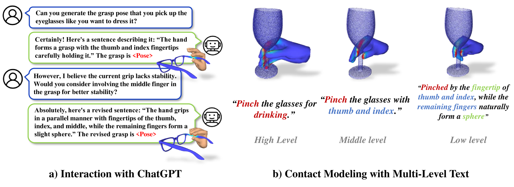

# NL2Contact：借助扩散模型，通过自然语言引导实现3D手-物体接触的精准建模。

发布时间：2024年07月17日

`LLM应用` `计算机视觉` `机器人学`

> NL2Contact: Natural Language Guided 3D Hand-Object Contact Modeling with Diffusion Model

# 摘要

> 在3D手-物体重建中，通过建模手与物体的物理接触来精炼手部姿势并生成新颖抓握是常规做法。然而，现有技术依赖于难以指定或控制的几何约束。本文提出了一项创新任务：利用自然语言描述进行可控的3D手-物体接触建模。面临的挑战包括跨模态建模的复杂性以及缺乏对接触模式的详细描述。为此，我们设计了NL2Contact模型，该模型通过分阶段扩散模型生成可控的接触。输入手和接触的描述，NL2Contact即可生成逼真的3D手-物体接触。我们还创建了首个以手为中心的接触描述数据集\textit{ContactDescribe}，包含多层次、多样化的描述，这些描述由大型语言模型根据精心设计的提示生成。我们的模型在抓握姿势优化和新型人类抓握生成方面展现了应用潜力，均基于文本接触描述。

> Modeling the physical contacts between the hand and object is standard for refining inaccurate hand poses and generating novel human grasp in 3D hand-object reconstruction. However, existing methods rely on geometric constraints that cannot be specified or controlled. This paper introduces a novel task of controllable 3D hand-object contact modeling with natural language descriptions. Challenges include i) the complexity of cross-modal modeling from language to contact, and ii) a lack of descriptive text for contact patterns. To address these issues, we propose NL2Contact, a model that generates controllable contacts by leveraging staged diffusion models. Given a language description of the hand and contact, NL2Contact generates realistic and faithful 3D hand-object contacts. To train the model, we build \textit{ContactDescribe}, the first dataset with hand-centered contact descriptions. It contains multi-level and diverse descriptions generated by large language models based on carefully designed prompts (e.g., grasp action, grasp type, contact location, free finger status). We show applications of our model to grasp pose optimization and novel human grasp generation, both based on a textual contact description.

[Arxiv](https://arxiv.org/abs/2407.12727)