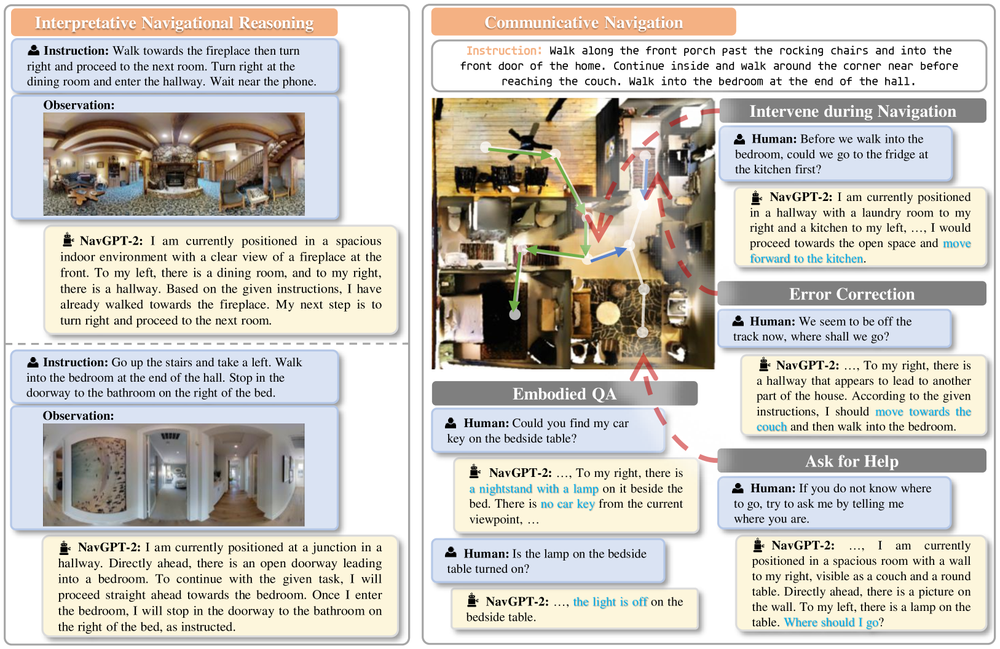
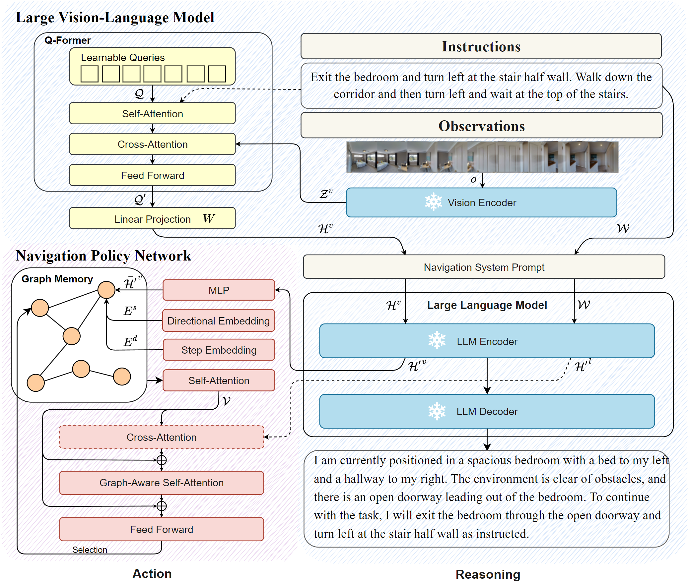
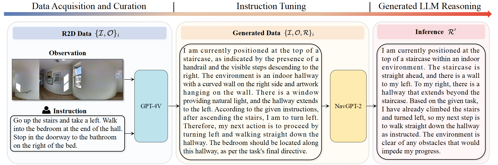

# NavGPT-2：激发大型视觉-语言模型的导航推理潜能

发布时间：2024年07月17日

`Agent` `机器人` `人工智能`

> NavGPT-2: Unleashing Navigational Reasoning Capability for Large Vision-Language Models

# 摘要

> 随着大型语言模型 (LLM) 的显著进步，利用 LLM 进行指令跟随机器人导航的倡议正蓬勃发展。这一趋势凸显了 LLM 在泛化导航推理和多样化语言理解方面的潜力。然而，在 VLN 任务中集成 LLM 时，代理性能与专业模型相比存在显著差异。此外，语言在代理交互中的沟通能力往往未得到充分利用。本研究旨在弥合 VLN 专业模型与基于 LLM 的导航范式之间的差距，同时保持 LLM 在语言导航推理方面的解释能力。通过在冻结的 LLM 中对齐视觉内容，我们实现了 LLM 的视觉观察理解，并探索了将 LLM 与导航策略网络结合的有效方法，以提升动作预测和导航推理的效率。我们展示了所提出方法的数据效率，并消除了基于 LM 的代理与最先进的 VLN 专家之间的性能差距。

> Capitalizing on the remarkable advancements in Large Language Models (LLMs), there is a burgeoning initiative to harness LLMs for instruction following robotic navigation. Such a trend underscores the potential of LLMs to generalize navigational reasoning and diverse language understanding. However, a significant discrepancy in agent performance is observed when integrating LLMs in the Vision-and-Language navigation (VLN) tasks compared to previous downstream specialist models. Furthermore, the inherent capacity of language to interpret and facilitate communication in agent interactions is often underutilized in these integrations. In this work, we strive to bridge the divide between VLN-specialized models and LLM-based navigation paradigms, while maintaining the interpretative prowess of LLMs in generating linguistic navigational reasoning. By aligning visual content in a frozen LLM, we encompass visual observation comprehension for LLMs and exploit a way to incorporate LLMs and navigation policy networks for effective action predictions and navigational reasoning. We demonstrate the data efficiency of the proposed methods and eliminate the gap between LM-based agents and state-of-the-art VLN specialists.

[Arxiv](https://arxiv.org/abs/2407.12366)