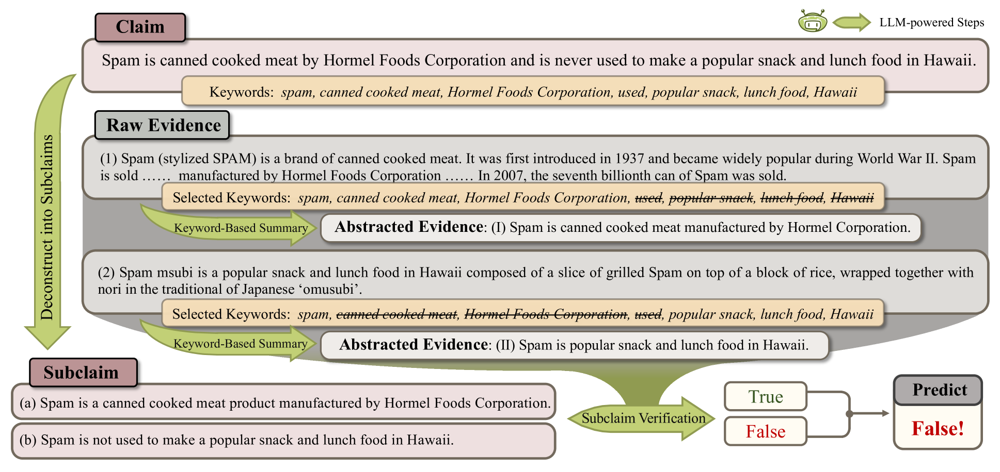
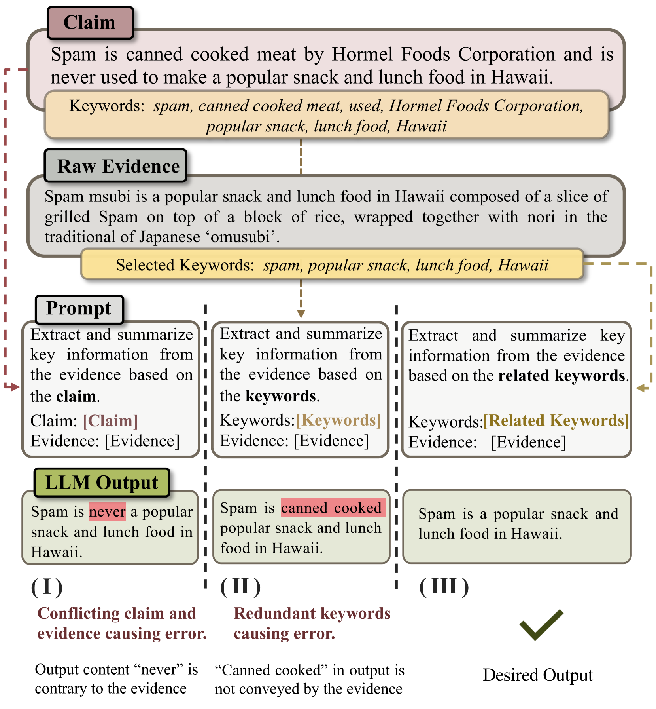

# 穿梭于喧嚣之中，探寻声明验证的关键信息

发布时间：2024年07月17日

`LLM应用` `信息安全` `人工智能`

> Navigating the Noisy Crowd: Finding Key Information for Claim Verification

# 摘要

> 声明验证任务旨在基于多重证据评估声明的真实性。利用大型语言模型 (LLM) 进行此任务颇具前景，但仅将所有证据输入 LLM 并询问声明真实性效果不佳。问题在于证据与声明的噪声特性：证据常含无关信息，关键事实隐匿于上下文，声明则多面并存。为应对这一“信息噪声”，我们设计了 EACon（证据抽象与声明解构）框架，旨在提炼证据中的关键信息并逐一验证声明的各个方面。EACon 先从声明中提取关键词，通过模糊匹配筛选出各证据的相关关键词，以此为线索提炼并概括关键信息为抽象证据。接着，EACon 将原声明分解为子声明，分别与抽象及原始证据对照验证。我们在两个挑战性数据集上使用两个开源 LLM 评估 EACon，结果显示 EACon 持续显著提升 LLM 在声明验证中的表现。

> Claim verification is a task that involves assessing the truthfulness of a given claim based on multiple evidence pieces. Using large language models (LLMs) for claim verification is a promising way. However, simply feeding all the evidence pieces to an LLM and asking if the claim is factual does not yield good results. The challenge lies in the noisy nature of both the evidence and the claim: evidence passages typically contain irrelevant information, with the key facts hidden within the context, while claims often convey multiple aspects simultaneously. To navigate this "noisy crowd" of information, we propose EACon (Evidence Abstraction and Claim Deconstruction), a framework designed to find key information within evidence and verify each aspect of a claim separately. EACon first finds keywords from the claim and employs fuzzy matching to select relevant keywords for each raw evidence piece. These keywords serve as a guide to extract and summarize critical information into abstracted evidence. Subsequently, EACon deconstructs the original claim into subclaims, which are then verified against both abstracted and raw evidence individually. We evaluate EACon using two open-source LLMs on two challenging datasets. Results demonstrate that EACon consistently and substantially improve LLMs' performance in claim verification.

[Arxiv](https://arxiv.org/abs/2407.12425)