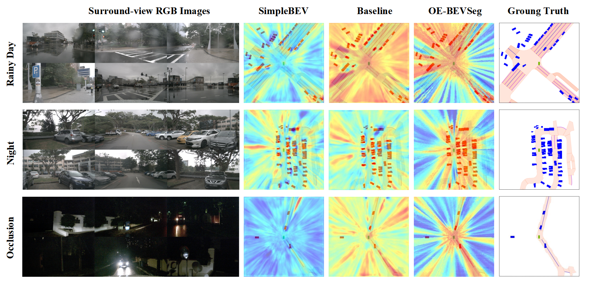

# OE-BevSeg：结合对象信息与环境感知的多模态框架，专为鸟瞰图车辆语义分割设计。

发布时间：2024年07月17日

`LLM应用` `自动驾驶` `计算机视觉`

> OE-BevSeg: An Object Informed and Environment Aware Multimodal Framework for Bird's-eye-view Vehicle Semantic Segmentation

# 摘要

> 鸟瞰图（BEV）语义分割在自动驾驶系统中日益关键。通过将2D多视角图像投影至3D世界空间，实现对自车周围环境的感知。近期，BEV分割因视角转换模块的优化、图像编码器的扩大及时序信息的增加而取得显著进展。然而，仍面临两大挑战：一是对BEV空间特征的有效理解和增强，尤其是远距离环境特征的准确捕捉；二是目标物体细节的识别。为此，我们提出OE-BevSeg，一个端到端的多模态框架，通过全局环境感知和局部目标增强提升BEV分割性能。OE-BevSeg利用环境感知的BEV压缩器，结合长序列全局建模，增强模型对环境的理解和感知。同时，引入中心信息引导的对象增强模块，从局部增强角度提升分割性能。此外，设计多模态融合分支，融合多视角RGB图像与雷达/LiDAR特征，显著提升性能。实验证明，无论在仅摄像头还是多模态融合的BEV分割任务中，我们的方法在nuScenes数据集上为车辆分割任务实现了大幅领先的最先进结果，彰显了在自动驾驶领域的优越适用性。

> Bird's-eye-view (BEV) semantic segmentation is becoming crucial in autonomous driving systems. It realizes ego-vehicle surrounding environment perception by projecting 2D multi-view images into 3D world space. Recently, BEV segmentation has made notable progress, attributed to better view transformation modules, larger image encoders, or more temporal information. However, there are still two issues: 1) a lack of effective understanding and enhancement of BEV space features, particularly in accurately capturing long-distance environmental features and 2) recognizing fine details of target objects. To address these issues, we propose OE-BevSeg, an end-to-end multimodal framework that enhances BEV segmentation performance through global environment-aware perception and local target object enhancement. OE-BevSeg employs an environment-aware BEV compressor. Based on prior knowledge about the main composition of the BEV surrounding environment varying with the increase of distance intervals, long-sequence global modeling is utilized to improve the model's understanding and perception of the environment. From the perspective of enriching target object information in segmentation results, we introduce the center-informed object enhancement module, using centerness information to supervise and guide the segmentation head, thereby enhancing segmentation performance from a local enhancement perspective. Additionally, we designed a multimodal fusion branch that integrates multi-view RGB image features with radar/LiDAR features, achieving significant performance improvements. Extensive experiments show that, whether in camera-only or multimodal fusion BEV segmentation tasks, our approach achieves state-of-the-art results by a large margin on the nuScenes dataset for vehicle segmentation, demonstrating superior applicability in the field of autonomous driving.

[Arxiv](https://arxiv.org/abs/2407.13137)