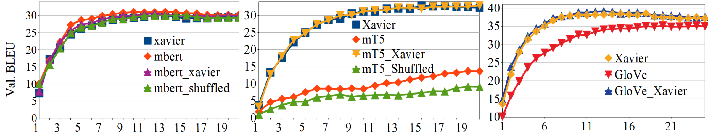

# 利用预训练嵌入初始化 Transformer 模型

发布时间：2024年07月17日

`LLM理论` `人工智能`

> On Initializing Transformers with Pre-trained Embeddings

# 摘要

> 如今，在从头开始训练基于transformer的模型时，采用随机初始化而非预训练嵌入已成为常态。我们发现，GloVe、T5和mT5的预训练嵌入在性能上远不如随机初始化，这与预训练的表示优势相悖。然而，BERT和mBERT的嵌入却显示出优于随机初始化的效果，突显了预训练的优势。我们推测，造成这种差异的两个关键因素是模型对参数分布的敏感性以及嵌入与位置编码的相互作用。预训练嵌入的广泛值分布可能导致训练不良，且可能掩盖位置信息。通过将这些嵌入标准化至较窄范围，我们显著提升了GloVe、T5和mT5的性能。而BERT嵌入虽大，却仍接近Xavier初始化范围，这或许有助于其有效迁移预训练知识。

> It has become common practice now to use random initialization schemes, rather than the pre-trained embeddings, when training transformer based models from scratch. Indeed, we find that pre-trained word embeddings from GloVe, and some sub-word embeddings extracted from language models such as T5 and mT5 fare much worse compared to random initialization. This is counter-intuitive given the well-known representational and transfer-learning advantages of pre-training. Interestingly, we also find that BERT and mBERT embeddings fare better than random initialization, showing the advantages of pre-trained representations. In this work, we posit two potential factors that contribute to these mixed results: the model sensitivity to parameter distribution and the embedding interactions with position encodings. We observe that pre-trained GloVe, T5, and mT5 embeddings have a wider distribution of values. As argued in the initialization studies, such large value initializations can lead to poor training because of saturated outputs. Further, the larger embedding values can, in effect, absorb the smaller position encoding values when added together, thus losing position information. Standardizing the pre-trained embeddings to a narrow range (e.g. as prescribed by Xavier) leads to substantial gains for Glove, T5, and mT5 embeddings. On the other hand, BERT pre-trained embeddings, while larger, are still relatively closer to Xavier initialization range which may allow it to effectively transfer the pre-trained knowledge.

[Arxiv](https://arxiv.org/abs/2407.12514)