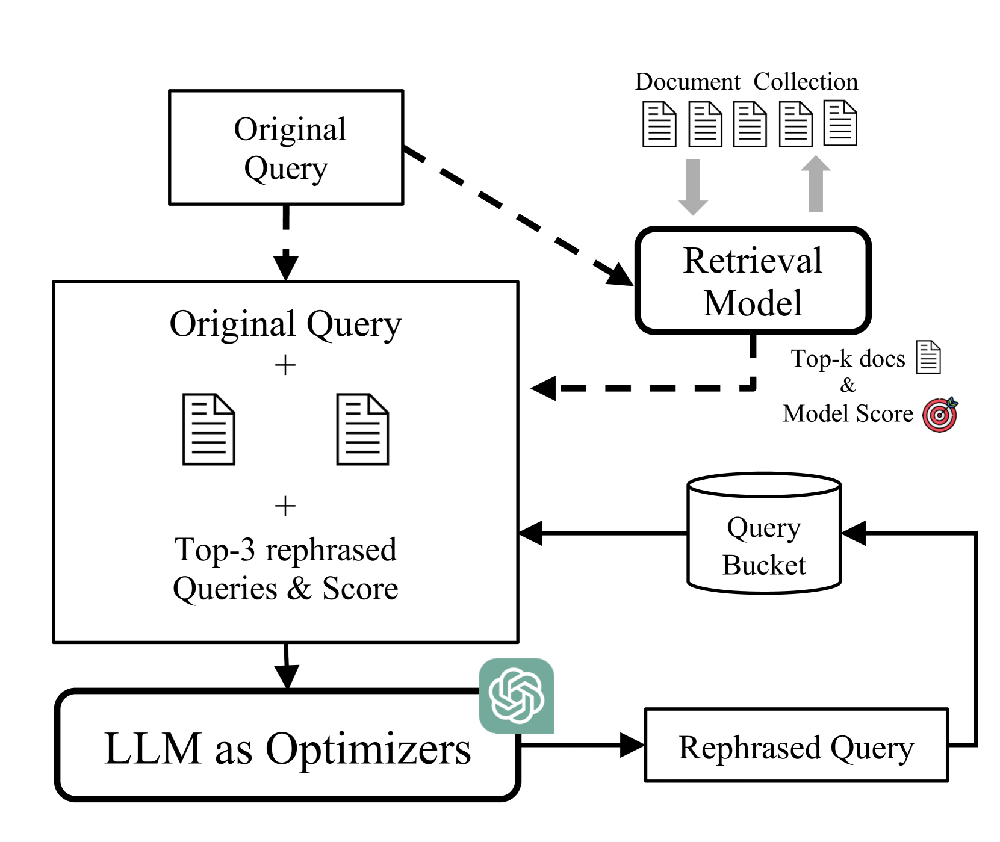
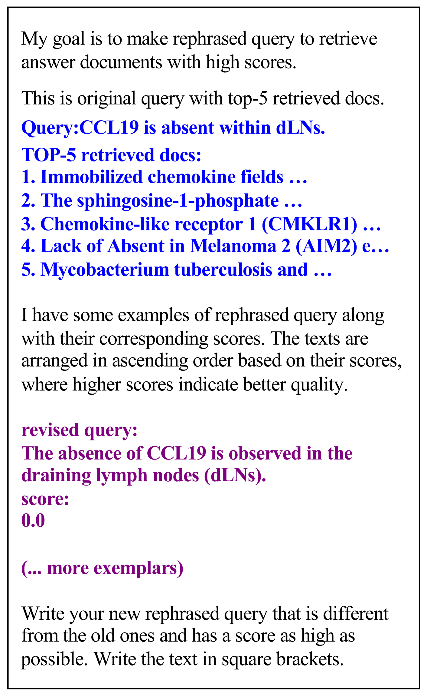

# 精进查询生成，提升RAG文档检索效能

发布时间：2024年07月17日

`RAG` `信息技术` `人工智能`

> Optimizing Query Generation for Enhanced Document Retrieval in RAG

# 摘要

> 尽管大型语言模型在多样的语言任务中表现卓越，但它们时常产生错误信息，即所谓的“幻觉”。检索增强生成技术通过文档检索来减少这一现象，以提供更准确的响应。然而，模糊的查询仍导致幻觉问题。本研究通过优化查询生成，并利用LLM精炼查询，提高了文档检索的精确度和效率。实验结果显示，这一改进使得文档检索的平均准确率提升了1.6%。

> Large Language Models (LLMs) excel in various language tasks but they often generate incorrect information, a phenomenon known as "hallucinations". Retrieval-Augmented Generation (RAG) aims to mitigate this by using document retrieval for accurate responses. However, RAG still faces hallucinations due to vague queries. This study aims to improve RAG by optimizing query generation with a query-document alignment score, refining queries using LLMs for better precision and efficiency of document retrieval. Experiments have shown that our approach improves document retrieval, resulting in an average accuracy gain of 1.6%.

[Arxiv](https://arxiv.org/abs/2407.12325)