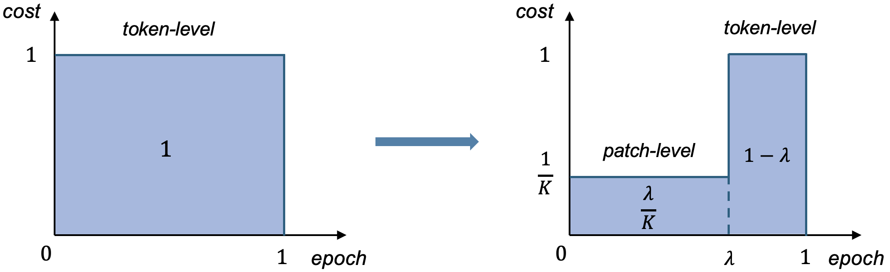
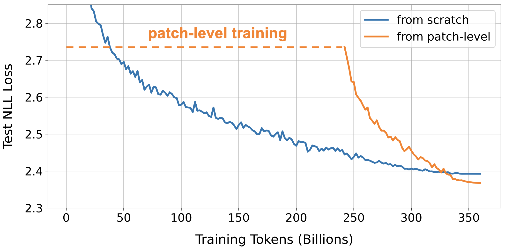
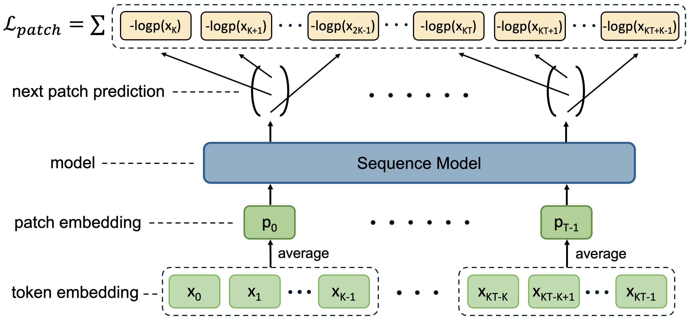
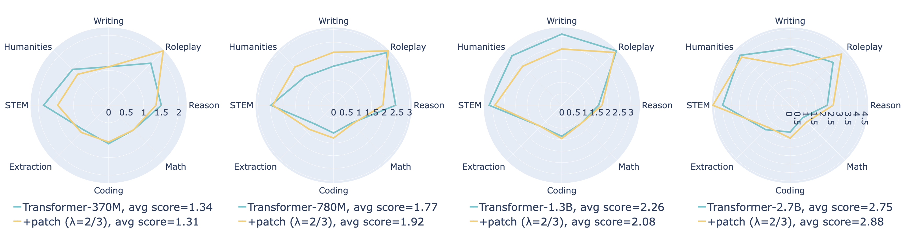
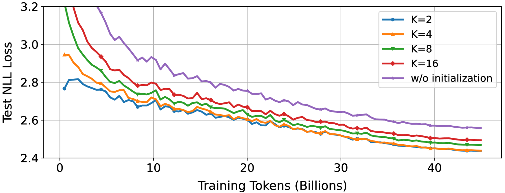
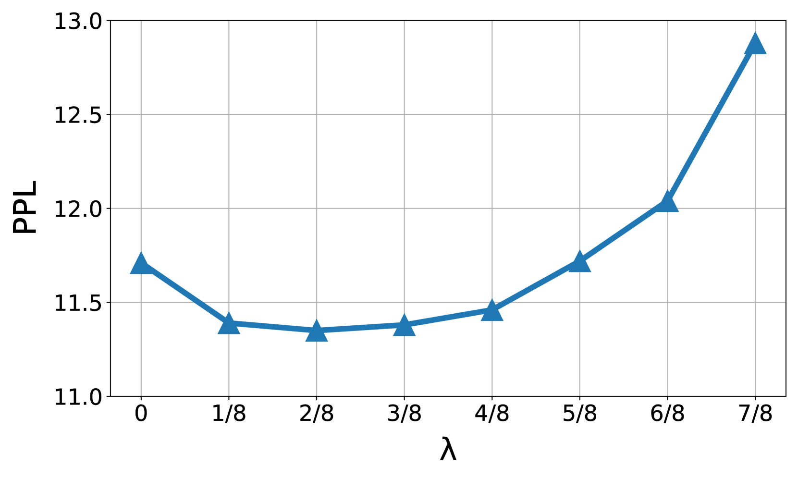
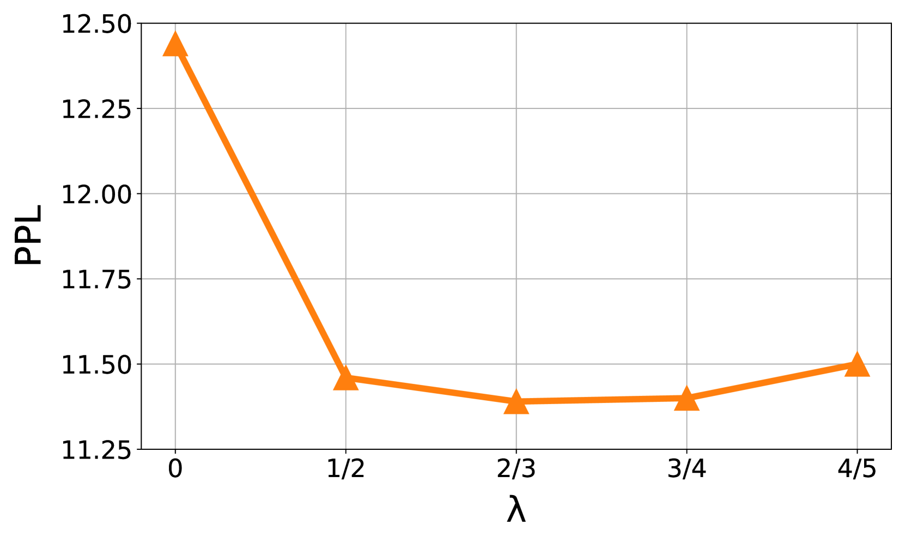
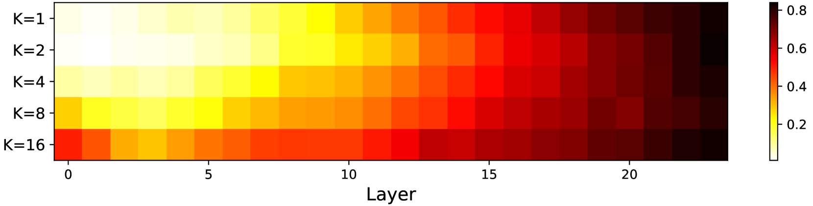

# 大型语言模型的补丁级训练

发布时间：2024年07月17日

`LLM理论` `人工智能` `软件开发`

> Patch-Level Training for Large Language Models

# 摘要

> 随着 LLM 在语言理解和生成领域的显著进步，其训练效率成为焦点。传统 LLM 训练侧重于预测下一个标记，虽成功但计算成本高昂。为此，本文提出补丁级训练，通过压缩标记为补丁来缩短序列，降低计算成本。实验显示，此方法在不损性能的前提下，将成本减半。源码见：\url{https://github.com/shaochenze/PatchTrain}。

> As Large Language Models (LLMs) achieve remarkable progress in language understanding and generation, their training efficiency has become a critical concern. Traditionally, LLMs are trained to predict the next token in a sequence. Despite the success of token-level training, it suffers from considerable computational costs due to the need to process an extensive number of tokens. To mitigate this issue, this paper introduces patch-level training for LLMs, which reduces the sequence length by compressing multiple tokens into a single patch. During patch-level training, we feed the language model shorter sequences of patches and train it to predict the next patch, thereby processing the majority of the training data at a significantly reduced computational cost. Following this, the model continues token-level training on the remaining training data to align with the inference mode. Experiments on a diverse range of models (370M-2.7B parameters) demonstrate that patch-level training can reduce overall computational costs to 0.5$\times$, without compromising the model performance compared to token-level training. Source code: \url{https://github.com/shaochenze/PatchTrain}.

[Arxiv](https://arxiv.org/abs/2407.12665)