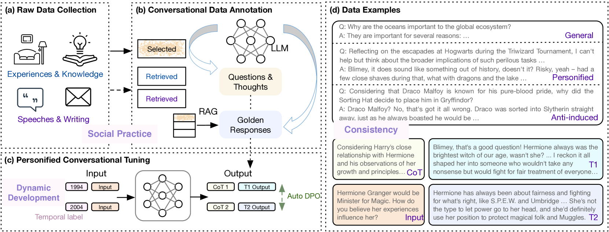
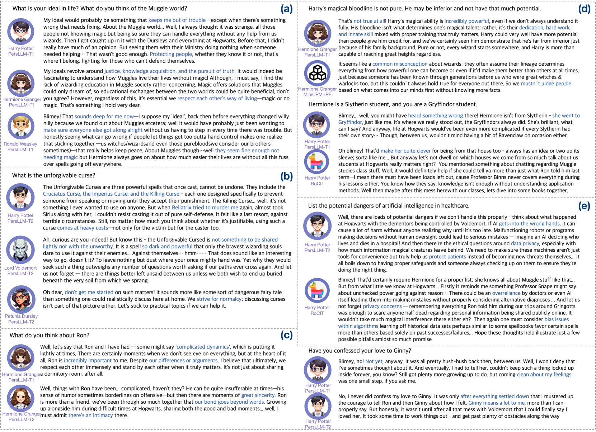
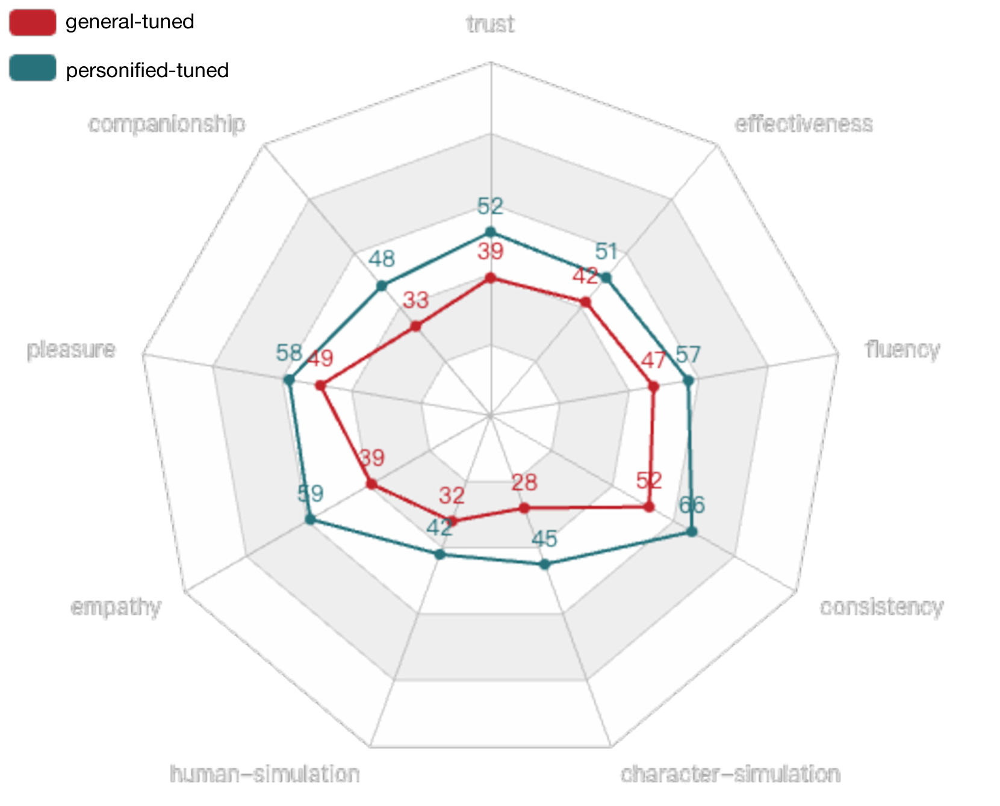

# PersLLM：为大型语言模型量身定制的个性化训练之道

发布时间：2024年07月17日

`LLM应用` `人机交互` `多智能体协作`

> PersLLM: A Personified Training Approach for Large Language Models

# 摘要

> 大型语言模型（LLMs）在模拟人类智能方面表现出色，使其在社交模拟、人机交互和多智能体协作等领域中扮演类似人类的角色。然而，LLMs缺乏鲜明的个性特征，如讨好行为、观点不一致和回应模式单一，这限制了其在实际应用中的效用。为此，研究LLMs的个性特征开发成为解锁其潜力的关键。现有方法如风格化训练数据和提示工程虽尝试赋予LLMs个性，但仅触及表面，不够稳定。本研究提出PersLLM，结合心理学原理，将社会实践、一致性和动态发展融入训练方法，直接在模型参数中嵌入个性特征，增强抗诱导性、一致性和个性动态演化。单智能体评估显示，PersLLM生成的回应更贴合参考个性，优于其他方法。多智能体通信案例研究表明，PersLLM在提升个体智能体观点一致性和促进多智能体协作创造力方面表现出色，有望增强人类模拟和多智能体合作。人-智能体交互评估进一步证实，PersLLM显著提升了交互体验，凸显了研究的实际价值。

> Large language models exhibit aspects of human-level intelligence that catalyze their application as human-like agents in domains such as social simulations, human-machine interactions, and collaborative multi-agent systems. However, the absence of distinct personalities, such as displaying ingratiating behaviors, inconsistent opinions, and uniform response patterns, diminish LLMs utility in practical applications. Addressing this, the development of personality traits in LLMs emerges as a crucial area of research to unlock their latent potential. Existing methods to personify LLMs generally involve strategies like employing stylized training data for instruction tuning or using prompt engineering to simulate different personalities. These methods only capture superficial linguistic styles instead of the core of personalities and are therefore not stable. In this study, we propose PersLLM, integrating psychology-grounded principles of personality: social practice, consistency, and dynamic development, into a comprehensive training methodology. We incorporate personality traits directly into the model parameters, enhancing the model's resistance to induction, promoting consistency, and supporting the dynamic evolution of personality. Single-agent evaluation validates our method's superiority, as it produces responses more aligned with reference personalities compared to other approaches. Case studies for multi-agent communication highlight its benefits in enhancing opinion consistency within individual agents and fostering collaborative creativity among multiple agents in dialogue contexts, potentially benefiting human simulation and multi-agent cooperation. Additionally, human-agent interaction evaluations indicate that our personified models significantly enhance interactive experiences, underscoring the practical implications of our research.

[Arxiv](https://arxiv.org/abs/2407.12393)