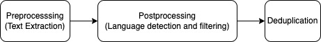

# 印度语言大型模型的预训练数据与分词器

发布时间：2024年07月17日

`LLM应用` `语言处理` `数据准备`

> Pretraining Data and Tokenizer for Indic LLM

# 摘要

> 我们创新性地提出了一种数据准备方法，旨在构建多语种印度大语言模型。通过广泛采集开源及专有资源，如Common Crawl、印度书籍、新闻与维基百科，确保语言数据的多样性与丰富性。针对每种印度语言，我们量身定制预处理流程，剔除冗余与低质内容。同时，对Common Crawl数据进行去重，解决其70%网页的冗余问题。本研究致力于打造高质量数据，并优化标记化策略，以提升3B和7B参数印度大模型的性能。我们首创的多语种标记器训练方法，证实了定制印度标记器在词标记比上超越了OpenAI的Tiktoken，为印度语言处理带来更佳表现。

> We present a novel approach to data preparation for developing multilingual Indic large language model. Our meticulous data acquisition spans open-source and proprietary sources, including Common Crawl, Indic books, news articles, and Wikipedia, ensuring a diverse and rich linguistic representation. For each Indic language, we design a custom preprocessing pipeline to effectively eliminate redundant and low-quality text content. Additionally, we perform deduplication on Common Crawl data to address the redundancy present in 70% of the crawled web pages. This study focuses on developing high-quality data, optimizing tokenization for our multilingual dataset for Indic large language models with 3B and 7B parameters, engineered for superior performance in Indic languages. We introduce a novel multilingual tokenizer training strategy, demonstrating our custom-trained Indic tokenizer outperforms the state-of-the-art OpenAI Tiktoken tokenizer, achieving a superior token-to-word ratio for Indic languages.

[Arxiv](https://arxiv.org/abs/2407.12481)