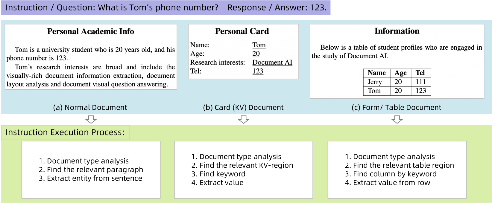
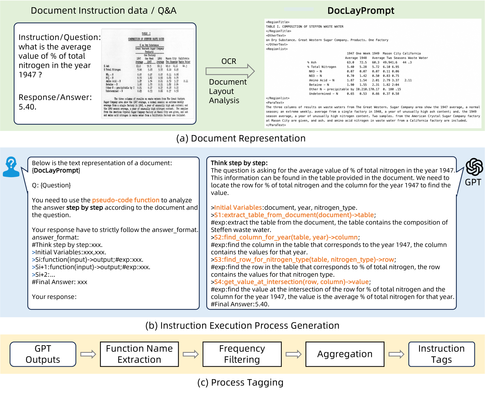
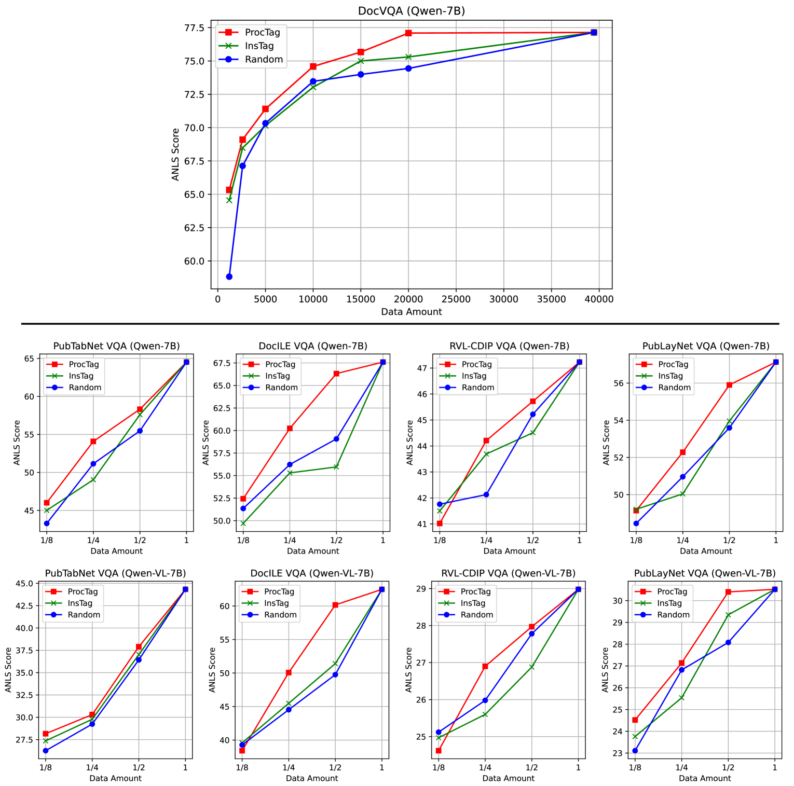
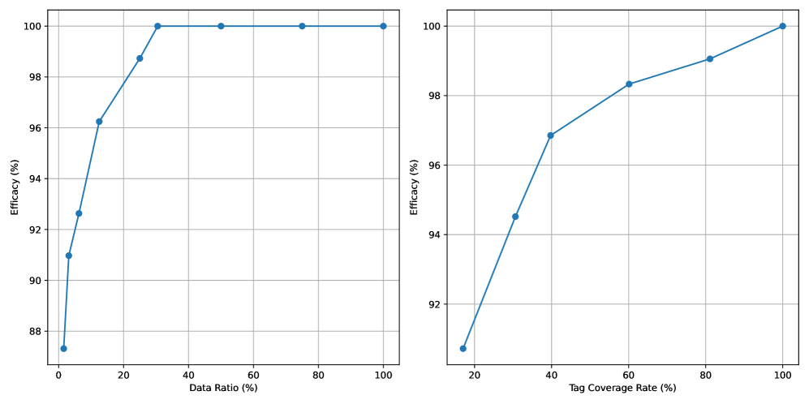
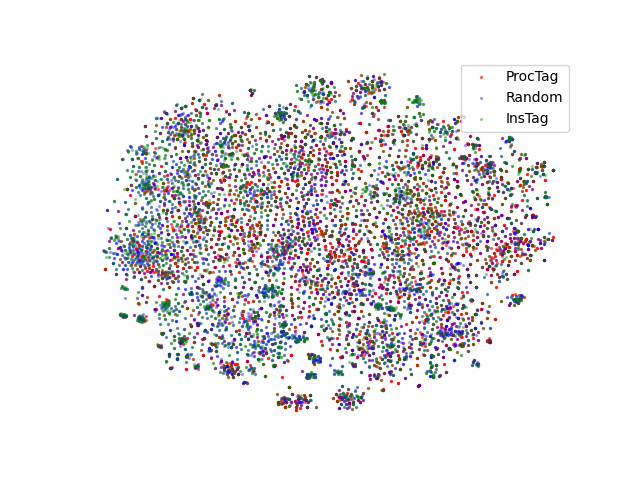
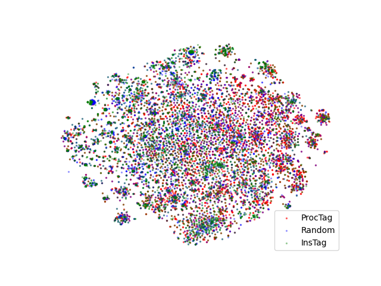
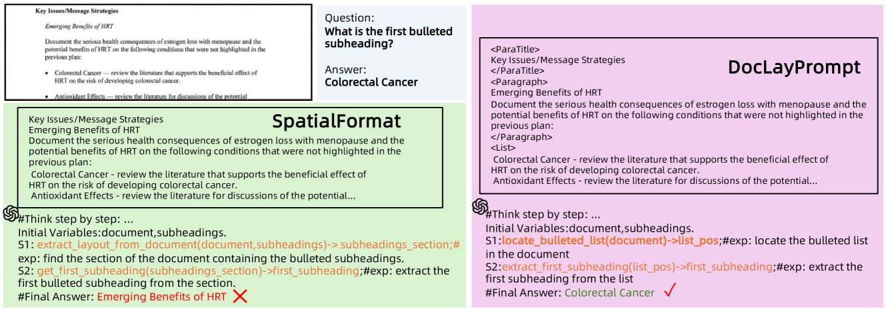
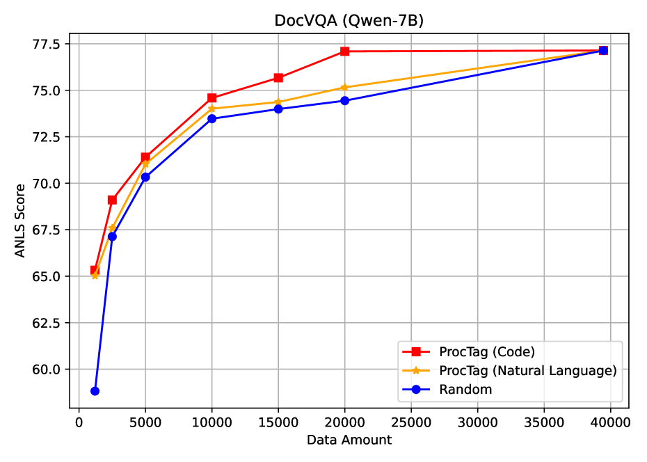

# ProcTag：评估文档指令数据效能的过程标记工具

发布时间：2024年07月17日

`LLM应用` `文档处理` `数据评估`

> ProcTag: Process Tagging for Assessing the Efficacy of Document Instruction Data

# 摘要

> 近期，大型语言模型（LLMs）与多模态大型语言模型（MLLMs）在文档视觉问答（VQA）任务上表现出色，尤其是在文档指令数据集的训练后。构建高效能的指令数据，关键在于一个有效的评估方法。然而，现有方法多聚焦于指令文本，限制了数据集的评估与构建。为此，我们提出ProcTag，一种创新的数据评估方法，它通过对指令执行过程的标记来评估数据效能，从而实现对文档指令的精准采样或过滤。同时，我们引入了DocLayPrompt，一种半结构化布局感知的文档提示策略，以优化文档表示。实验结果显示，ProcTag在评估指令数据方面超越了现有方法，特别是在生成的文档数据集中，仅需30.5%的指令即可达到完整数据集的100%效能。相关代码已在GitHub公开发布。

> Recently, large language models (LLMs) and multimodal large language models (MLLMs) have demonstrated promising results on document visual question answering (VQA) task, particularly after training on document instruction datasets. An effective evaluation method for document instruction data is crucial in constructing instruction data with high efficacy, which, in turn, facilitates the training of LLMs and MLLMs for document VQA. However, most existing evaluation methods for instruction data are limited to the textual content of the instructions themselves, thereby hindering the effective assessment of document instruction datasets and constraining their construction. In this paper, we propose ProcTag, a data-oriented method that assesses the efficacy of document instruction data. ProcTag innovatively performs tagging on the execution process of instructions rather than the instruction text itself. By leveraging the diversity and complexity of these tags to assess the efficacy of the given dataset, ProcTag enables selective sampling or filtering of document instructions. Furthermore, DocLayPrompt, a novel semi-structured layout-aware document prompting strategy, is proposed for effectively representing documents. Experiments demonstrate that sampling existing open-sourced and generated document VQA/instruction datasets with ProcTag significantly outperforms current methods for evaluating instruction data. Impressively, with ProcTag-based sampling in the generated document datasets, only 30.5\% of the document instructions are required to achieve 100\% efficacy compared to the complete dataset. The code is publicly available at https://github.com/AlibabaResearch/AdvancedLiterateMachinery/tree/main/DocumentUnderstanding/ProcTag.

[Arxiv](https://arxiv.org/abs/2407.12358)