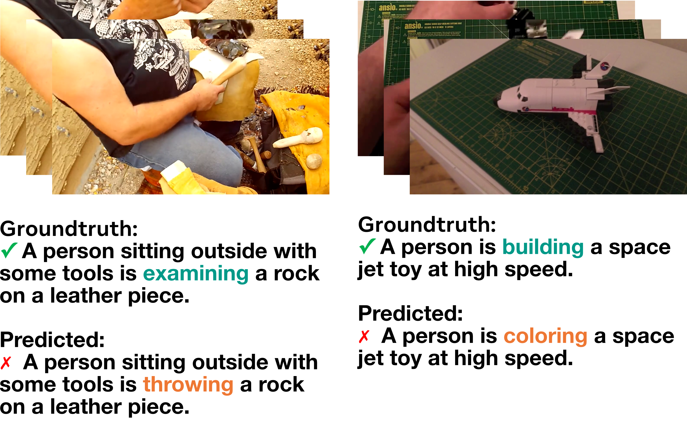

# 探索视频与文本理解的新视角：从反事实增强数据中进行检索

发布时间：2024年07月17日

`LLM应用` `视频理解` `人工智能`

> Rethinking Video-Text Understanding: Retrieval from Counterfactually Augmented Data

# 摘要

> 近期，视频-文本基础模型在众多视频理解任务中表现出色。然而，这些模型是否真正理解了自然视频的内容？标准评估可能存在误导，因为许多问题仅基于单帧对象和上下文或数据集偏见即可推断。本文旨在深入评估现有视频-文本模型的能力，并揭示其局限。为此，我们提出了一个新颖的评估任务——反事实增强数据检索（RCAD），并创建了Feint6K数据集。该任务要求模型通过跨帧推理全面理解视频内容。分析表明，先前的模型易受反事实数据影响，表现远不及人类水平。为缩小这一差距，我们指出了现有对比方法的局限，并推出了LLM-teacher方法，该方法通过利用预训练大型语言模型的知识，有效学习动作语义。实验显示，该方法能提升动作嵌入的区分度，并在多个模型上优化了Feint6K的性能。Feint6K数据集及项目详情可访问https://feint6k.github.io。

> Recent video-text foundation models have demonstrated strong performance on a wide variety of downstream video understanding tasks. Can these video-text models genuinely understand the contents of natural videos? Standard video-text evaluations could be misleading as many questions can be inferred merely from the objects and contexts in a single frame or biases inherent in the datasets. In this paper, we aim to better assess the capabilities of current video-text models and understand their limitations. We propose a novel evaluation task for video-text understanding, namely retrieval from counterfactually augmented data (RCAD), and a new Feint6K dataset. To succeed on our new evaluation task, models must derive a comprehensive understanding of the video from cross-frame reasoning. Analyses show that previous video-text foundation models can be easily fooled by counterfactually augmented data and are far behind human-level performance. In order to narrow the gap between video-text models and human performance on RCAD, we identify a key limitation of current contrastive approaches on video-text data and introduce LLM-teacher, a more effective approach to learn action semantics by leveraging knowledge obtained from a pretrained large language model. Experiments and analyses show that our approach successfully learn more discriminative action embeddings and improves results on Feint6K when applied to multiple video-text models. Our Feint6K dataset and project page is available at https://feint6k.github.io.

[Arxiv](https://arxiv.org/abs/2407.13094)