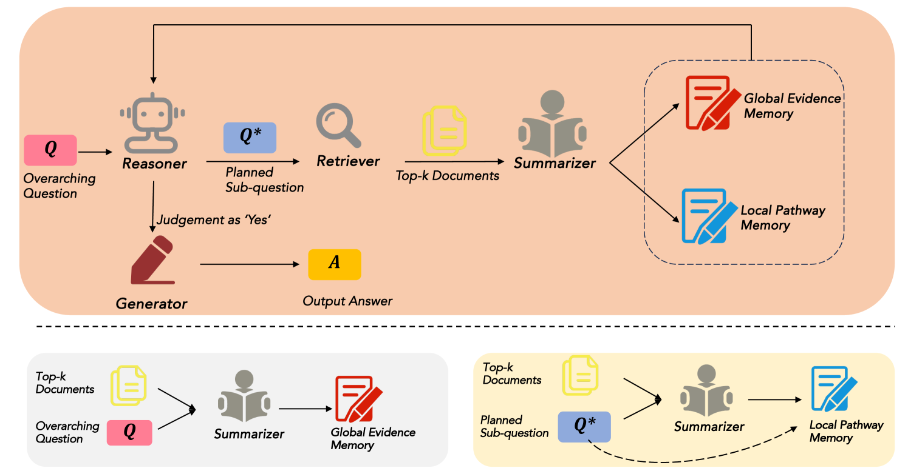
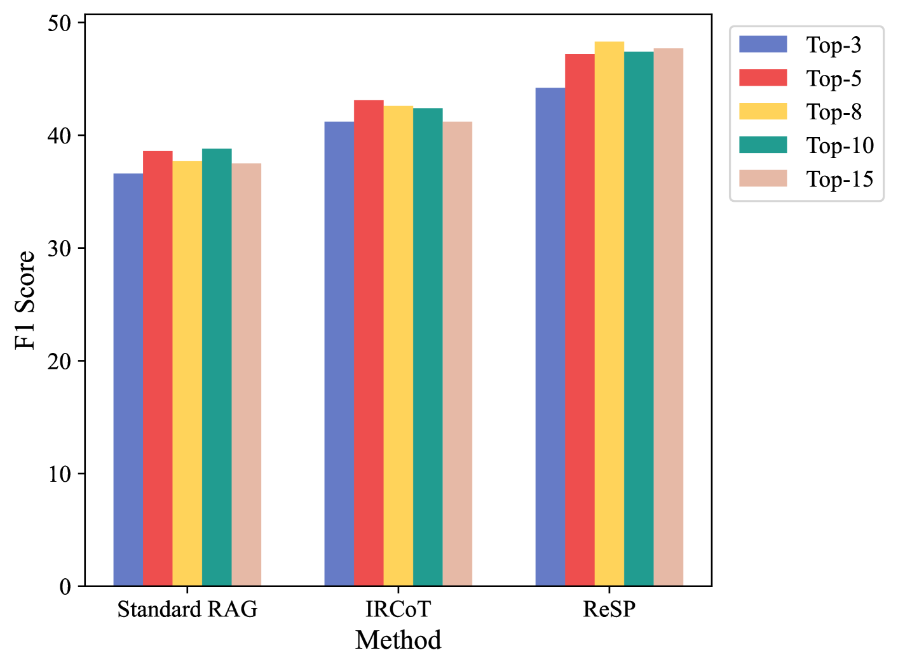

# 通过迭代的三步法——检索、总结、规划，我们正推动多跳问答技术向前发展。

发布时间：2024年07月17日

`RAG` `问答系统` `人工智能`

> Retrieve, Summarize, Plan: Advancing Multi-hop Question Answering with an Iterative Approach

# 摘要

> 多跳问答任务因其工业应用价值而备受挑战，基于大型语言模型的检索增强生成（RAG）方法已成为解决这一难题的热门选择。然而，单次检索可能无法涵盖所有必要信息，因此一系列迭代RAG方法应运而生，性能显著提升。尽管如此，现有方法仍受限于多轮检索带来的上下文过载，以及因缺乏检索轨迹记录而导致的过度与重复规划。为此，我们提出了一种创新的迭代RAG方法——ReSP，其特色在于配备了一个双功能总结器，能同时压缩检索文档中的信息，服务于整体问题与当前子问题。实验证明，ReSP在HotpotQA和2WikiMultihopQA数据集上表现卓越，不仅超越了现有技术水平，更在上下文长度处理上展现了出色的稳健性。

> Multi-hop question answering is a challenging task with distinct industrial relevance, and Retrieval-Augmented Generation (RAG) methods based on large language models (LLMs) have become a popular approach to tackle this task. Owing to the potential inability to retrieve all necessary information in a single iteration, a series of iterative RAG methods has been recently developed, showing significant performance improvements. However, existing methods still face two critical challenges: context overload resulting from multiple rounds of retrieval, and over-planning and repetitive planning due to the lack of a recorded retrieval trajectory. In this paper, we propose a novel iterative RAG method called ReSP, equipped with a dual-function summarizer. This summarizer compresses information from retrieved documents, targeting both the overarching question and the current sub-question concurrently. Experimental results on the multi-hop question-answering datasets HotpotQA and 2WikiMultihopQA demonstrate that our method significantly outperforms the state-of-the-art, and exhibits excellent robustness concerning context length.

[Arxiv](https://arxiv.org/abs/2407.13101)