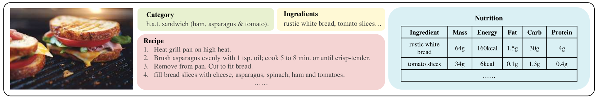

# RoDE：专为食品领域大型多模态模型设计的线性整流混合多样专家系统

发布时间：2024年07月17日

`LLM应用` `营养分析`

> RoDE: Linear Rectified Mixture of Diverse Experts for Food Large Multi-Modal Models

# 摘要

> 大型多模态模型（LMMs）在视觉-语言任务中取得了显著进步，其中高质量训练数据的可用性和可扩展性至关重要。在食品领域，尽管Recipe1M等数据集提供了丰富的食材和食谱信息，但在营养分析方面数据不足。为此，我们推出了Uni-Food数据集，包含超过100,000张图像，涵盖食物类别、食材、食谱及营养信息，旨在全面提升食品数据分析。为解决LMMs微调中的多任务冲突，我们创新性地提出了线性校正多样化专家混合（RoDE）方法，通过多样化专家团队处理不同复杂任务，优化参数分配，提升任务分配效率，确保GPU内存高效和优化简便。实验证明，RoDE有效应对了食品多任务的挑战。

> Large Multi-modal Models (LMMs) have significantly advanced a variety of vision-language tasks. The scalability and availability of high-quality training data play a pivotal role in the success of LMMs. In the realm of food, while comprehensive food datasets such as Recipe1M offer an abundance of ingredient and recipe information, they often fall short of providing ample data for nutritional analysis. The Recipe1M+ dataset, despite offering a subset for nutritional evaluation, is limited in the scale and accuracy of nutrition information. To bridge this gap, we introduce Uni-Food, a unified food dataset that comprises over 100,000 images with various food labels, including categories, ingredients, recipes, and ingredient-level nutritional information. Uni-Food is designed to provide a more holistic approach to food data analysis, thereby enhancing the performance and capabilities of LMMs in this domain. To mitigate the conflicts arising from multi-task supervision during fine-tuning of LMMs, we introduce a novel Linear Rectification Mixture of Diverse Experts (RoDE) approach. RoDE utilizes a diverse array of experts to address tasks of varying complexity, thereby facilitating the coordination of trainable parameters, i.e., it allocates more parameters for more complex tasks and, conversely, fewer parameters for simpler tasks. RoDE implements linear rectification union to refine the router's functionality, thereby enhancing the efficiency of sparse task allocation. These design choices endow RoDE with features that ensure GPU memory efficiency and ease of optimization. Our experimental results validate the effectiveness of our proposed approach in addressing the inherent challenges of food-related multitasking.

[Arxiv](https://arxiv.org/abs/2407.12730)