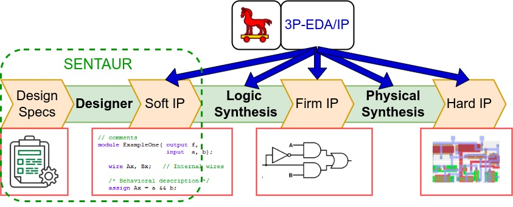

# SENTAUR：利用 LLM 提升对抗不良修订的安全特洛伊评估

发布时间：2024年07月17日

`LLM应用` `半导体` `网络安全`

> SENTAUR: Security EnhaNced Trojan Assessment Using LLMs Against Undesirable Revisions

# 摘要

> 全球IC供应链因不可信第三方而充满风险，涉及硬件木马（HT）、知识产权（3P-IP）或电子设计自动化（EDA）流程。HT可能导致隐秘行为、功能障碍或敏感数据泄露。为应对HT威胁，快速检测HT场景至关重要。Trust-Hub基准虽为评估起点，但仅涵盖少数手动HT。HT在合成中可能消失。我们提出LLM框架SENTAUR，通过学习RTL设计规范和HT描述，生成合法HT。现有工具需学习期且难以重现。SENTAUR利用LLM即时生成HT，无需学习期，简化评估。评估显示SENTAUR能生成有效、可合成HT，并研究RTL级影响。虽聚焦HT插入，SENTAUR亦可自动修改RTL代码功能。

> A globally distributed IC supply chain brings risks due to untrusted third parties. The risks span inadvertent use of hardware Trojan (HT), inserted Intellectual Property (3P-IP) or Electronic Design Automation (EDA) flows. HT can introduce stealthy HT behavior, prevent an IC work as intended, or leak sensitive data via side channels. To counter HTs, rapidly examining HT scenarios is a key requirement. While Trust-Hub benchmarks are a good starting point to assess defenses, they encompass a small subset of manually created HTs within the expanse of HT designs. Further, the HTs may disappear during synthesis. We propose a large language model (LLM) framework SENTAUR to generate a suite of legitimate HTs for a Register Transfer Level (RTL) design by learning its specifications, descriptions, and natural language descriptions of HT effects. Existing tools and benchmarks are limited; they need a learning period to construct an ML model to mimic the threat model and are difficult to reproduce. SENTAUR can swiftly produce HT instances by leveraging LLMs without any learning period and sanitizing the HTs facilitating their rapid assessment. Evaluation of SENTAUR involved generating effective, synthesizable, and practical HTs from TrustHub and elsewhere, investigating impacts of payloads/triggers at the RTL. While our evaluation focused on HT insertion, SENTAUR can generalize to automatically transform an RTL code to have defined functional modifications.

[Arxiv](https://arxiv.org/abs/2407.12352)