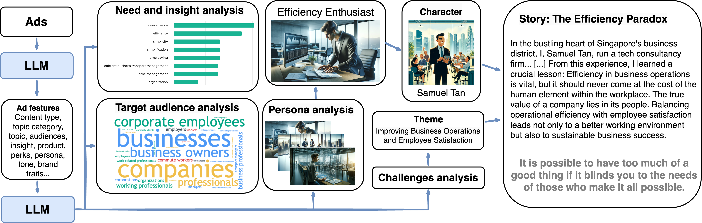
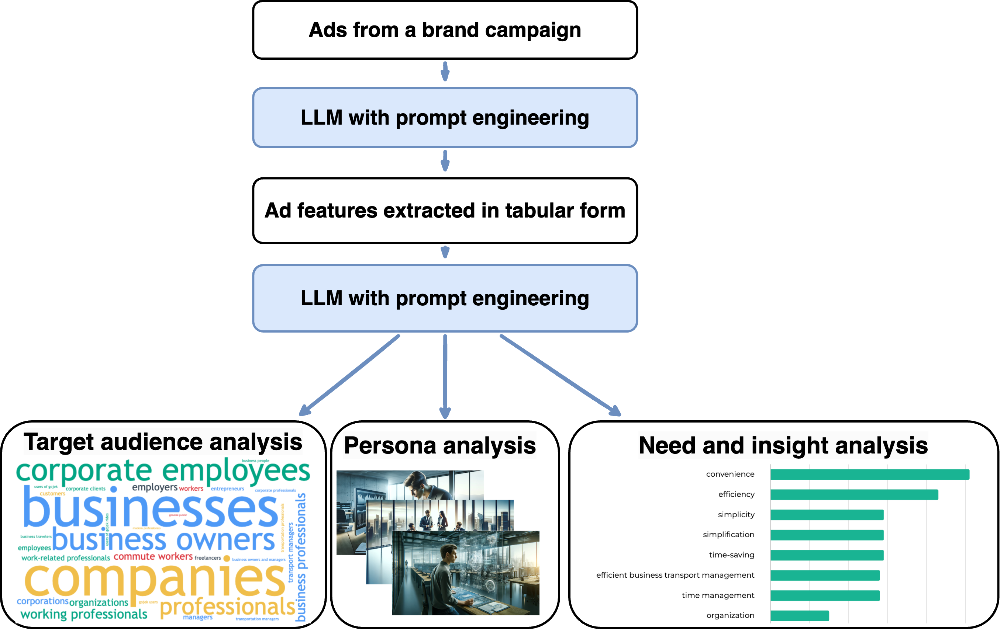
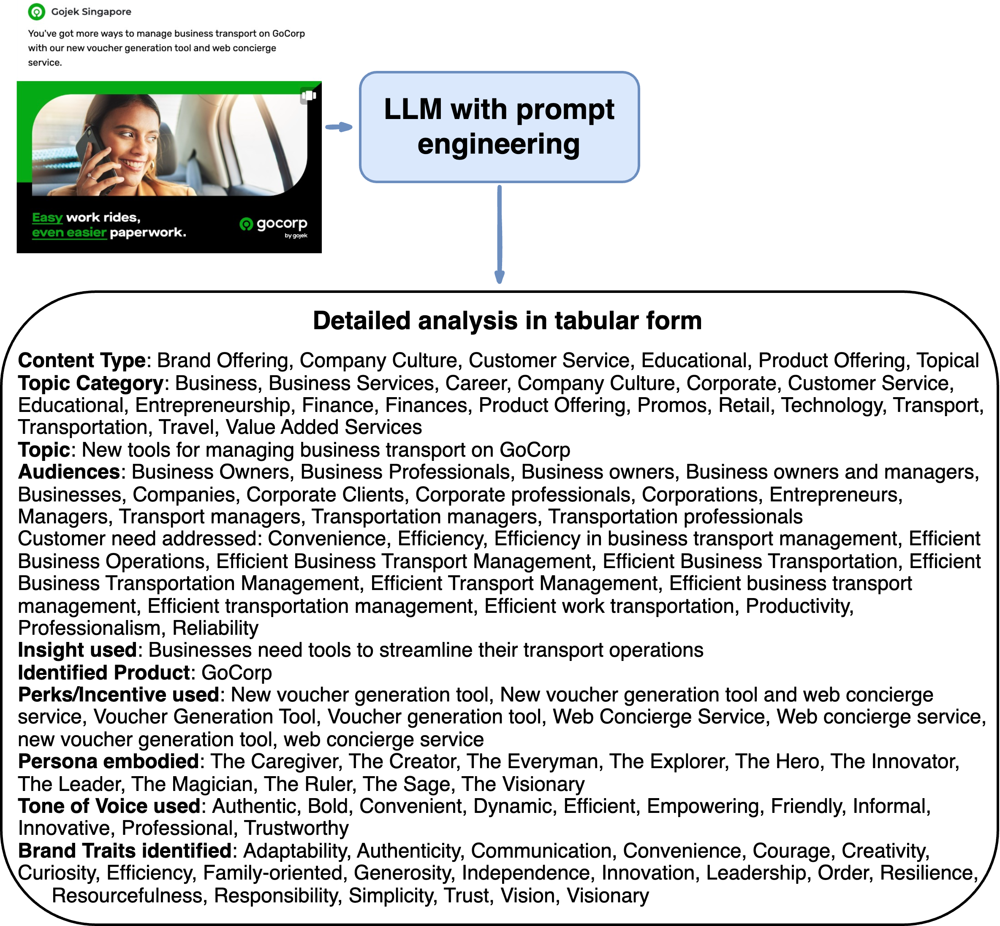
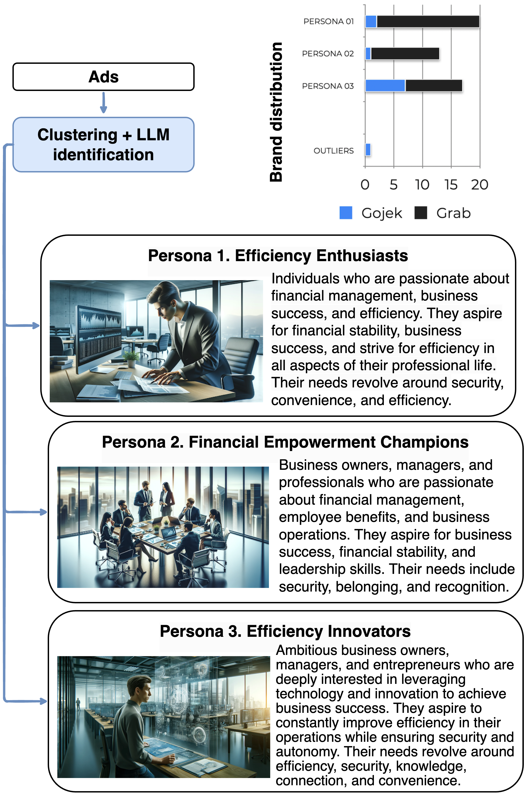
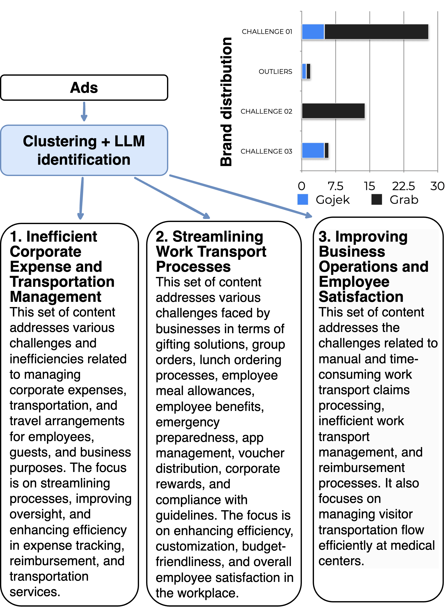
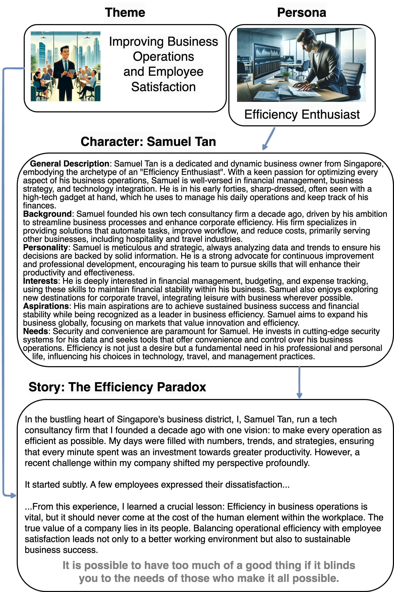

# SOMONITOR：借助大型语言模型，实现营销数据的可解释处理与深度分析

发布时间：2024年07月17日

`LLM应用` `人工智能`

> SOMONITOR: Explainable Marketing Data Processing and Analysis with Large Language Models

# 摘要

> 在线营销在处理海量数据时面临挑战，这些数据对竞争对手分析、内容研究和品牌战略至关重要。手动审查大量瞬息万变的在线内容几乎不可能，而片面分析常导致营销活动效果不佳。我们推出的SoMonitor框架，结合人类直觉与AI效率，助力营销人员从战略规划到内容创作和活动执行的每个环节。SoMonitor通过CTR预测和排名模型优化广告内容，并利用大型语言模型分析竞争对手内容，提炼目标受众、客户需求和产品特性等核心要素。这些要素被归类为沟通主题和目标客户角色，与品牌自身广告数据结合，构建针对新客户角色的叙事，并生成用户故事形式的详细内容简报，直接供营销团队应用，简化内容生产和活动执行。SoMonitor的日常应用使营销人员能迅速解析大数据，提供切实可行的洞察，大幅提升营销效果和工作满意度。

> Online marketing faces formidable challenges in managing and interpreting immense volumes of data necessary for competitor analysis, content research, and strategic branding. It is impossible to review hundreds to thousands of transient online content items by hand, and partial analysis often leads to suboptimal outcomes and poorly performing campaigns. We introduce an explainable AI framework SoMonitor that aims to synergize human intuition with AI-based efficiency, helping marketers across all stages of the marketing funnel, from strategic planning to content creation and campaign execution. SoMonitor incorporates a CTR prediction and ranking model for advertising content and uses large language models (LLMs) to process high-performing competitor content, identifying core content pillars such as target audiences, customer needs, and product features. These pillars are then organized into broader categories, including communication themes and targeted customer personas. By integrating these insights with data from the brand's own advertising campaigns, SoMonitor constructs a narrative for addressing new customer personas and simultaneously generates detailed content briefs in the form of user stories that can be directly applied by marketing teams to streamline content production and campaign execution. The adoption of SoMonitor in daily operations allows digital marketers to quickly parse through extensive datasets, offering actionable insights that significantly enhance campaign effectiveness and overall job satisfaction

[Arxiv](https://arxiv.org/abs/2407.13117)