# 在解答健康问题时，我们应选择搜索引擎、大型语言模型，还是两者结合？本文将评估这些信息寻求策略的有效性。

发布时间：2024年07月17日

`RAG` `搜索引擎`

> Search Engines, LLMs or Both? Evaluating Information Seeking Strategies for Answering Health Questions

# 摘要

> 传统搜索引擎一直是信息检索的核心工具，但新型大型语言模型（LLM）在多任务处理中表现出色，尤其在问答系统领域日益普及。未来，基于LLM的对话系统与传统网络引擎预计将并存，以不同方式服务用户。本研究聚焦于这两类系统在解答健康问题上的表现，通过对比不同搜索引擎、LLM及检索增强（RAG）方法，我们发现：尽管网页质量在排名靠后时未见下降，但LLM在准确回答健康问题上优于传统引擎。同时，LLM对输入提示极为敏感，而RAG则显著提升了信息检索的效率。

> Search engines have traditionally served as primary tools for information seeking. However, the new Large Language Models (LLMs) have recently demonstrated remarkable capabilities in multiple tasks and, specifically, their adoption as question answering systems is becoming increasingly prevalent. It is expected that LLM-based conversational systems and traditional web engines will continue to coexist in the future, supporting end users in various ways. But there is a need for more scientific research on the effectiveness of both types of systems in facilitating accurate information seeking. In this study, we focus on their merits in answering health questions. We conducted an extensive study comparing different web search engines, LLMs and retrieval-augmented (RAG) approaches. Our research reveals intriguing conclusions. For example, we observed that the quality of webpages potentially responding to a health question does not decline as we navigate further down the ranked lists. However, according to our evaluation, web engines are less accurate than LLMs in finding correct answers to health questions. On the other hand, LLMs are quite sensitive to the input prompts, and we also found out that RAG leads to highly effective information seeking methods.

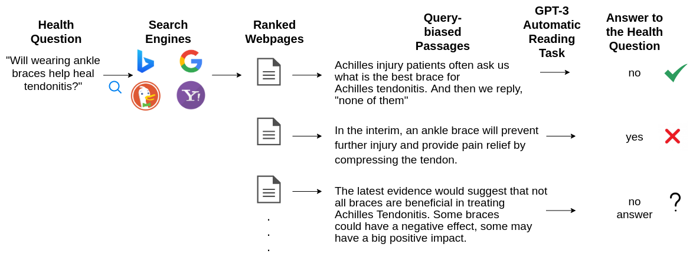

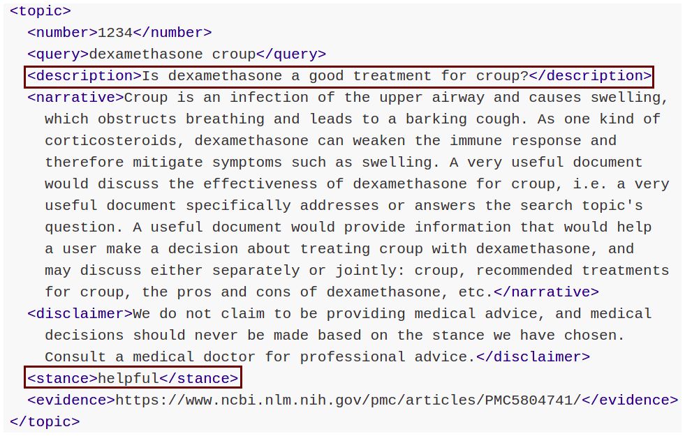

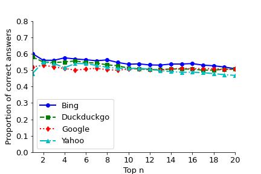

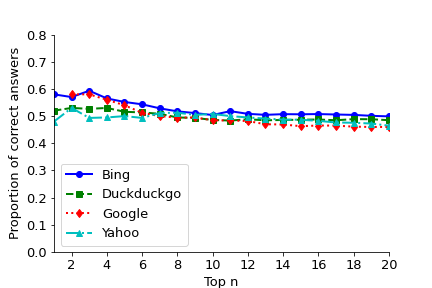

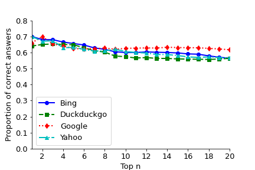

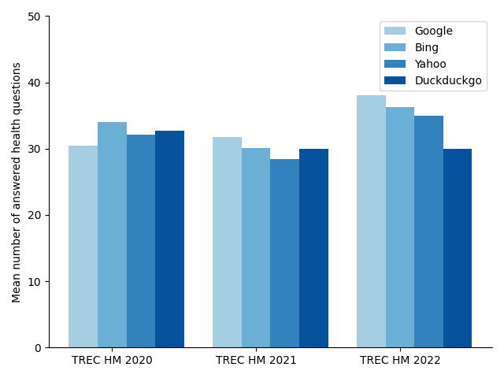

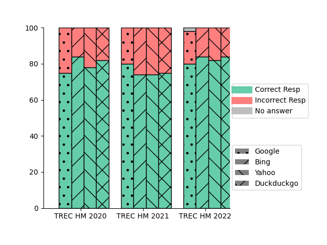

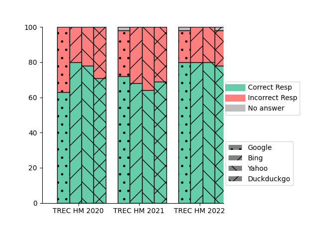

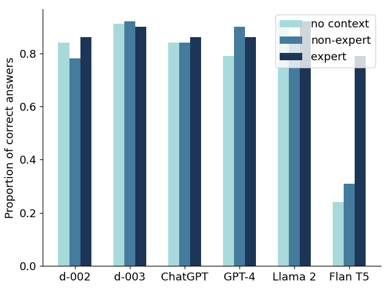

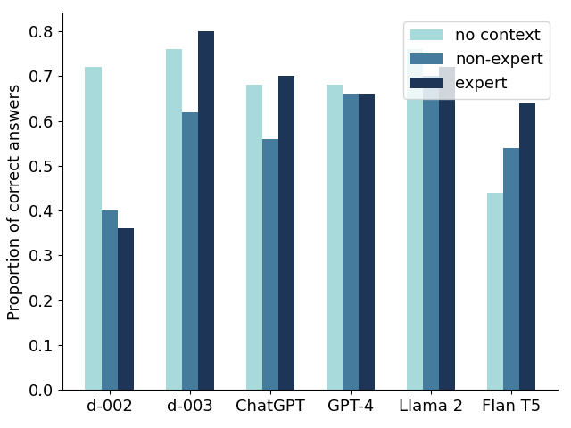

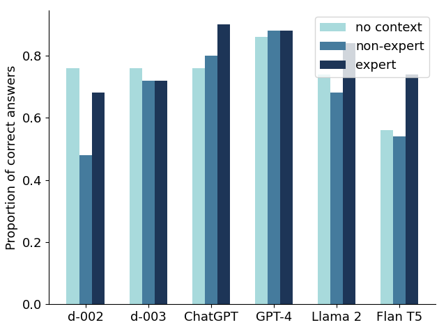

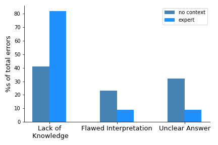

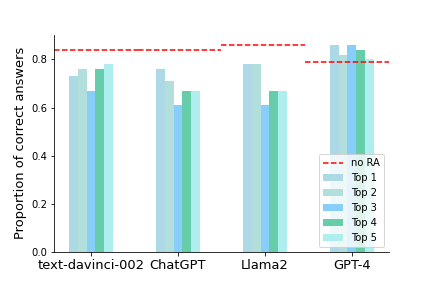

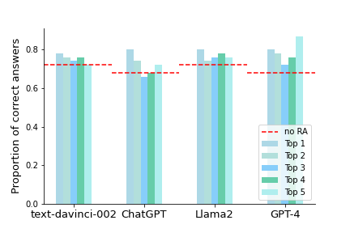

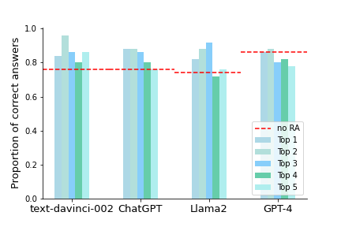

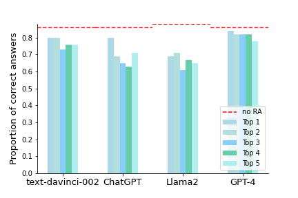

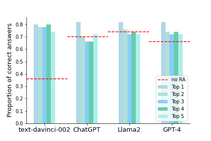

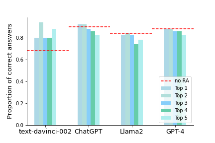

[Arxiv](https://arxiv.org/abs/2407.12468)