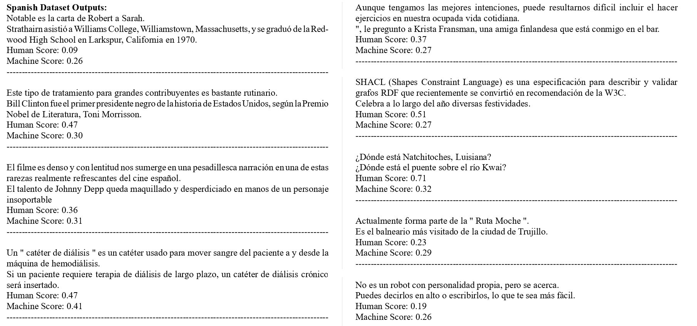

# Sharif-STR 在 SemEval-2024 任务 1 中，采用 Transformer 作为回归模型，对文本语义关系进行精细评分。

发布时间：2024年07月17日

`LLM应用` `多语言技术`

> Sharif-STR at SemEval-2024 Task 1: Transformer as a Regression Model for Fine-Grained Scoring of Textual Semantic Relations

# 摘要

> 语义文本相关性在自然语言处理领域至关重要，应用广泛。传统方法多基于知识和统计，但大型语言模型的兴起带来了新变革。本文通过微调RoBERTa模型，深入探讨了监督学习下的句子级STR。我们评估了该方法在多语言中的效果，发现其在拉丁语系中表现出色，尤其在英语中相关性达0.82，排名第19；西班牙语中相关性为0.67，排名第15。但在阿拉伯语中，相关性仅0.38，排名第20，显示出挑战。

> Semantic Textual Relatedness holds significant relevance in Natural Language Processing, finding applications across various domains. Traditionally, approaches to STR have relied on knowledge-based and statistical methods. However, with the emergence of Large Language Models, there has been a paradigm shift, ushering in new methodologies. In this paper, we delve into the investigation of sentence-level STR within Track A (Supervised) by leveraging fine-tuning techniques on the RoBERTa transformer. Our study focuses on assessing the efficacy of this approach across different languages. Notably, our findings indicate promising advancements in STR performance, particularly in Latin languages. Specifically, our results demonstrate notable improvements in English, achieving a correlation of 0.82 and securing a commendable 19th rank. Similarly, in Spanish, we achieved a correlation of 0.67, securing the 15th position. However, our approach encounters challenges in languages like Arabic, where we observed a correlation of only 0.38, resulting in a 20th rank.

[Arxiv](https://arxiv.org/abs/2407.12426)