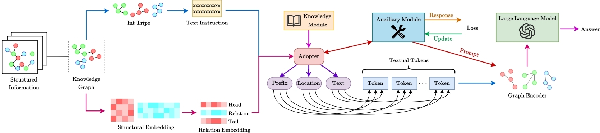
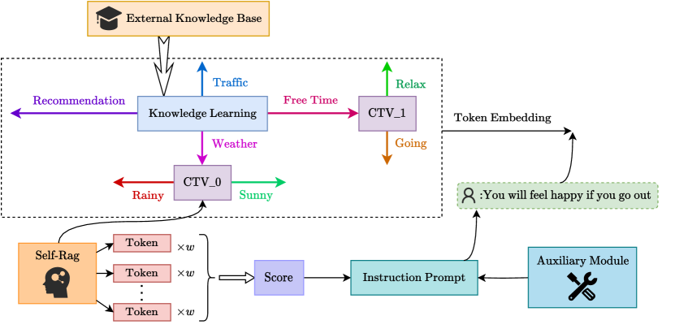
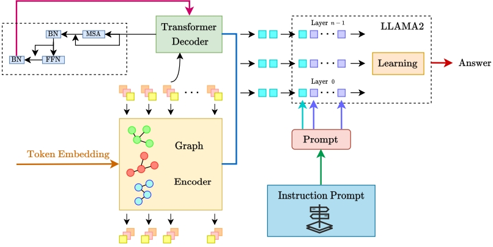
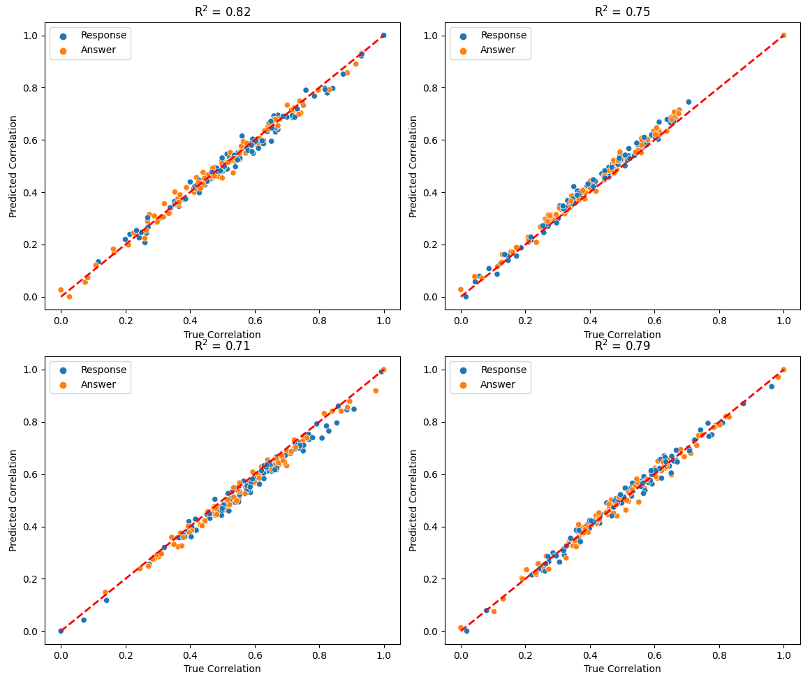
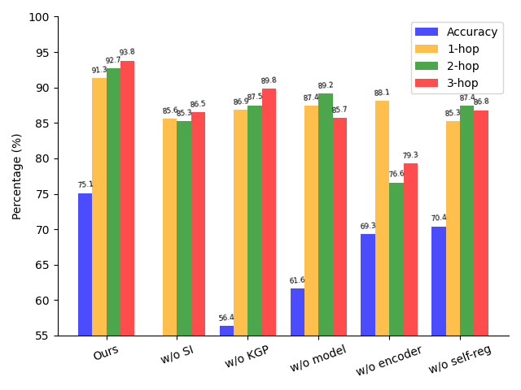
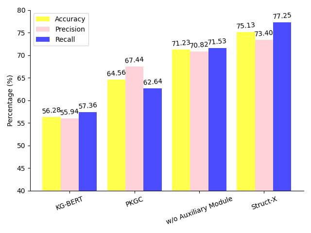
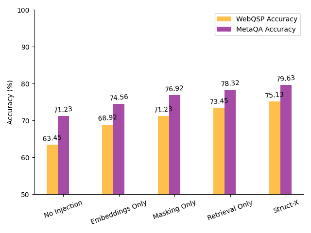
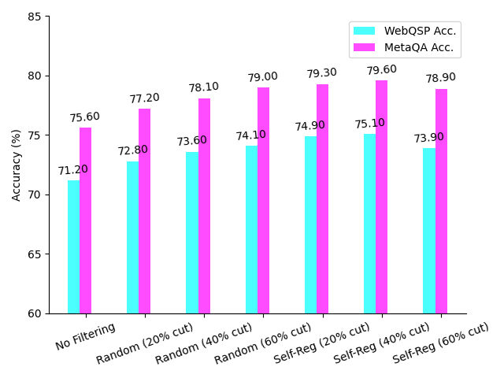

# Struct-X 利用结构化数据，显著提升大型语言模型的推理性能。

发布时间：2024年07月17日

`LLM应用` `知识图谱` `阅读理解`

> Struct-X: Enhancing Large Language Models Reasoning with Structured Data

# 摘要

> 结构化数据因其丰富的逻辑和关系信息，有望提升大型语言模型（LLM）的推理能力。然而，整合这些数据面临挑战，主要是可能因过多的令牌和无关信息而使LLM不堪重负。为此，我们设计了Struct-X框架，通过“读取-建模-填充-反思-推理”五个阶段，有效利用结构化数据。该框架首先将数据编码至拓扑空间，填补实体信息空白，并剔除无关令牌，最终构建拓扑网络以精简令牌，优化LLM推理。Struct-X还包含辅助模块，生成提示以辅助LLM分析数据。实验证明，Struct-X在知识图谱问答和长文档阅读理解等任务中显著提升LLM推理能力，凸显了结构化数据增强在复杂输入情境下提升LLM推理的有效性。

> Structured data, rich in logical and relational information, has the potential to enhance the reasoning abilities of large language models (LLMs). Still, its integration poses a challenge due to the risk of overwhelming LLMs with excessive tokens and irrelevant context information. To address this, we propose Struct-X, a novel framework that operates through five key phases: ``read-model-fill-reflect-reason'' efficiently enabling LLMs to utilize structured data. It begins by encoding structured data into a topological space using graph embeddings, followed by filling in missing entity information with knowledge retrieval modules, and filtering out irrelevant tokens via a self-supervised module. The final phase involves constructing a topological network with selected tokens to further reduce the total token length for more effective LLM inference. Additionally, Struct-X includes an Auxiliary Module trained to generate prompts, aiding LLMs in analyzing structured data. Extensive experiments on benchmarks, including the knowledge graph question-answer task and the long document reading comprehension task, show that Struct-X notably improves LLM reasoning, demonstrating the effectiveness of structured data augmentation in improving LLM inference with complex input context.

[Arxiv](https://arxiv.org/abs/2407.12522)