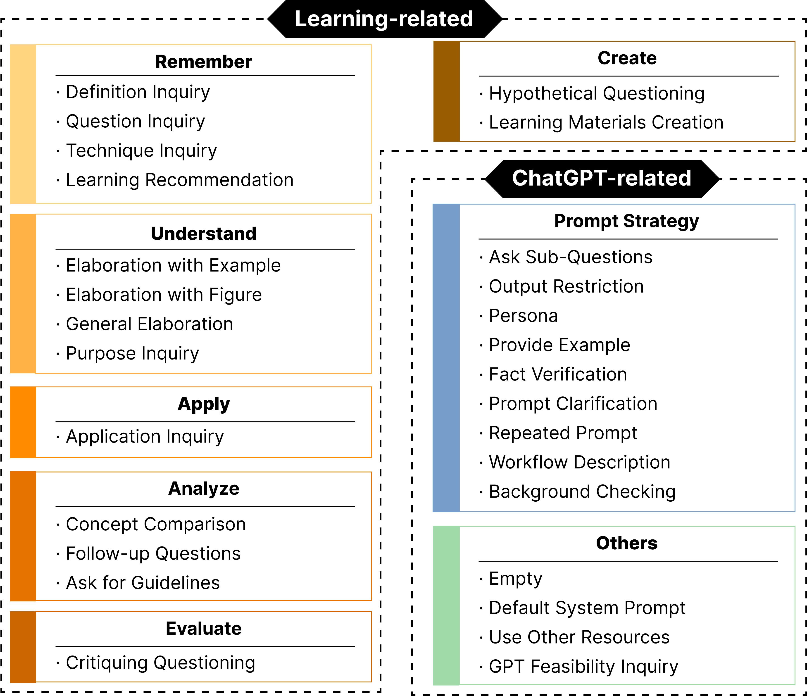

# StuGPTViz：探索学生与ChatGPT互动的可视化分析工具

发布时间：2024年07月17日

`LLM应用` `人工智能`

> StuGPTViz: A Visual Analytics Approach to Understand Student-ChatGPT Interactions

# 摘要

> 将ChatGPT等大型语言模型融入教育，正通过创新的对话学习方式重塑学习体验。为使学生充分运用ChatGPT，教师需深入理解其交互模式。面对缺乏相关数据集及分析交互演变的复杂性，我们收集了48名硕士生与ChatGPT的对话数据，并基于认知与主题分析文献制定了编码方案，分类交互模式。我们开发的StuGPTViz系统，通过多尺度追踪与比较学生提示及ChatGPT响应质量，为教师提供了宝贵见解。通过专家访谈与案例研究，我们验证了StuGPTViz的有效性，确认其能深化教育者对ChatGPT教学价值的认识。此外，我们还探讨了在教育中应用可视化分析及开发AI个性化学习方案的研究前景。

> The integration of Large Language Models (LLMs), especially ChatGPT, into education is poised to revolutionize students' learning experiences by introducing innovative conversational learning methodologies. To empower students to fully leverage the capabilities of ChatGPT in educational scenarios, understanding students' interaction patterns with ChatGPT is crucial for instructors. However, this endeavor is challenging due to the absence of datasets focused on student-ChatGPT conversations and the complexities in identifying and analyzing the evolutional interaction patterns within conversations. To address these challenges, we collected conversational data from 48 students interacting with ChatGPT in a master's level data visualization course over one semester. We then developed a coding scheme, grounded in the literature on cognitive levels and thematic analysis, to categorize students' interaction patterns with ChatGPT. Furthermore, we present a visual analytics system, StuGPTViz, that tracks and compares temporal patterns in student prompts and the quality of ChatGPT's responses at multiple scales, revealing significant pedagogical insights for instructors. We validated the system's effectiveness through expert interviews with six data visualization instructors and three case studies. The results confirmed StuGPTViz's capacity to enhance educators' insights into the pedagogical value of ChatGPT. We also discussed the potential research opportunities of applying visual analytics in education and developing AI-driven personalized learning solutions.

[Arxiv](https://arxiv.org/abs/2407.12423)