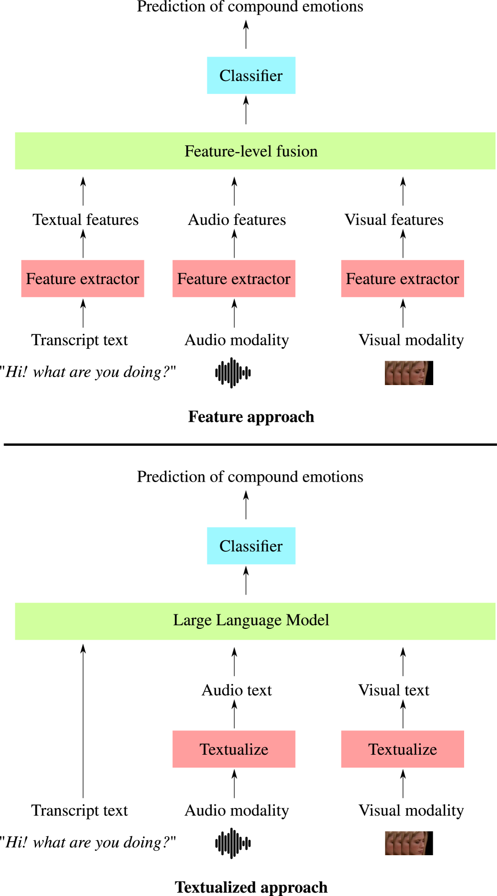
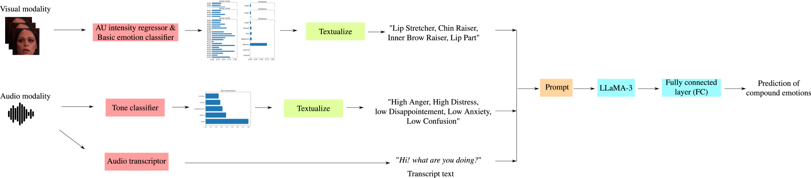

# 针对野外环境中的复合多模态情绪识别，我们提出了基于文本和特征的模型。

发布时间：2024年07月17日

`LLM应用` `情感分析` `视频处理`

> Text- and Feature-based Models for Compound Multimodal Emotion Recognition in the Wild

# 摘要

> 多模态情感识别系统常通过提取视觉、音频和文本等不同模态的特征来预测基本情感，但现实中的复合情感更难预测，尤其在视频中因模态多样性而更具挑战。传统基于特征的模型可能难以捕捉复合情感的复杂细节。为此，我们建议将所有模态文本化，借助大型语言模型（如 BERT 和 LLaMA）来解析模态间的复杂互动和情感的微妙变化。尽管训练这些模型需大量数据，但预训练模型已可便捷地微调应用于复合情感识别等任务。本文对比了视频复合情感识别的两种方法：传统特征基与创新文本基。实验在 C-EXPR-DB 数据集上进行，并与 MELD 数据集的基本情感识别结果对比。相关代码已公开。

> Systems for multimodal Emotion Recognition (ER) commonly rely on features extracted from different modalities (e.g., visual, audio, and textual) to predict the seven basic emotions. However, compound emotions often occur in real-world scenarios and are more difficult to predict. Compound multimodal ER becomes more challenging in videos due to the added uncertainty of diverse modalities.
  In addition, standard features-based models may not fully capture the complex and subtle cues needed to understand compound emotions.
  %%%%
  Since relevant cues can be extracted in the form of text, we advocate for textualizing all modalities, such as visual and audio, to harness the capacity of large language models (LLMs). These models may understand the complex interaction between modalities and the subtleties of complex emotions. Although training an LLM requires large-scale datasets, a recent surge of pre-trained LLMs, such as BERT and LLaMA, can be easily fine-tuned for downstream tasks like compound ER.
  This paper compares two multimodal modeling approaches for compound ER in videos -- standard feature-based vs. text-based. Experiments were conducted on the challenging C-EXPR-DB dataset for compound ER, and contrasted with results on the MELD dataset for basic ER.
  Our code is available

[Arxiv](https://arxiv.org/abs/2407.12927)