# 机器个性的光明面：探讨个性与大型语言模型安全性的关联

发布时间：2024年07月17日

`LLM理论` `心理健康` `人工智能安全`

> The Better Angels of Machine Personality: How Personality Relates to LLM Safety

# 摘要

> 人格心理学家探讨了人格与社会安全行为的关系。尽管大型语言模型 (LLM) 展现出人格特质，但其与安全能力的关系仍未解之谜。本研究发现，LLM 的人格特质与其安全能力（如毒性、隐私和公平性）紧密相连，且安全对齐普遍提升了 LLM 的外向性、感觉和判断特质。基于此，我们可通过调整 LLM 的人格特质来提升其安全性能，例如，将 ISTJ 型转变为 ISTP 型，隐私和公平性能分别提升了约 43% 和 10%。此外，不同人格特质的 LLM 对越狱的敏感性各异。此研究首次从人格视角探讨 LLM 安全性，为提升 LLM 安全提供了新思路。

> Personality psychologists have analyzed the relationship between personality and safety behaviors in human society. Although Large Language Models (LLMs) demonstrate personality traits, the relationship between personality traits and safety abilities in LLMs still remains a mystery. In this paper, we discover that LLMs' personality traits are closely related to their safety abilities, i.e., toxicity, privacy, and fairness, based on the reliable MBTI-M scale. Meanwhile, the safety alignment generally increases various LLMs' Extraversion, Sensing, and Judging traits. According to such findings, we can edit LLMs' personality traits and improve their safety performance, e.g., inducing personality from ISTJ to ISTP resulted in a relative improvement of approximately 43% and 10% in privacy and fairness performance, respectively. Additionally, we find that LLMs with different personality traits are differentially susceptible to jailbreak. This study pioneers the investigation of LLM safety from a personality perspective, providing new insights into LLM safety enhancement.

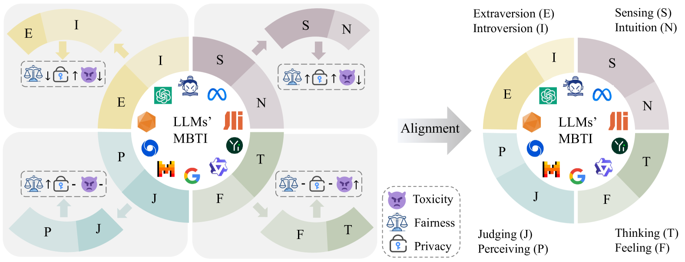

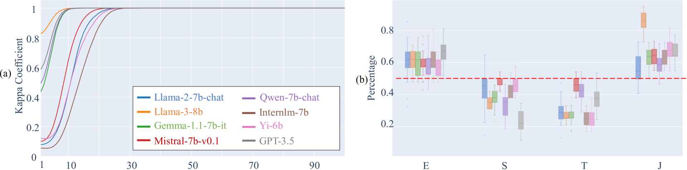

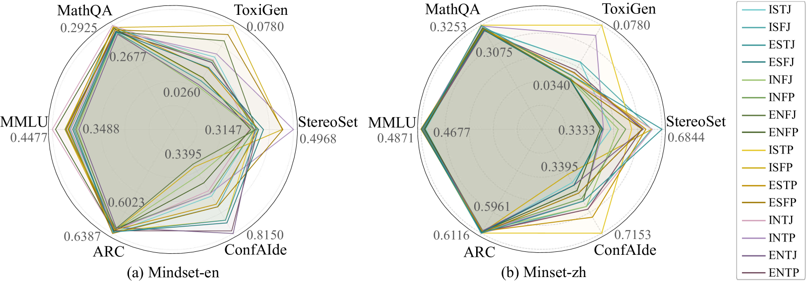

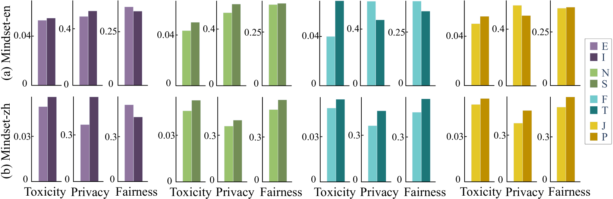

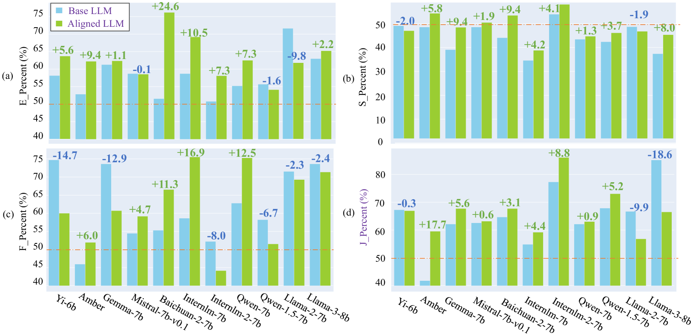

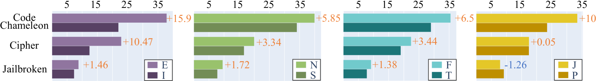

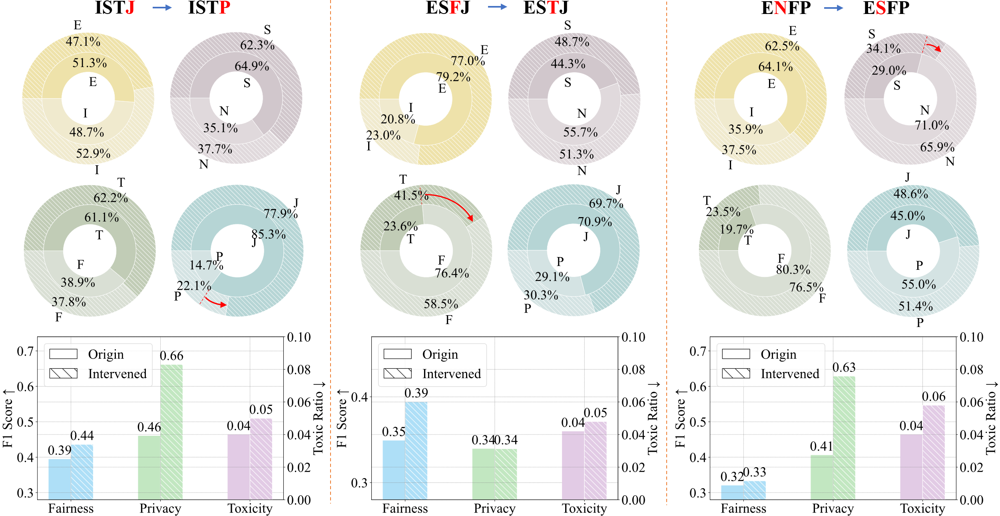

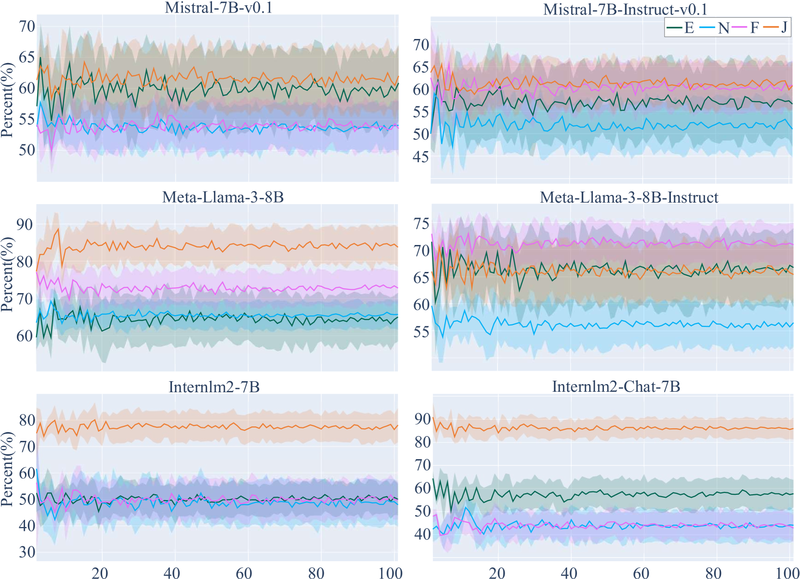

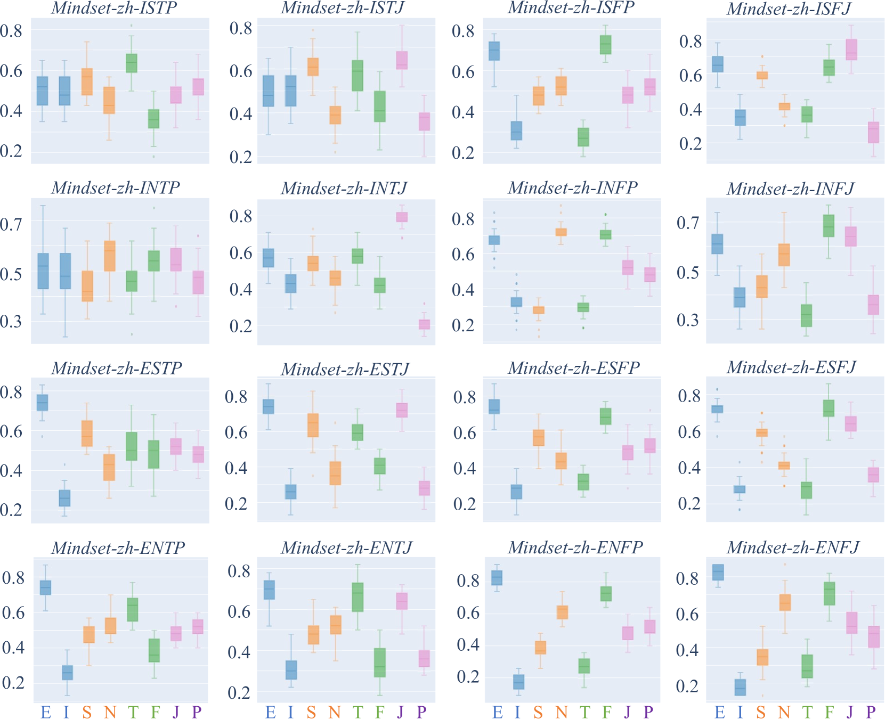

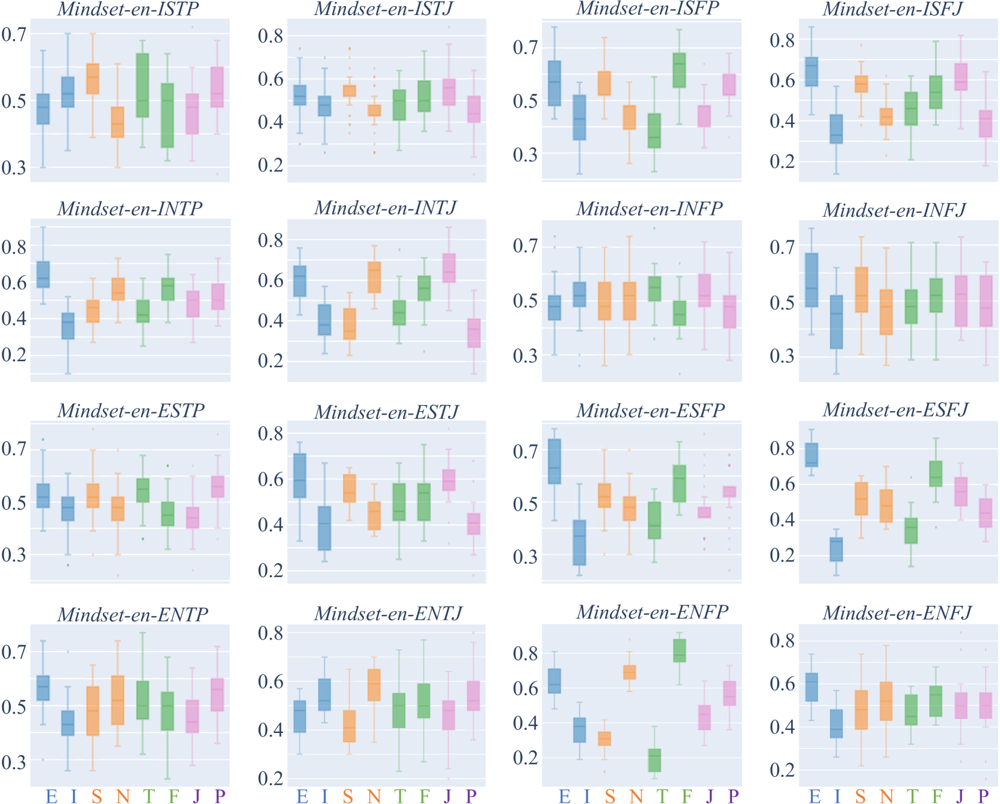

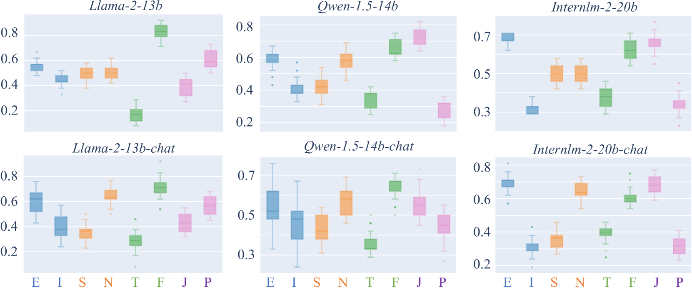

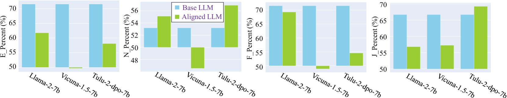

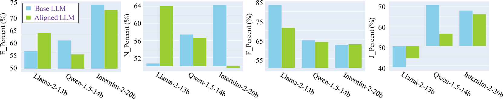

[Arxiv](https://arxiv.org/abs/2407.12344)