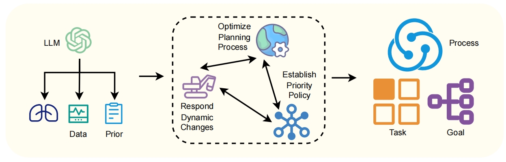

# 迈向协作智能：利用大型语言模型，推动多智能体间的意图交流与协同推理

发布时间：2024年07月17日

`Agent` `人工智能` `多代理系统`

> Towards Collaborative Intelligence: Propagating Intentions and Reasoning for Multi-Agent Coordination with Large Language Models

# 摘要

> 在多代理系统中，有效协作的关键在于代理间目标与意图的沟通。然而，现有框架常因单一代理执行的依赖和模块间通信不足，导致MARL策略不佳和任务协调不力。为此，我们设计了一个框架，利用LLM训练协作代理，以促进合作性MARL中的协调行为。每个代理持有包含当前目标与子任务的私人意图，并定期广播，使其他代理能推断协调任务。通过传播网络，广播的意图被转化为针对特定队友的通信消息，确保目标共享的精准性。框架分为规划、接地和执行三大模块。执行中，代理们在环境中互动并沟通意图，实现协调行为。接地模块根据协调模式动态调整理解策略，执行反馈则驱动规划模块进行子任务的动态重规划。模拟结果显示，意图传播有效减少了协调错误，代理们学会了何时沟通及向谁提供任务细节，从而促成了协调行为的涌现。这充分展示了基于LLM的意图共享在合作性多代理RL中的强大效能。

> Effective collaboration in multi-agent systems requires communicating goals and intentions between agents. Current agent frameworks often suffer from dependencies on single-agent execution and lack robust inter-module communication, frequently leading to suboptimal multi-agent reinforcement learning (MARL) policies and inadequate task coordination. To address these challenges, we present a framework for training large language models (LLMs) as collaborative agents to enable coordinated behaviors in cooperative MARL. Each agent maintains a private intention consisting of its current goal and associated sub-tasks. Agents broadcast their intentions periodically, allowing other agents to infer coordination tasks. A propagation network transforms broadcast intentions into teammate-specific communication messages, sharing relevant goals with designated teammates. The architecture of our framework is structured into planning, grounding, and execution modules. During execution, multiple agents interact in a downstream environment and communicate intentions to enable coordinated behaviors. The grounding module dynamically adapts comprehension strategies based on emerging coordination patterns, while feedback from execution agents influnces the planning module, enabling the dynamic re-planning of sub-tasks. Results in collaborative environment simulation demonstrate intention propagation reduces miscoordination errors by aligning sub-task dependencies between agents. Agents learn when to communicate intentions and which teammates require task details, resulting in emergent coordinated behaviors. This demonstrates the efficacy of intention sharing for cooperative multi-agent RL based on LLMs.

[Arxiv](https://arxiv.org/abs/2407.12532)