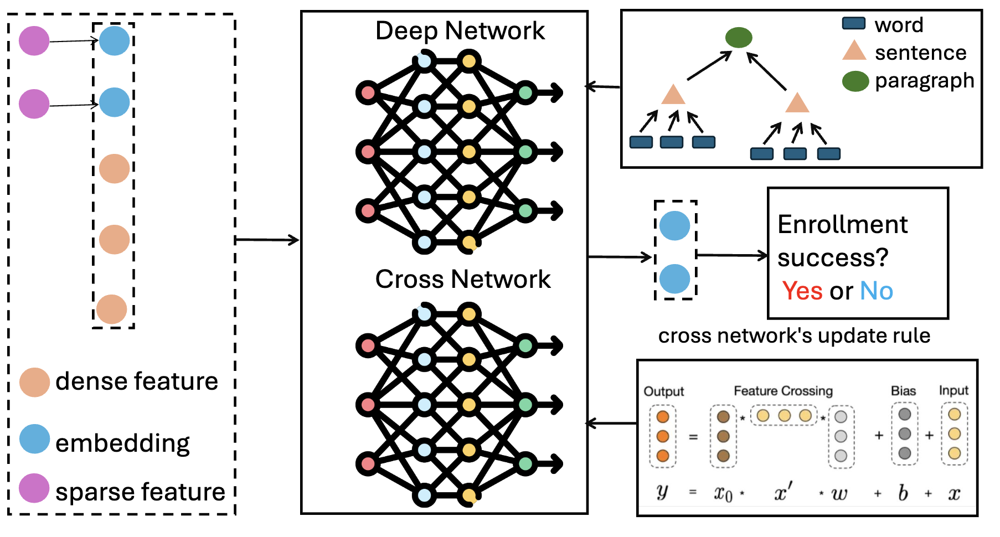

# TrialEnroll 项目：结合深度与交叉网络及大型语言模型，精准预测临床试验的招募成功率。

发布时间：2024年07月17日

`LLM应用` `临床试验`

> TrialEnroll: Predicting Clinical Trial Enrollment Success with Deep & Cross Network and Large Language Models

# 摘要

> 临床试验的成功与否，很大程度上取决于能否招募到足够数量的志愿者患者。本文创新性地采用深度与交叉网络，辅以大型语言模型增强的文本特征，从试验资格标准中提取关键语义信息，精准预测入组成功率。该方法不仅提高了预测的准确性（PR-AUC达到0.7002），还增强了模型的可解释性，揭示了资格标准中哪些词句对预测结果影响最大。相关代码和数据集已公开，供学术界进一步研究与应用。

> Clinical trials need to recruit a sufficient number of volunteer patients to demonstrate the statistical power of the treatment (e.g., a new drug) in curing a certain disease. Clinical trial recruitment has a significant impact on trial success. Forecasting whether the recruitment process would be successful before we run the trial would save many resources and time. This paper develops a novel deep & cross network with large language model (LLM)-augmented text feature that learns semantic information from trial eligibility criteria and predicts enrollment success. The proposed method enables interpretability by understanding which sentence/word in eligibility criteria contributes heavily to prediction. We also demonstrate the empirical superiority of the proposed method (0.7002 PR-AUC) over a bunch of well-established machine learning methods. The code and curated dataset are publicly available at https://anonymous.4open.science/r/TrialEnroll-7E12.

[Arxiv](https://arxiv.org/abs/2407.13115)