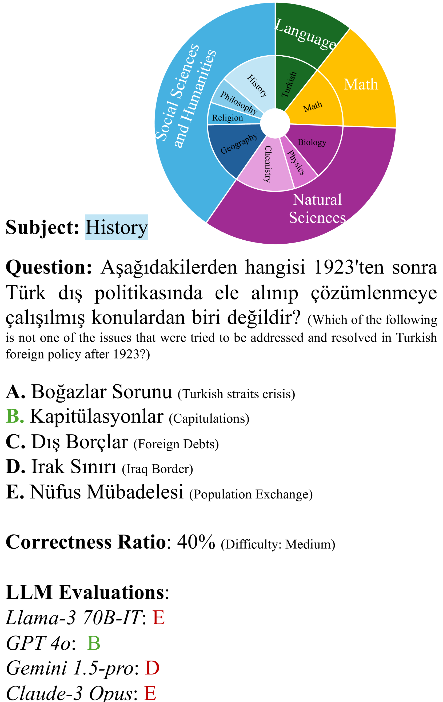
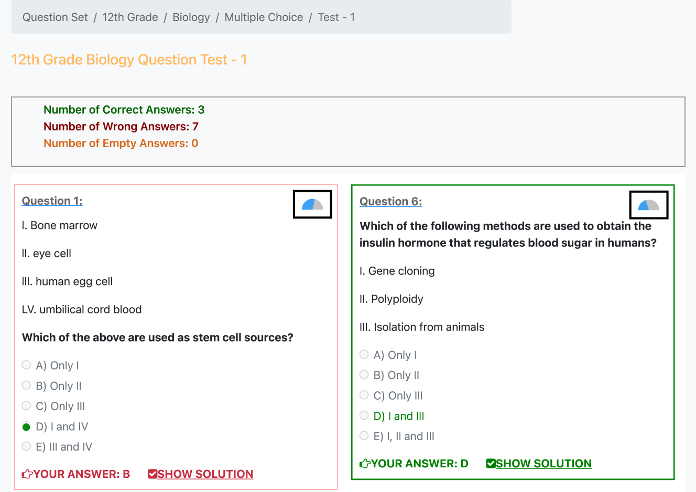
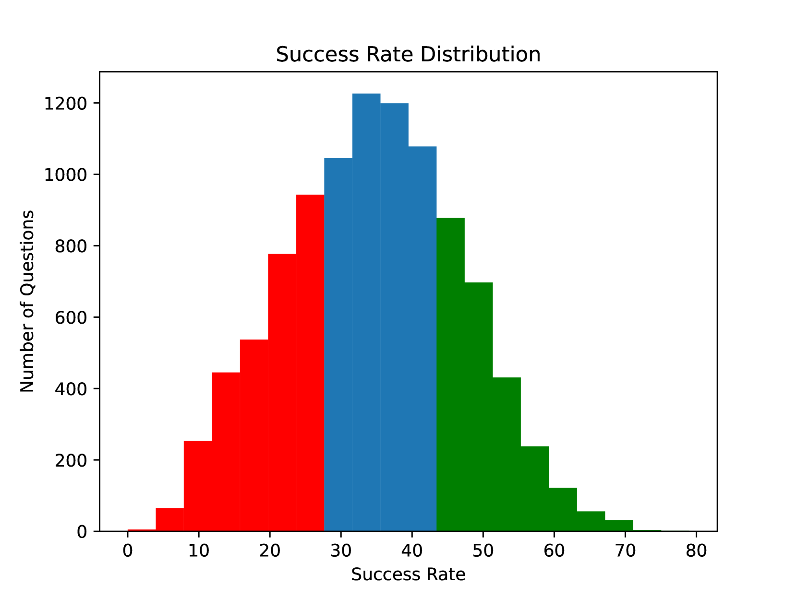
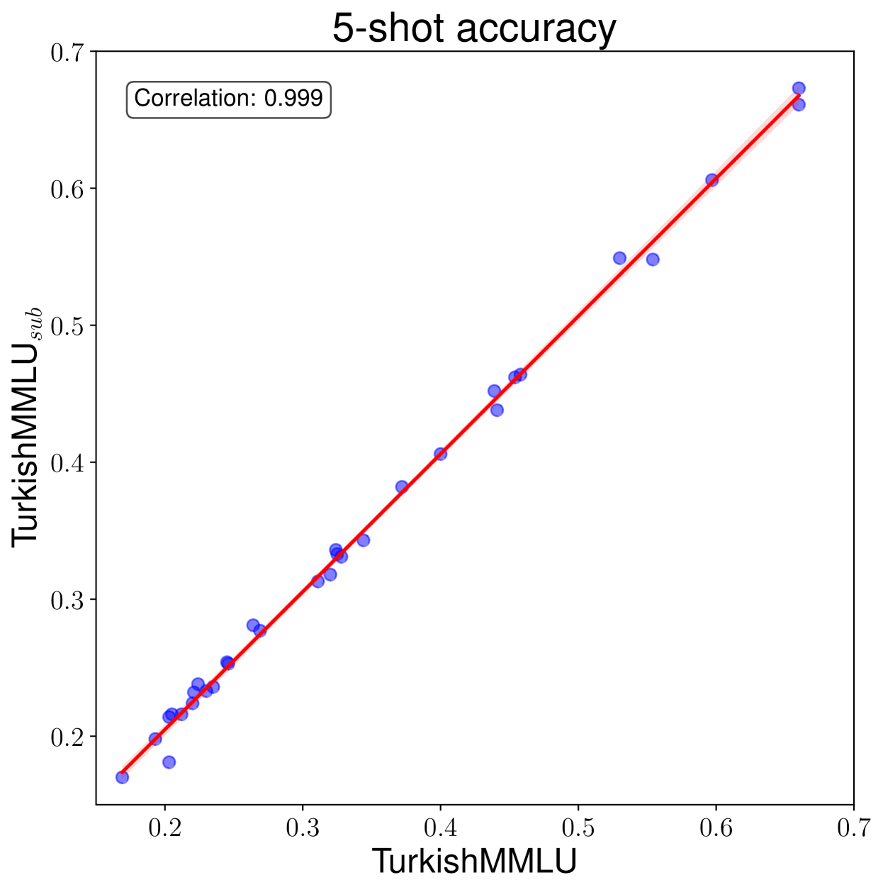

# TurkishMMLU：探索土耳其语中的大规模多任务语言理解能力

发布时间：2024年07月17日

`LLM应用` `语言处理`

> TurkishMMLU: Measuring Massive Multitask Language Understanding in Turkish

# 摘要

> 我们推出了首个多任务的土耳其多选QA基准——TurkishMMLU，旨在评估大型语言模型（LLMs）对土耳其语的理解。该基准包含超过10,000个问题，覆盖土耳其高中课程的9大科目，由专家精心编写，适合当地教育体系。我们评估了20多个模型，包括开源、闭源及土耳其本土适配模型，并进行了全面的性能分析，涵盖零-shot、少-shot学习、思维链推理及问题难度评估。通过深入剖析，我们揭示了当前LLMs在土耳其语处理上的优势与不足，为未来发展提供参考。相关代码已公开发布于：https://github.com/ArdaYueksel/TurkishMMLU。

> Multiple choice question answering tasks evaluate the reasoning, comprehension, and mathematical abilities of Large Language Models (LLMs). While existing benchmarks employ automatic translation for multilingual evaluation, this approach is error-prone and potentially introduces culturally biased questions, especially in social sciences. We introduce the first multitask, multiple-choice Turkish QA benchmark, TurkishMMLU, to evaluate LLMs' understanding of the Turkish language. TurkishMMLU includes over 10,000 questions, covering 9 different subjects from Turkish high-school education curricula. These questions are written by curriculum experts, suitable for the high-school curricula in Turkey, covering subjects ranging from natural sciences and math questions to more culturally representative topics such as Turkish Literature and the history of the Turkish Republic. We evaluate over 20 LLMs, including multilingual open-source (e.g., Gemma, Llama, MT5), closed-source (GPT 4o, Claude, Gemini), and Turkish-adapted (e.g., Trendyol) models. We provide an extensive evaluation, including zero-shot and few-shot evaluation of LLMs, chain-of-thought reasoning, and question difficulty analysis along with model performance. We provide an in-depth analysis of the Turkish capabilities and limitations of current LLMs to provide insights for future LLMs for the Turkish language. We publicly release our code for the dataset and evaluation: https://github.com/ArdaYueksel/TurkishMMLU.

[Arxiv](https://arxiv.org/abs/2407.12402)