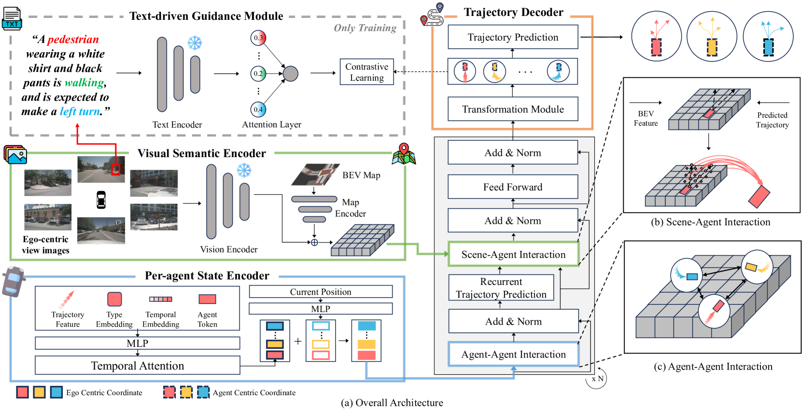

# VisionTrap：结合文本描述，增强视觉引导的轨迹预测技术

发布时间：2024年07月17日

`Agent` `自动驾驶` `计算机视觉`

> VisionTrap: Vision-Augmented Trajectory Prediction Guided by Textual Descriptions

# 摘要

> 为自动驾驶车辆预测其他道路代理的未来轨迹是一项关键任务。传统方法主要依赖于检测和跟踪系统生成的轨迹及高清地图。我们提出了一种创新方法，不仅利用这些数据，还引入了环视摄像机的视觉输入，使模型能捕捉到人类目光、手势、道路状况及车辆信号等细节。此外，我们通过视觉-语言模型生成的文本描述，并由大型语言模型进一步细化，来指导模型学习。尽管增加了这些输入，我们的方法仍能以53毫秒的低延迟实现实时处理，远超同类方法。实验证明，视觉和文本输入均有效提升预测性能。我们还发布了nuScenes-Text数据集，通过丰富的文本注释增强了nuScenes数据集，展示了VLM在轨迹预测中的潜力。项目详情见https://moonseokha.github.io/VisionTrap/。

> Predicting future trajectories for other road agents is an essential task for autonomous vehicles. Established trajectory prediction methods primarily use agent tracks generated by a detection and tracking system and HD map as inputs. In this work, we propose a novel method that also incorporates visual input from surround-view cameras, allowing the model to utilize visual cues such as human gazes and gestures, road conditions, vehicle turn signals, etc, which are typically hidden from the model in prior methods. Furthermore, we use textual descriptions generated by a Vision-Language Model (VLM) and refined by a Large Language Model (LLM) as supervision during training to guide the model on what to learn from the input data. Despite using these extra inputs, our method achieves a latency of 53 ms, making it feasible for real-time processing, which is significantly faster than that of previous single-agent prediction methods with similar performance. Our experiments show that both the visual inputs and the textual descriptions contribute to improvements in trajectory prediction performance, and our qualitative analysis highlights how the model is able to exploit these additional inputs. Lastly, in this work we create and release the nuScenes-Text dataset, which augments the established nuScenes dataset with rich textual annotations for every scene, demonstrating the positive impact of utilizing VLM on trajectory prediction. Our project page is at https://moonseokha.github.io/VisionTrap/

[Arxiv](https://arxiv.org/abs/2407.12345)