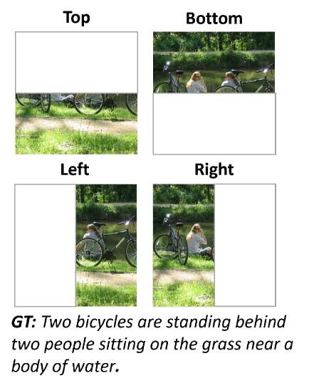

# 借助 LLM 引导，实现零-shot 文本驱动的无限图像合成

发布时间：2024年07月17日

`LLM应用` `图像处理` `人工智能`

> Zero-shot Text-guided Infinite Image Synthesis with LLM guidance

# 摘要

> 文本引导的图像编辑与生成技术应用广泛，但无限图像合成仍面临挑战。首先，高分辨率且上下文多样的文本-图像配对数据稀缺。其次，基于文本的图像扩展需全局连贯与细致的局部理解。传统研究多聚焦于特定类别，如自然景观，且依赖高分辨率配对数据训练。为此，我们创新地运用大型语言模型（LLM），无需高分辨率配对数据，实现全局连贯与局部理解。训练扩散模型时，我们依据LLM生成的全局与局部描述及视觉特征扩展图像。推理时，结合图像与全局描述，LLM生成局部描述以扩展图像，确保全局一致与空间局部细节。实验证明，我们的模型在数量与质量上均超越基线，并能在LLM引导下零-shot生成任意尺寸的文本引导图像。

> Text-guided image editing and generation methods have diverse real-world applications. However, text-guided infinite image synthesis faces several challenges. First, there is a lack of text-image paired datasets with high-resolution and contextual diversity. Second, expanding images based on text requires global coherence and rich local context understanding. Previous studies have mainly focused on limited categories, such as natural landscapes, and also required to train on high-resolution images with paired text. To address these challenges, we propose a novel approach utilizing Large Language Models (LLMs) for both global coherence and local context understanding, without any high-resolution text-image paired training dataset. We train the diffusion model to expand an image conditioned on global and local captions generated from the LLM and visual feature. At the inference stage, given an image and a global caption, we use the LLM to generate a next local caption to expand the input image. Then, we expand the image using the global caption, generated local caption and the visual feature to consider global consistency and spatial local context. In experiments, our model outperforms the baselines both quantitatively and qualitatively. Furthermore, our model demonstrates the capability of text-guided arbitrary-sized image generation in zero-shot manner with LLM guidance.

[Arxiv](https://arxiv.org/abs/2407.12642)