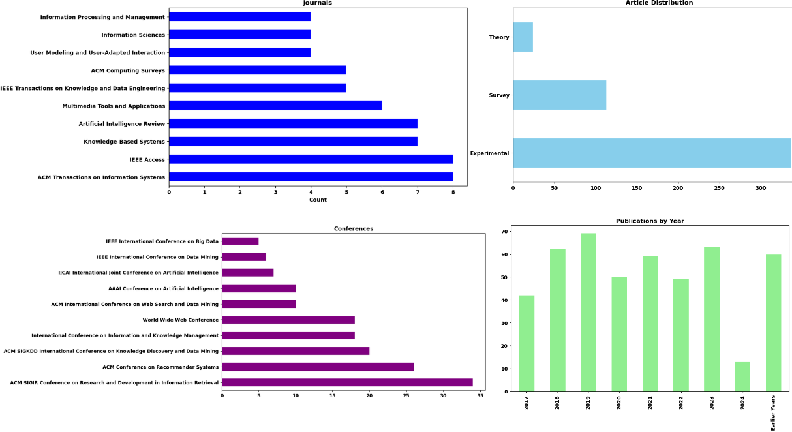
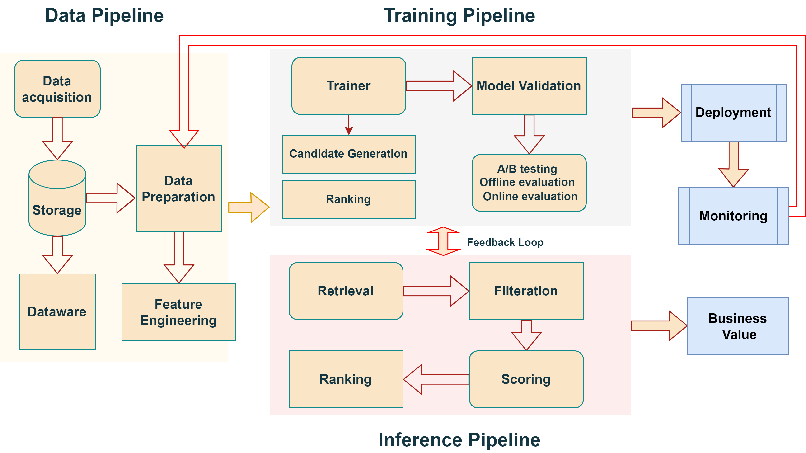
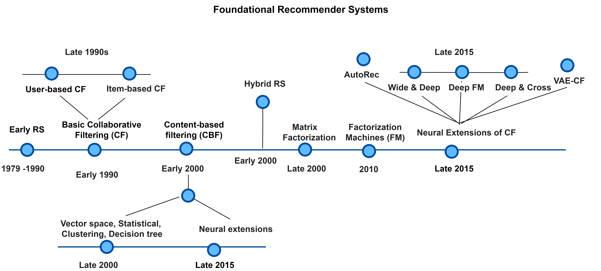

# 推荐系统全面回顾：跨越理论与实践的桥梁

发布时间：2024年07月18日

`LLM应用` `电子商务` `医疗保健`

> A Comprehensive Review of Recommender Systems: Transitioning from Theory to Practice

# 摘要

> 推荐系统 (RS) 通过个性化建议，极大地提升了用户体验。本次调查从 2017 年至 2024 年全面审视了 RS 的发展，将理论与实践紧密结合。我们追溯了从传统技术如基于内容和协同过滤到现代方法如深度学习、图模型、强化学习及大型语言模型的演进。同时，我们探讨了上下文感知、基于评论和注重公平的特殊系统。本次调查旨在弥合理论与实践的鸿沟，应对电子商务、医疗保健和金融等领域的挑战，强调解决方案需兼具可扩展性、实时性和可信度。通过本次调查，我们加强了学术与行业的合作，旨在指导行业优化 RS 应用，并激发未来研究，特别是应对新兴技术和社会趋势的研究方向。

> Recommender Systems (RS) play an integral role in enhancing user experiences by providing personalized item suggestions. This survey reviews the progress in RS inclusively from 2017 to 2024, effectively connecting theoretical advances with practical applications. We explore the development from traditional RS techniques like content-based and collaborative filtering to advanced methods involving deep learning, graph-based models, reinforcement learning, and large language models. We also discuss specialized systems such as context-aware, review-based, and fairness-aware RS. The primary goal of this survey is to bridge theory with practice. It addresses challenges across various sectors, including e-commerce, healthcare, and finance, emphasizing the need for scalable, real-time, and trustworthy solutions. Through this survey, we promote stronger partnerships between academic research and industry practices. The insights offered by this survey aim to guide industry professionals in optimizing RS deployment and to inspire future research directions, especially in addressing emerging technological and societal trends

[Arxiv](https://arxiv.org/abs/2407.13699)