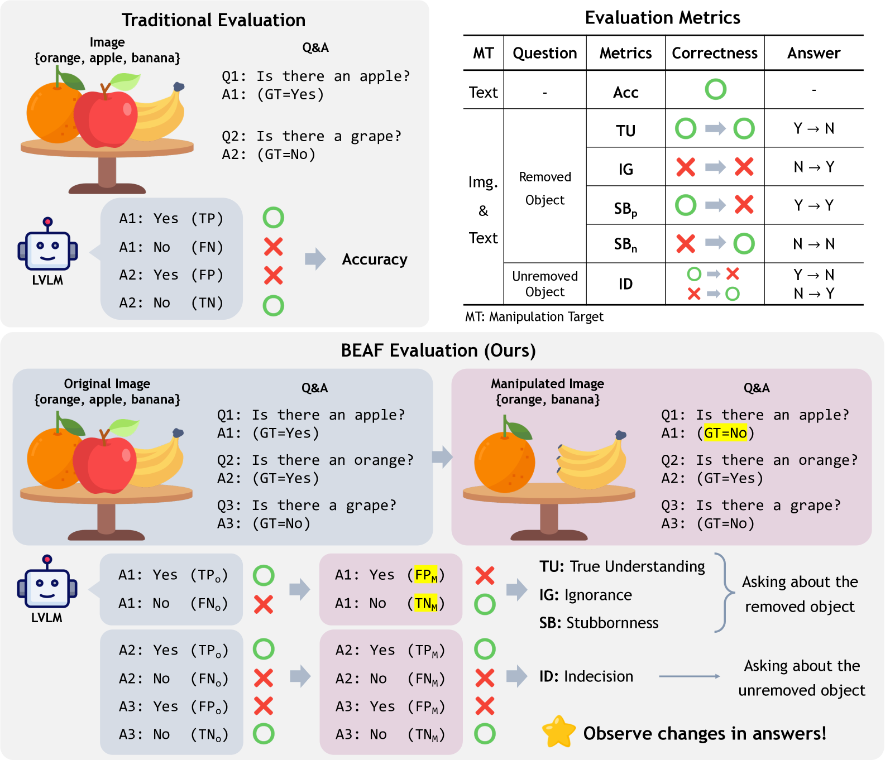
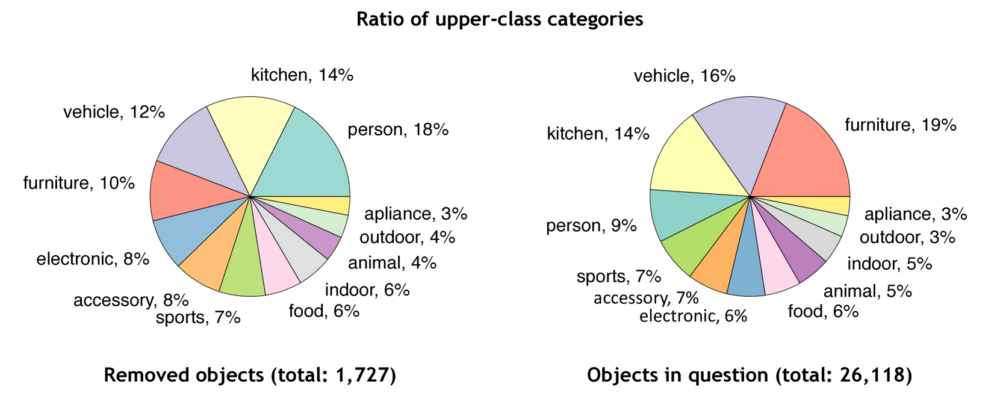
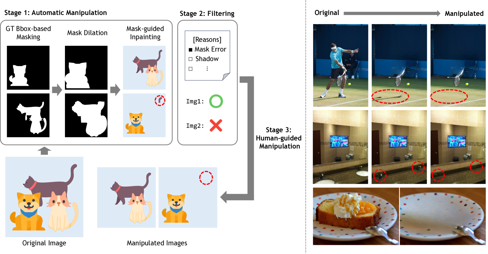
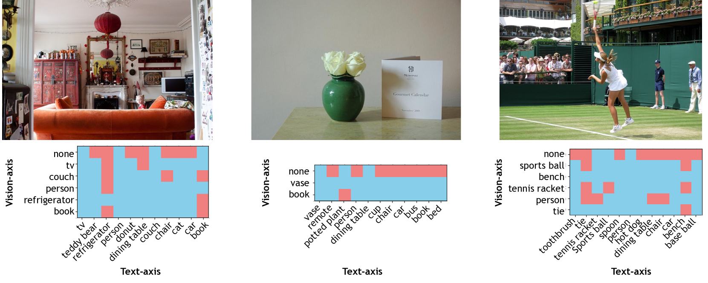
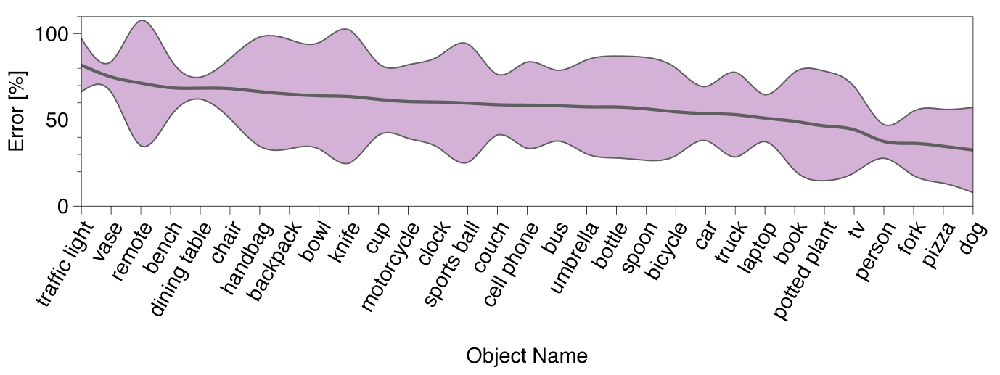
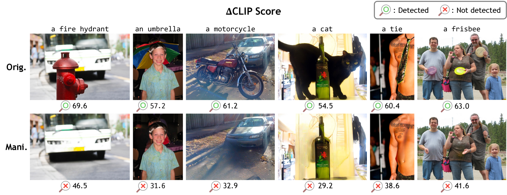
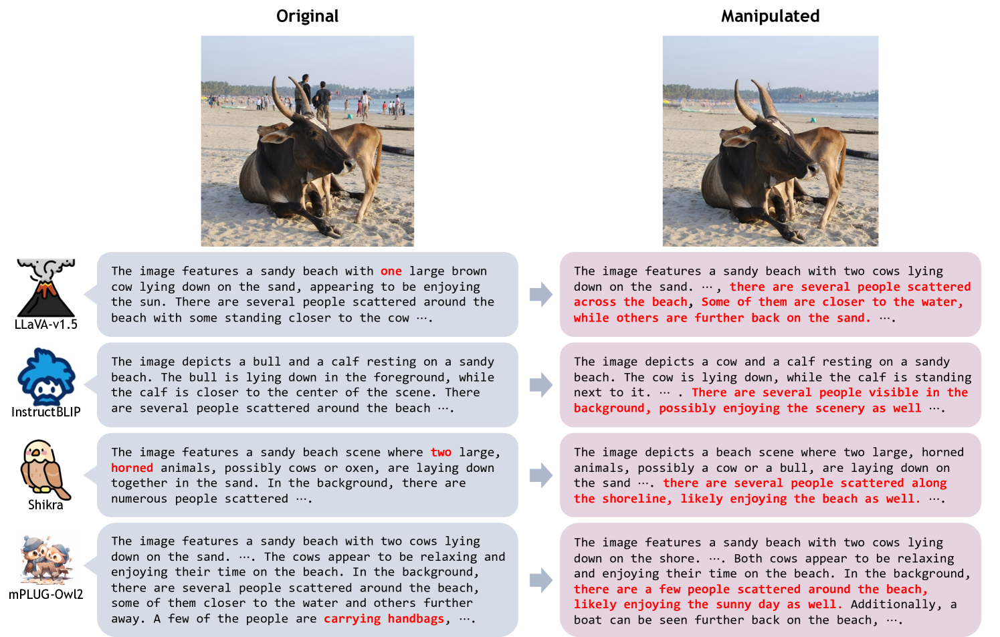

# BEAF：通过观察变化前后的情况，评估视觉-语言模型中的幻觉现象。

发布时间：2024年07月18日

`LLM应用` `人工智能` `计算机视觉`

> BEAF: Observing BEfore-AFter Changes to Evaluate Hallucination in Vision-language Models

# 摘要

> 视觉语言模型（VLMs）结合视觉编码器和大型语言模型（LLM）来感知世界，无需微调即可在广泛基准上实现高性能，展现出零-shot或few-shot能力。然而，VLMs易产生幻觉，影响其可靠性和可信度。为此，我们创建了BEfore-AFter幻觉数据集（BEAF），并引入True Understanding（TU）、IGnorance（IG）、StuBbornness（SB）和InDecision（ID）等新指标，通过图像编辑模型操纵视觉场景信息，基于场景变化设计指标，以评估VLMs对场景的理解。我们还通过双轴视图（视觉和文本）可视化图像对象关系。评估结果显示，这些新指标揭示了VLMs幻觉的未被报告的方面。项目页面：\url{https://beafbench.github.io/}

> Vision language models (VLMs) perceive the world through a combination of a visual encoder and a large language model (LLM). The visual encoder, pre-trained on large-scale vision-text datasets, provides zero-shot generalization to visual data, and the LLM endows its high reasoning ability to VLMs. It leads VLMs to achieve high performance on wide benchmarks without fine-tuning, exhibiting zero or few-shot capability. However, recent studies show that VLMs are vulnerable to hallucination. This undesirable behavior degrades reliability and credibility, thereby making users unable to fully trust the output from VLMs. To enhance trustworthiness and better tackle the hallucination of VLMs, we curate a new evaluation dataset, called the BEfore-AFter hallucination dataset (BEAF), and introduce new metrics: True Understanding (TU), IGnorance (IG), StuBbornness (SB), and InDecision (ID). Unlike prior works that focus only on constructing questions and answers, the key idea of our benchmark is to manipulate visual scene information by image editing models and to design the metrics based on scene changes. This allows us to clearly assess whether VLMs correctly understand a given scene by observing the ability to perceive changes. We also visualize image-wise object relationship by virtue of our two-axis view: vision and text. Upon evaluating VLMs with our dataset, we observed that our metrics reveal different aspects of VLM hallucination that have not been reported before. Project page: \url{https://beafbench.github.io/}

[Arxiv](https://arxiv.org/abs/2407.13442)