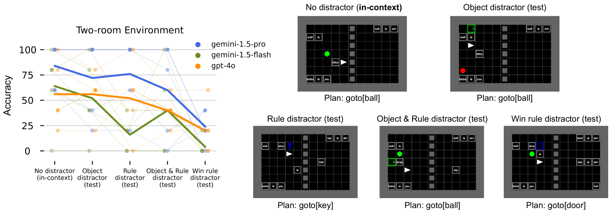

# Baba Is AI：破旧立新，超越基准

发布时间：2024年07月18日

`Agent` `人工智能`

> Baba Is AI: Break the Rules to Beat the Benchmark

# 摘要

> 人类解决问题既依赖于遵循现有规则，也通过创造性思维重新定义规则和目标。为此，我们基于游戏 Baba Is You 设计了一个新基准，模拟代理通过操作环境和规则瓷砖来达成目标。测试了三种顶尖的多模态大型语言模型后，我们发现它们在需要灵活操纵和组合游戏规则的泛化任务中表现不佳。

> Humans solve problems by following existing rules and procedures, and also by leaps of creativity to redefine those rules and objectives. To probe these abilities, we developed a new benchmark based on the game Baba Is You where an agent manipulates both objects in the environment and rules, represented by movable tiles with words written on them, to reach a specified goal and win the game. We test three state-of-the-art multi-modal large language models (OpenAI GPT-4o, Google Gemini-1.5-Pro and Gemini-1.5-Flash) and find that they fail dramatically when generalization requires that the rules of the game must be manipulated and combined.

[Arxiv](https://arxiv.org/abs/2407.13729)