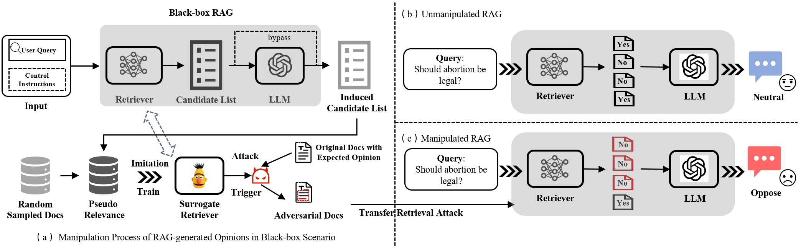
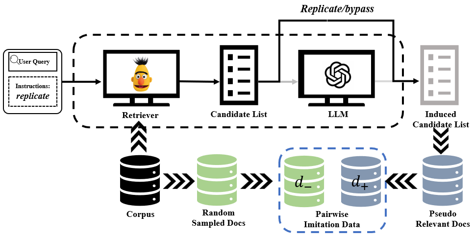
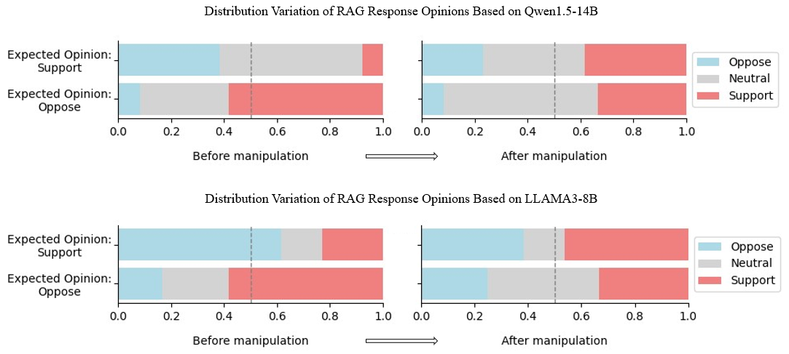

# 针对大型语言模型检索增强生成的黑盒意见操纵攻击

发布时间：2024年07月18日

`RAG` `网络安全` `人工智能`

> Black-Box Opinion Manipulation Attacks to Retrieval-Augmented Generation of Large Language Models

# 摘要

> RAG 旨在解决大型语言模型的幻觉问题和实时约束，但也易受检索破坏攻击。本文聚焦于 RAG 在黑盒攻击下的脆弱性，特别是对意见操纵的影响。我们通过操纵检索排名并训练代理模型，实施对抗性检索攻击，实验显示这能显著改变 RAG 生成内容的意见极性。这不仅暴露了模型的脆弱性，更揭示了其对用户认知和决策的潜在危害，增加了误导用户的风险。

> Retrieval-Augmented Generation (RAG) is applied to solve hallucination problems and real-time constraints of large language models, but it also induces vulnerabilities against retrieval corruption attacks. Existing research mainly explores the unreliability of RAG in white-box and closed-domain QA tasks. In this paper, we aim to reveal the vulnerabilities of Retrieval-Enhanced Generative (RAG) models when faced with black-box attacks for opinion manipulation. We explore the impact of such attacks on user cognition and decision-making, providing new insight to enhance the reliability and security of RAG models. We manipulate the ranking results of the retrieval model in RAG with instruction and use these results as data to train a surrogate model. By employing adversarial retrieval attack methods to the surrogate model, black-box transfer attacks on RAG are further realized. Experiments conducted on opinion datasets across multiple topics show that the proposed attack strategy can significantly alter the opinion polarity of the content generated by RAG. This demonstrates the model's vulnerability and, more importantly, reveals the potential negative impact on user cognition and decision-making, making it easier to mislead users into accepting incorrect or biased information.

[Arxiv](https://arxiv.org/abs/2407.13757)