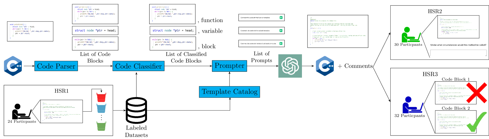
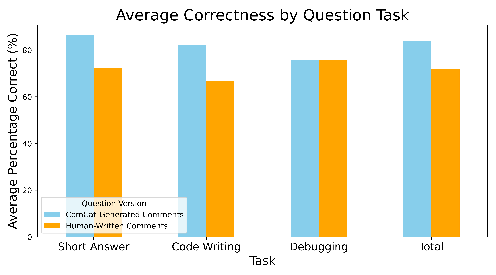

# COMCAT：借助人类智慧，提升自动文档与摘要的质量

发布时间：2024年07月18日

`LLM应用` `软件工程` `信息技术`

> COMCAT: Leveraging Human Judgment to Improve Automatic Documentation and Summarization

# 摘要

> 软件维护成本高昂，其中代码理解占据了重要部分。为此，我们推出了COMCAT，一种利用大型语言模型（LLMs）结合专业指导上下文自动生成注释的方法，旨在提升代码的可理解性。COMCAT能够精准选择并生成最相关的注释，适用于C/C++文件，通过自动定位、预测注释类型并生成注释。在实际测试中，COMCAT显著提升了开发者在三个关键软件工程任务中的代码理解能力，高达12%的提升受益于87%的参与者。同时，COMCAT生成的注释在准确性和可读性上不逊于人类作品，且在92%的代码片段中优于ChatGPT的标准注释。此外，我们还发布了一个包含源代码、人类注释及类别标注的数据集，以支持COMCAT在多样化软件工程任务中的应用。

> Software maintenance constitutes a substantial portion of the total lifetime costs of software, with a significant portion attributed to code comprehension. Software comprehension is eased by documentation such as comments that summarize and explain code. We present COMCAT, an approach to automate comment generation by augmenting Large Language Models (LLMs) with expertise-guided context to target the annotation of source code with comments that improve comprehension. Our approach enables the selection of the most relevant and informative comments for a given snippet or file containing source code. We develop the COMCAT pipeline to comment C/C++ files by (1) automatically identifying suitable locations in which to place comments, (2) predicting the most helpful type of comment for each location, and (3) generating a comment based on the selected location and comment type. In a human subject evaluation, we demonstrate that COMCAT-generated comments significantly improve developer code comprehension across three indicative software engineering tasks by up to 12% for 87% of participants. In addition, we demonstrate that COMCAT-generated comments are at least as accurate and readable as human-generated comments and are preferred over standard ChatGPT-generated comments for up to 92% of snippets of code. Furthermore, we develop and release a dataset containing source code snippets, human-written comments, and human-annotated comment categories. COMCAT leverages LLMs to offer a significant improvement in code comprehension across a variety of human software engineering tasks.

[Arxiv](https://arxiv.org/abs/2407.13648)