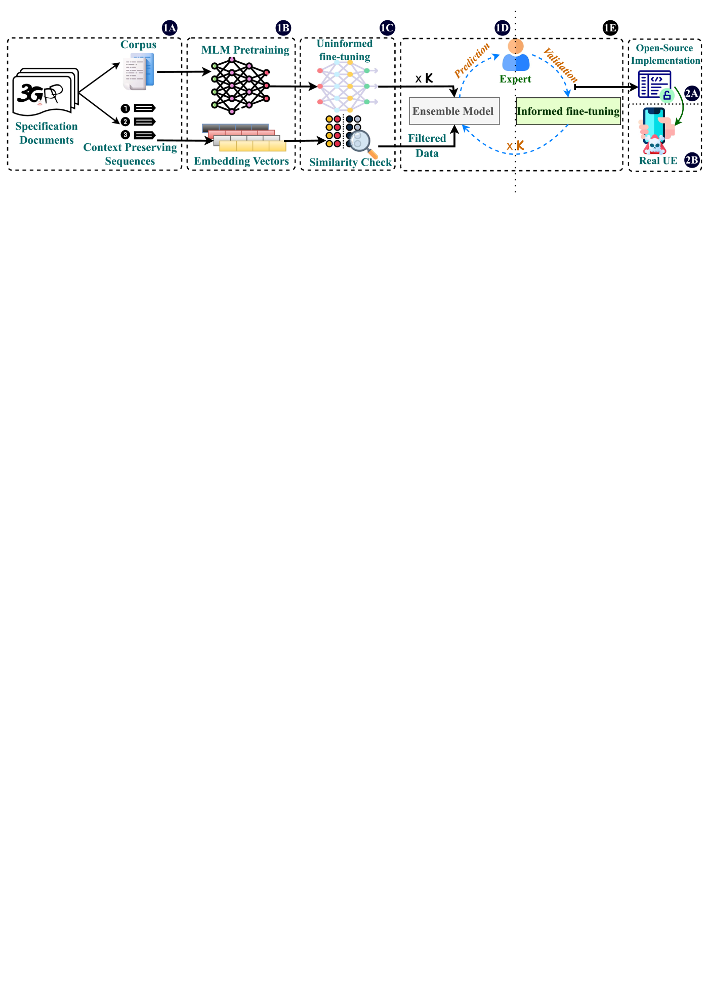
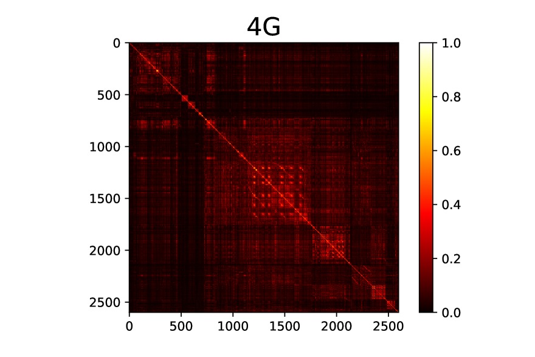
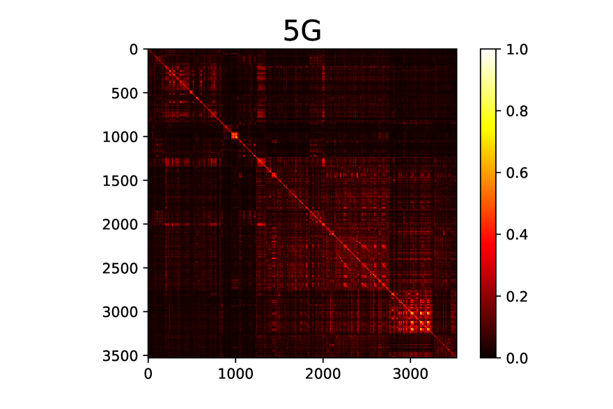
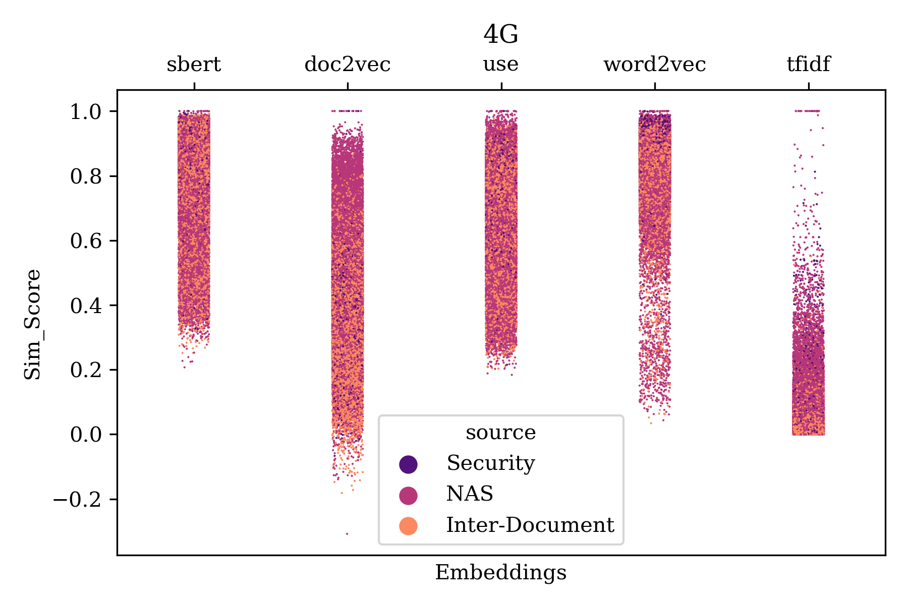
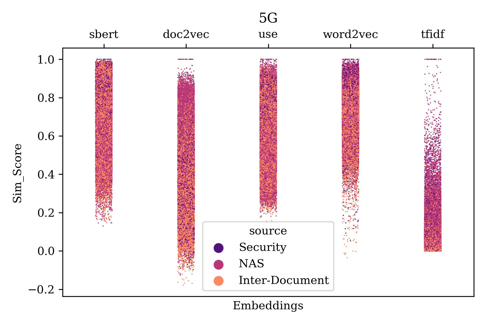
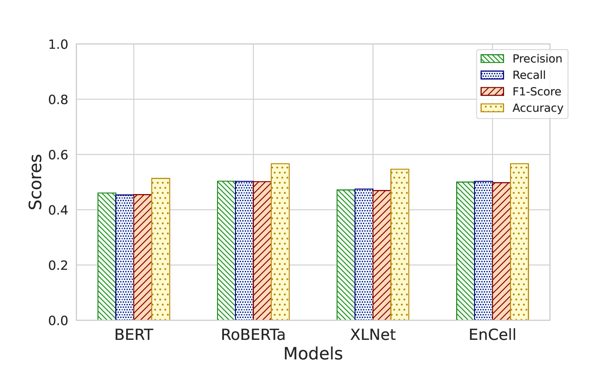
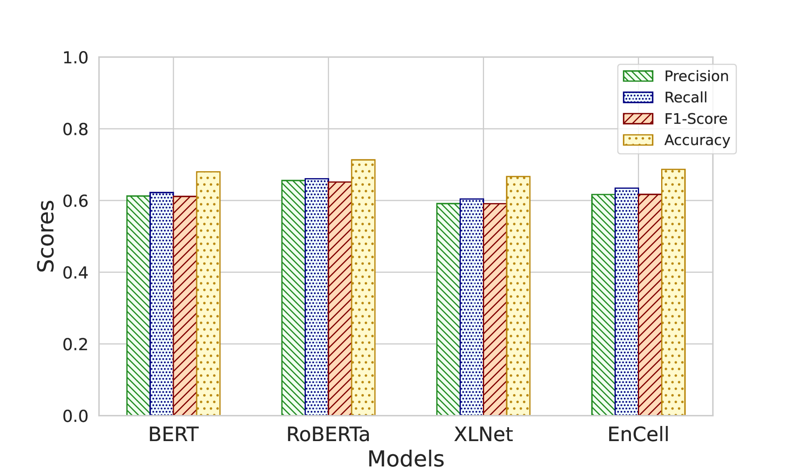
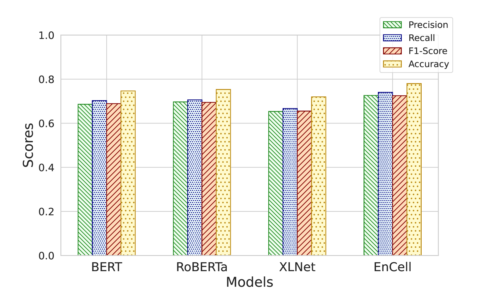
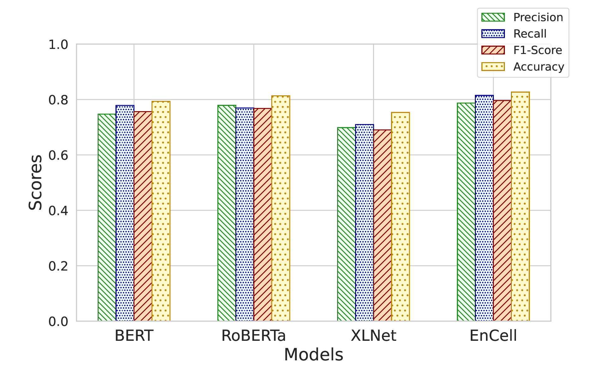
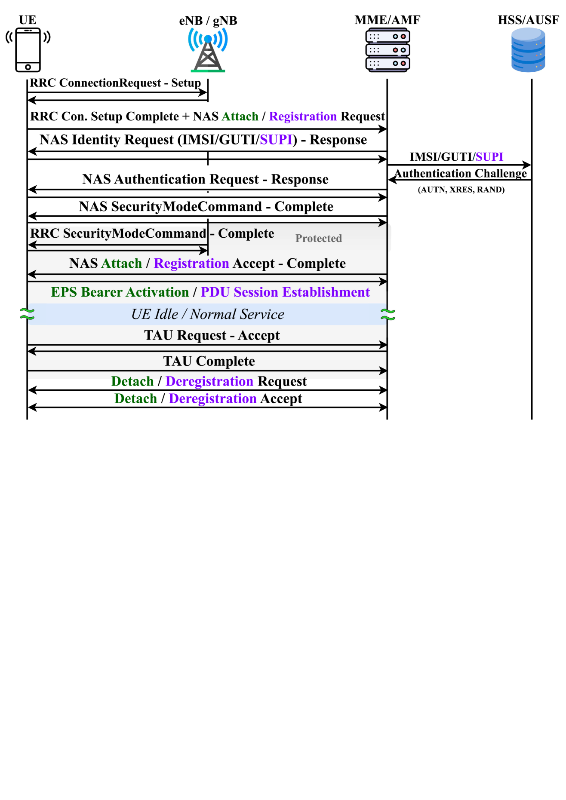

# CellularLint：系统性识别蜂窝网络规范不一致行为的工具

发布时间：2024年07月18日

`LLM应用` `移动通信` `网络安全`

> CellularLint: A Systematic Approach to Identify Inconsistent Behavior in Cellular Network Specifications

# 摘要

> 近年来，移动网络安全备受关注，常因底层协议设计缺陷而引发安全漏洞。这些详尽的协议文档可能存在诸多问题，如不准确、未充分指定等。为此，我们推出了CellularLint框架，利用自然语言处理技术，半自动检测4G和5G标准中的不一致性。该框架采用领域适应的大型语言模型，通过改进的少样本学习机制，在预训练的协议语料库上运行，能高效检测多层次的不一致性，极大提升了协议规范的自动化分析能力。我们针对4G和5G的NAS及安全规范进行了深入研究，成功发现157处不一致性，准确率达82.67%。经开源实现和商业设备验证，这些不一致性确实影响设计决策，可能引发隐私、完整性等安全问题。

> In recent years, there has been a growing focus on scrutinizing the security of cellular networks, often attributing security vulnerabilities to issues in the underlying protocol design descriptions. These protocol design specifications, typically extensive documents that are thousands of pages long, can harbor inaccuracies, underspecifications, implicit assumptions, and internal inconsistencies. In light of the evolving landscape, we introduce CellularLint--a semi-automatic framework for inconsistency detection within the standards of 4G and 5G, capitalizing on a suite of natural language processing techniques. Our proposed method uses a revamped few-shot learning mechanism on domain-adapted large language models. Pre-trained on a vast corpus of cellular network protocols, this method enables CellularLint to simultaneously detect inconsistencies at various levels of semantics and practical use cases. In doing so, CellularLint significantly advances the automated analysis of protocol specifications in a scalable fashion. In our investigation, we focused on the Non-Access Stratum (NAS) and the security specifications of 4G and 5G networks, ultimately uncovering 157 inconsistencies with 82.67% accuracy. After verification of these inconsistencies on open-source implementations and 17 commercial devices, we confirm that they indeed have a substantial impact on design decisions, potentially leading to concerns related to privacy, integrity, availability, and interoperability.

[Arxiv](https://arxiv.org/abs/2407.13742)