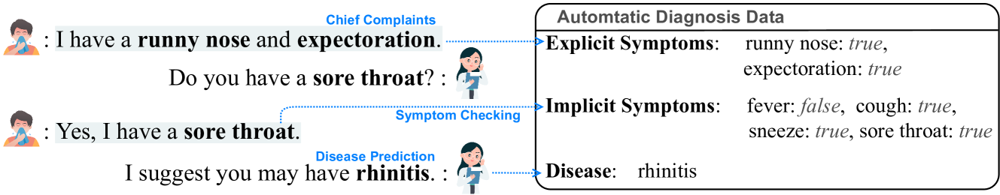
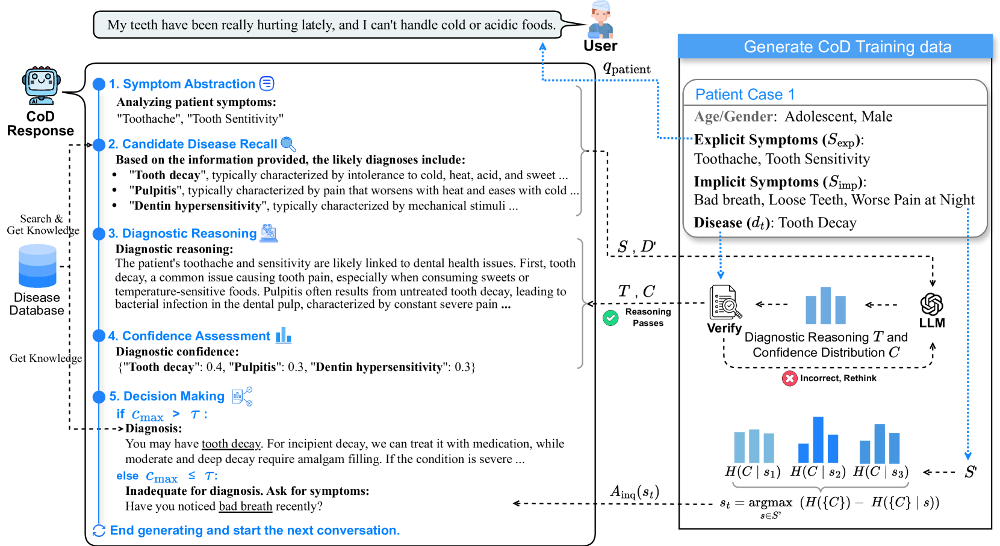
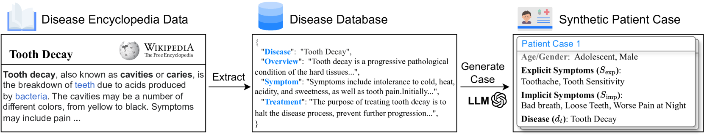
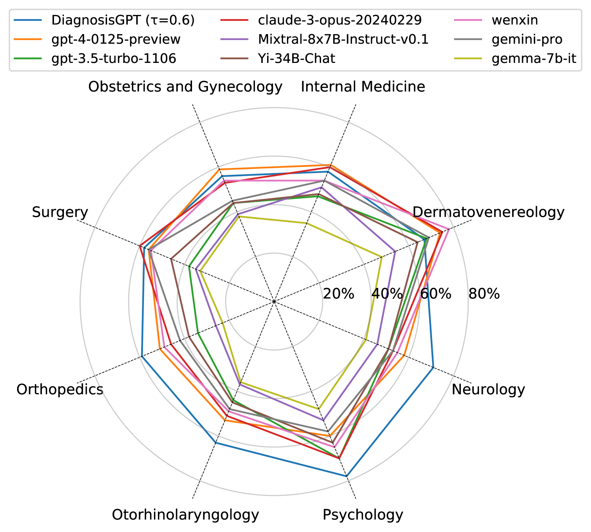
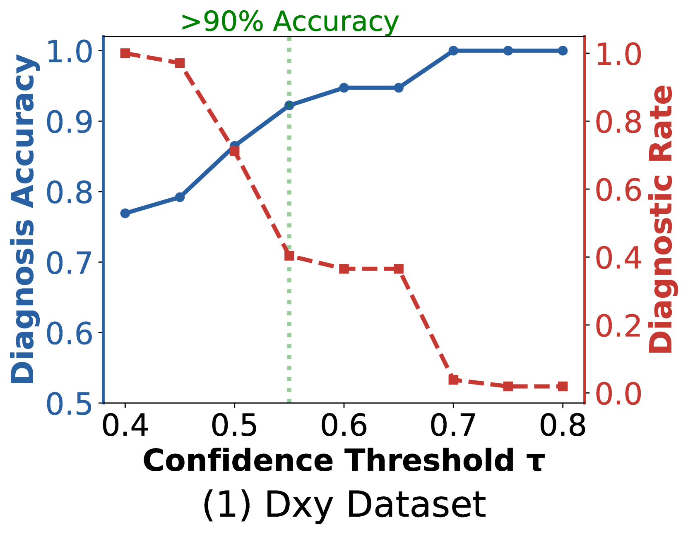
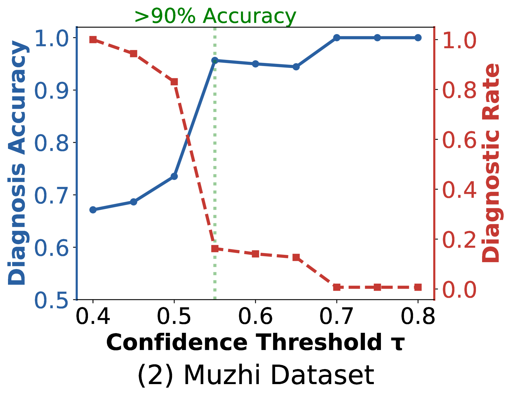
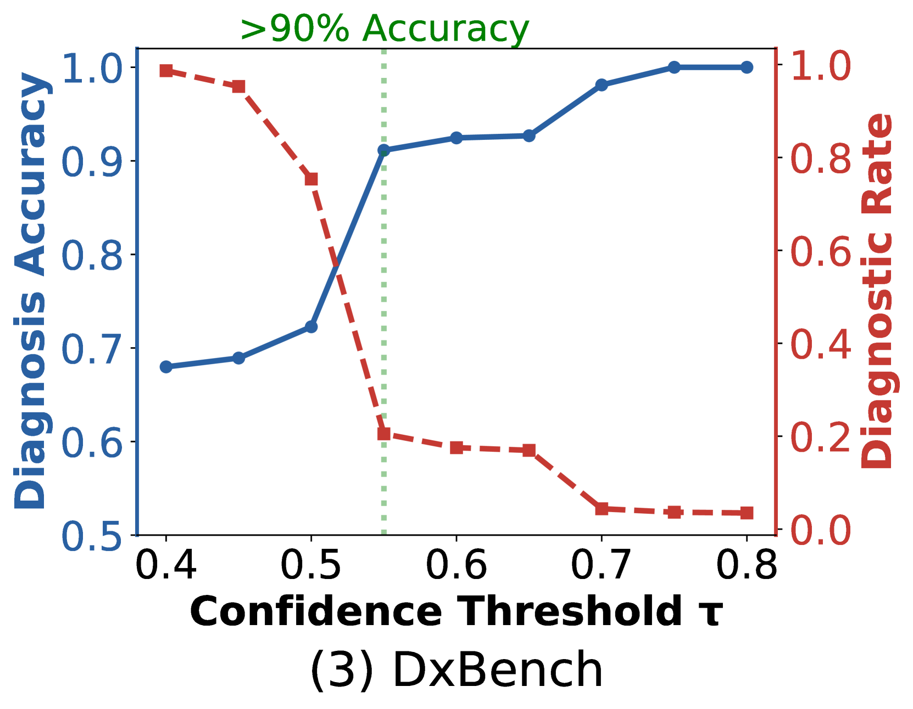
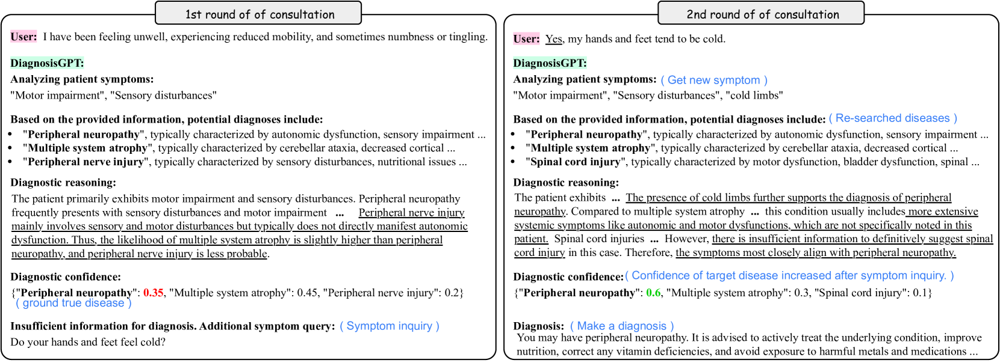
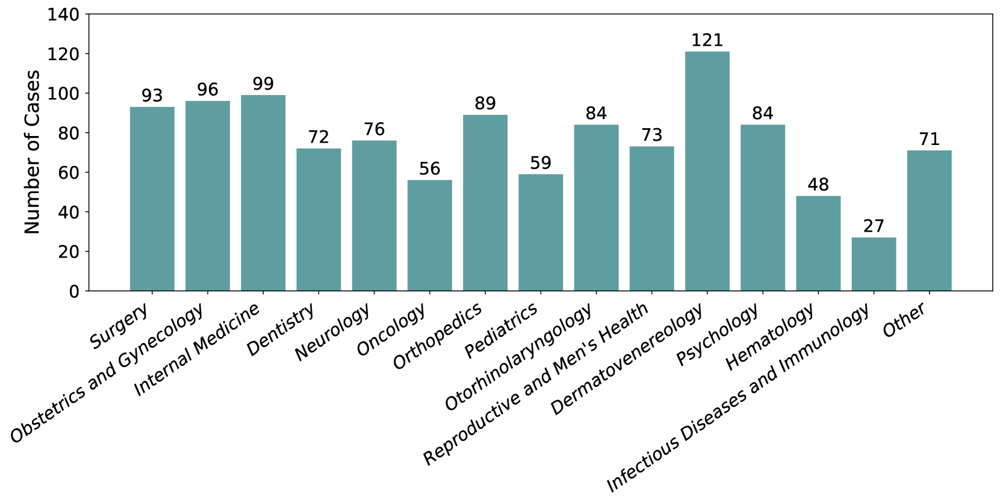

# CoD：通过诊断链构建可解释的医疗智能体

发布时间：2024年07月18日

`LLM应用` `人工智能`

> CoD, Towards an Interpretable Medical Agent using Chain of Diagnosis

# 摘要

> 随着大型语言模型的兴起，医学诊断领域迎来了革新，但模型的可解释性问题依旧悬而未决。本研究提出的诊断链（CoD）机制，模仿医生思维，将诊断过程透明化，并输出疾病置信度分布，增强了决策透明性。CoD不仅使诊断过程可控，还通过置信度熵的降低，助力识别关键症状。基于CoD，我们研发的DiagnosisGPT能诊断9604种疾病，实验表明其在诊断准确性上超越其他LLM，并确保了诊断过程的可解释性与严谨性。

> The field of medical diagnosis has undergone a significant transformation with the advent of large language models (LLMs), yet the challenges of interpretability within these models remain largely unaddressed. This study introduces Chain-of-Diagnosis (CoD) to enhance the interpretability of LLM-based medical diagnostics. CoD transforms the diagnostic process into a diagnostic chain that mirrors a physician's thought process, providing a transparent reasoning pathway. Additionally, CoD outputs the disease confidence distribution to ensure transparency in decision-making. This interpretability makes model diagnostics controllable and aids in identifying critical symptoms for inquiry through the entropy reduction of confidences. With CoD, we developed DiagnosisGPT, capable of diagnosing 9604 diseases. Experimental results demonstrate that DiagnosisGPT outperforms other LLMs on diagnostic benchmarks. Moreover, DiagnosisGPT provides interpretability while ensuring controllability in diagnostic rigor.

[Arxiv](https://arxiv.org/abs/2407.13301)