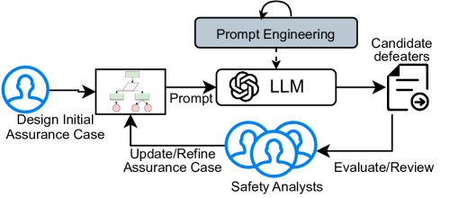
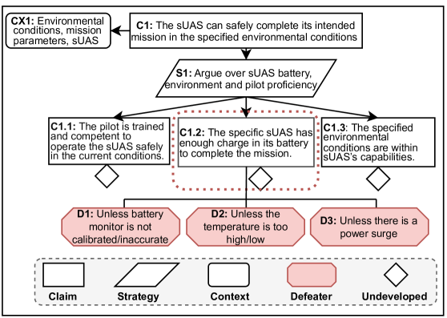
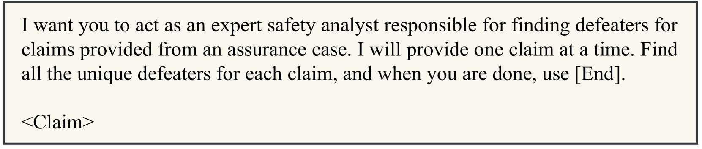
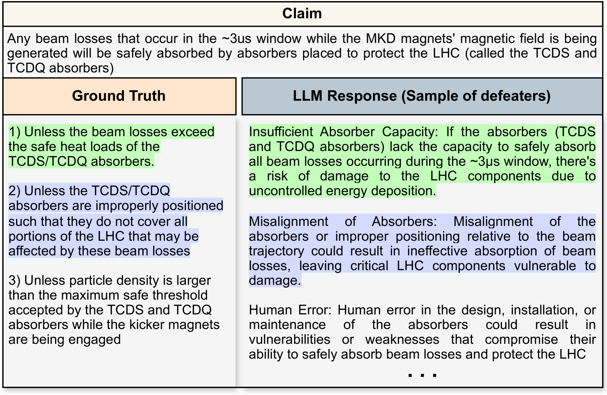
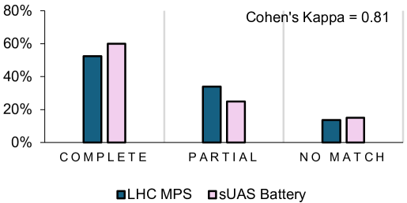

# CoDefeater：借助 LLMs 在保证案例中精准定位反驳证据

发布时间：2024年07月18日

`LLM应用` `安全关键系统` `人工智能`

> CoDefeater: Using LLMs To Find Defeaters in Assurance Cases

# 摘要

> 构建保证案例是确保安全关键系统在其设计环境中安全运行的关键步骤。为了应对潜在的错误和遗漏，我们引入了“失败者”概念，即挑战保证案例中声明的论据或证据。这些失败者能及时揭示论据弱点，推动深入调查和风险缓解。然而，识别失败者需依赖专家的判断和创造力，且需随需求和法规的变化而迭代更新。本文提出的CoDefeater系统，利用大型语言模型自动寻找这些失败者，初步结果表明，LLM能有效发现已知及未预见的失败者，助力安全分析师提升保证案例的完整性和可信度。

> Constructing assurance cases is a widely used, and sometimes required, process toward demonstrating that safety-critical systems will operate safely in their planned environment. To mitigate the risk of errors and missing edge cases, the concept of defeaters - arguments or evidence that challenge claims in an assurance case - has been introduced. Defeaters can provide timely detection of weaknesses in the arguments, prompting further investigation and timely mitigations. However, capturing defeaters relies on expert judgment, experience, and creativity and must be done iteratively due to evolving requirements and regulations. This paper proposes CoDefeater, an automated process to leverage large language models (LLMs) for finding defeaters. Initial results on two systems show that LLMs can efficiently find known and unforeseen feasible defeaters to support safety analysts in enhancing the completeness and confidence of assurance cases.

[Arxiv](https://arxiv.org/abs/2407.13717)