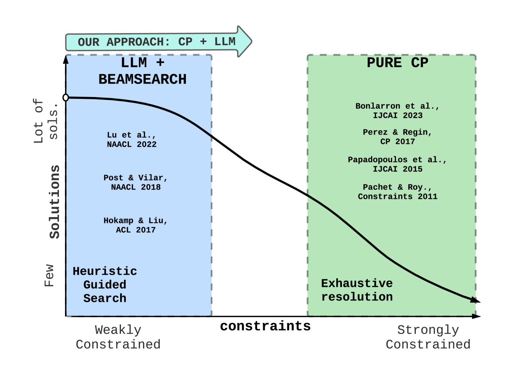
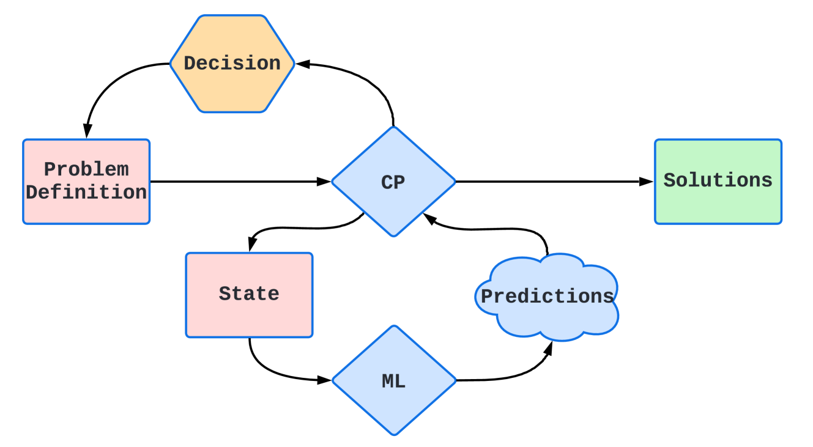
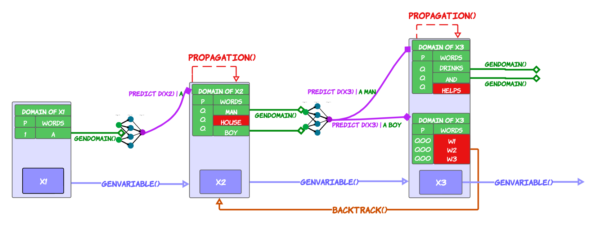

# 融合约束编程推理与大型语言模型预测

发布时间：2024年07月18日

`LLM应用` `文本生成` `人工智能`

> Combining Constraint Programming Reasoning with Large Language Model Predictions

# 摘要

> 约束编程 (CP) 和机器学习 (ML) 在文本生成领域各有所长，但也各有短板：CP 难以把握“意义”，ML 则难以应对结构约束。本文巧妙融合两者，将大型语言模型 (LLM) 嵌入 CP 框架中，由 LLM 负责词义生成，CP 则掌控结构约束。这一创新方法基于 GenCP，即利用 LLM 优化域的即时约束编程搜索 (OTFS) 的升级版。相较于传统的 Beam Search (BS)，这一融合策略不仅提速，更确保了约束的全方位满足，为约束条件下的文本生成开辟了新径。

> Constraint Programming (CP) and Machine Learning (ML) face challenges in text generation due to CP's struggle with implementing "meaning'' and ML's difficulty with structural constraints. This paper proposes a solution by combining both approaches and embedding a Large Language Model (LLM) in CP. The LLM handles word generation and meaning, while CP manages structural constraints. This approach builds on GenCP, an improved version of On-the-fly Constraint Programming Search (OTFS) using LLM-generated domains. Compared to Beam Search (BS), a standard NLP method, this combined approach (GenCP with LLM) is faster and produces better results, ensuring all constraints are satisfied. This fusion of CP and ML presents new possibilities for enhancing text generation under constraints.

[Arxiv](https://arxiv.org/abs/2407.13490)