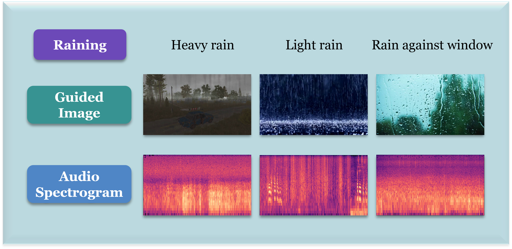
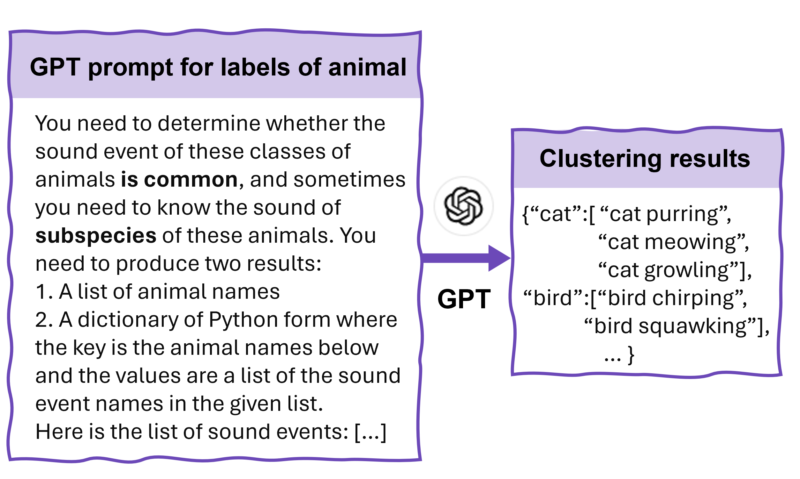
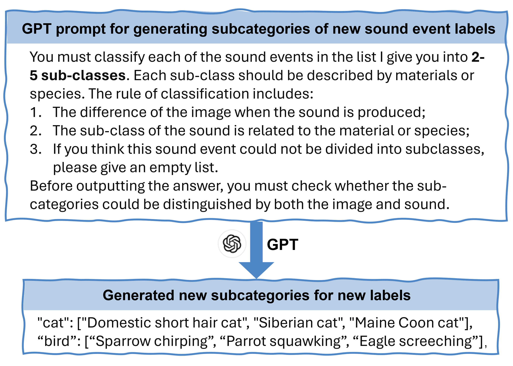
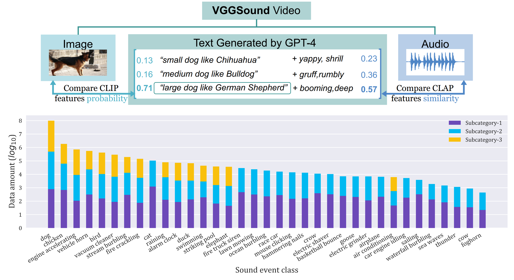

# DiveSound：借助 LLM 进行自动分类构建，助力多样化音频生成

发布时间：2024年07月18日

`LLM应用` `音频处理` `数据集构建`

> DiveSound: LLM-Assisted Automatic Taxonomy Construction for Diverse Audio Generation

# 摘要

> 音频生成领域备受瞩目，尽管质量大幅提升，多样性评估却被忽视。这主要源于缺乏系统的声音多样性框架和相应数据集。为此，我们创新提出DiveSound框架，利用大型语言模型构建类别内多样化的多模态数据集。该框架融合文本与视觉信息，通过多模态对比表示提升数据多样性。我们的框架自主性强，易于扩展，并提供了一个包含丰富子类别的文本-音频-图像对齐数据集。实验表明，视觉信息指导下的文本到音频生成，多样性显著增强。

> Audio generation has attracted significant attention. Despite remarkable enhancement in audio quality, existing models overlook diversity evaluation. This is partially due to the lack of a systematic sound class diversity framework and a matching dataset. To address these issues, we propose DiveSound, a novel framework for constructing multimodal datasets with in-class diversified taxonomy, assisted by large language models. As both textual and visual information can be utilized to guide diverse generation, DiveSound leverages multimodal contrastive representations in data construction. Our framework is highly autonomous and can be easily scaled up. We provide a textaudio-image aligned diversity dataset whose sound event class tags have an average of 2.42 subcategories. Text-to-audio experiments on the constructed dataset show a substantial increase of diversity with the help of the guidance of visual information.

[Arxiv](https://arxiv.org/abs/2407.13198)