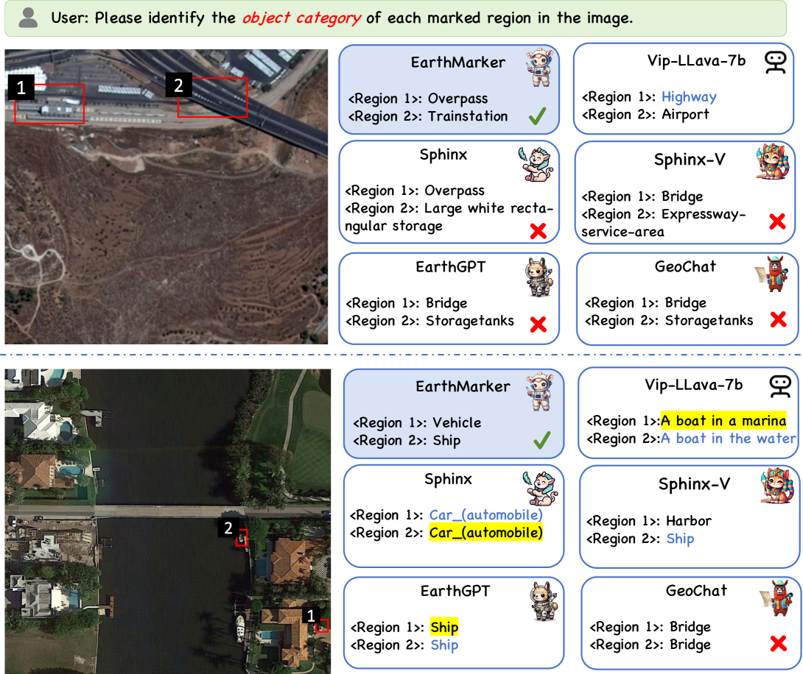
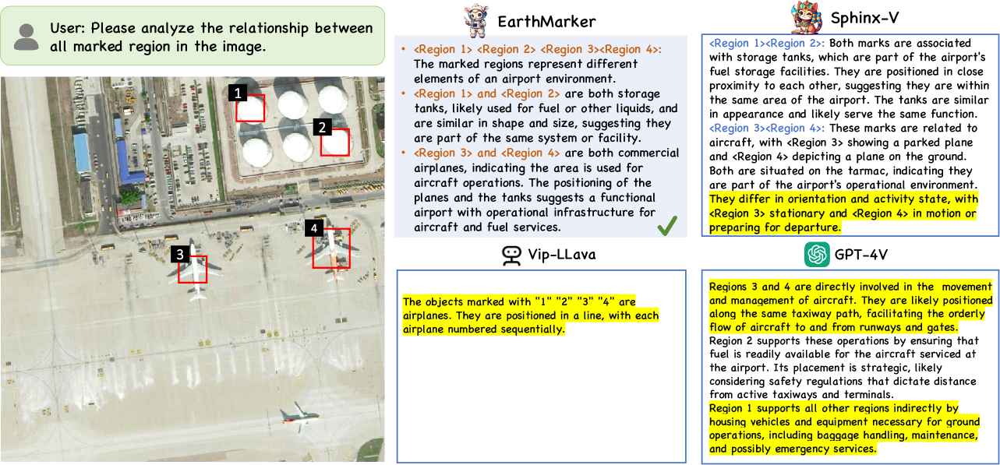

# EarthMarker：一款专为区域与点级遥感图像理解设计的视觉提示学习框架

发布时间：2024年07月18日

`LLM应用` `人工智能`

> EarthMarker: A Visual Prompt Learning Framework for Region-level and Point-level Remote Sensing Imagery Comprehension

# 摘要

> 近期，自然图像领域的视觉提示技术进步，让用户能通过框、点、自由形状等视觉标记与AI工具互动。但自然与遥感图像的显著差异，使现有视觉提示模型在遥感场景中遇阻。遥感MLLMs虽专注图像级数据解读，却仅能通过语言指令交互，限制了实际应用的灵活性。为此，我们推出了EarthMarker模型，专精于图像、区域、点级遥感图像解析。该模型将视觉提示与图像、文本指令一同输入LLM，精准适应特定任务。我们还创新了共享视觉编码法，统一优化多尺度图像与提示信息。为增强其多粒度视觉感知，我们设计了跨域分阶段学习策略，并轻量化优化参数，融合自然与遥感领域知识。同时，为弥补遥感视觉提示数据的不足，我们构建了RSVP数据集，内含多模态细粒度指令。大量实验显示，EarthMarker在视觉提示框架下，于多粒度遥感图像解析中表现卓越，标志着该领域的重大进步。

> Recent advances in visual prompting in the natural image area have allowed users to interact with artificial intelligence (AI) tools through various visual marks such as box, point, and free-form shapes. However, due to the significant difference between the natural and remote sensing (RS) images, existing visual prompting models face challenges in RS scenarios. Moreover, RS MLLMs mainly focus on interpreting image-level RS data and only support interaction with language instruction, restricting flexibility applications in the real world. To address those limitations, a novel visual prompting model named EarthMarker is proposed, which excels in image-level, region-level, and point-level RS imagery interpretation. Specifically, the visual prompts alongside images and text instruction input into the large language model (LLM), adapt models toward specific predictions and tasks. Subsequently, a sharing visual encoding method is introduced to refine multi-scale image features and visual prompt information uniformly. Furthermore, to endow the EarthMarker with versatile multi-granularity visual perception abilities, the cross-domain phased learning strategy is developed, and the disjoint parameters are optimized in a lightweight manner by leveraging both the natural and RS domain-specific knowledge. In addition, to tackle the lack of RS visual prompting data, a dataset named RSVP featuring multi-modal fine-grained visual prompting instruction is constructed. Extensive experiments are conducted to demonstrate the proposed EarthMarker's competitive performance, representing a significant advance in multi-granularity RS imagery interpretation under the visual prompting learning framework.

[Arxiv](https://arxiv.org/abs/2407.13596)