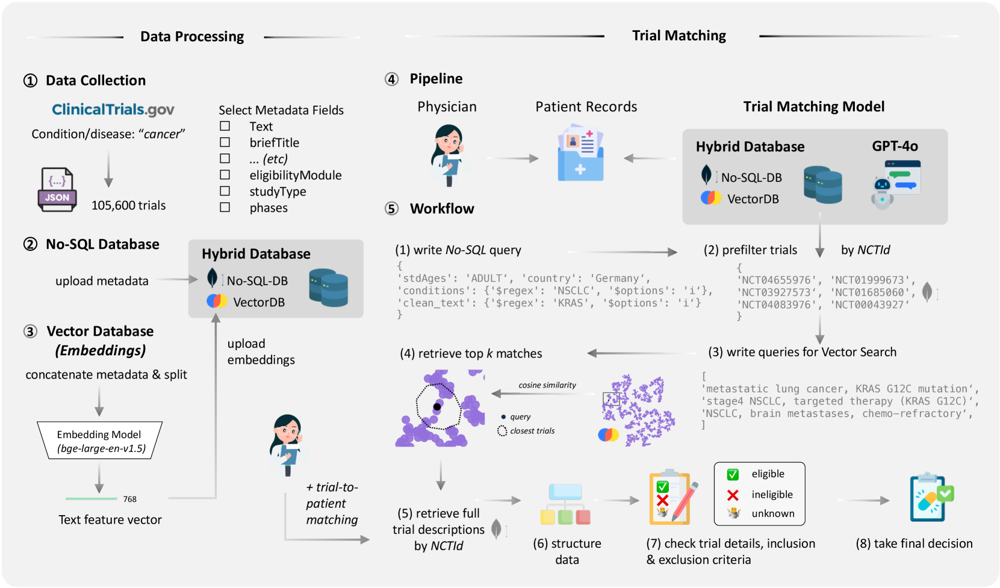
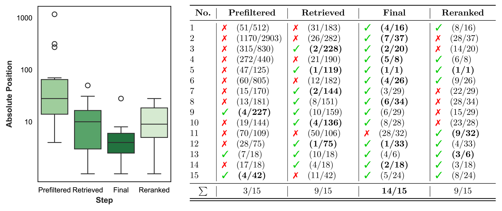
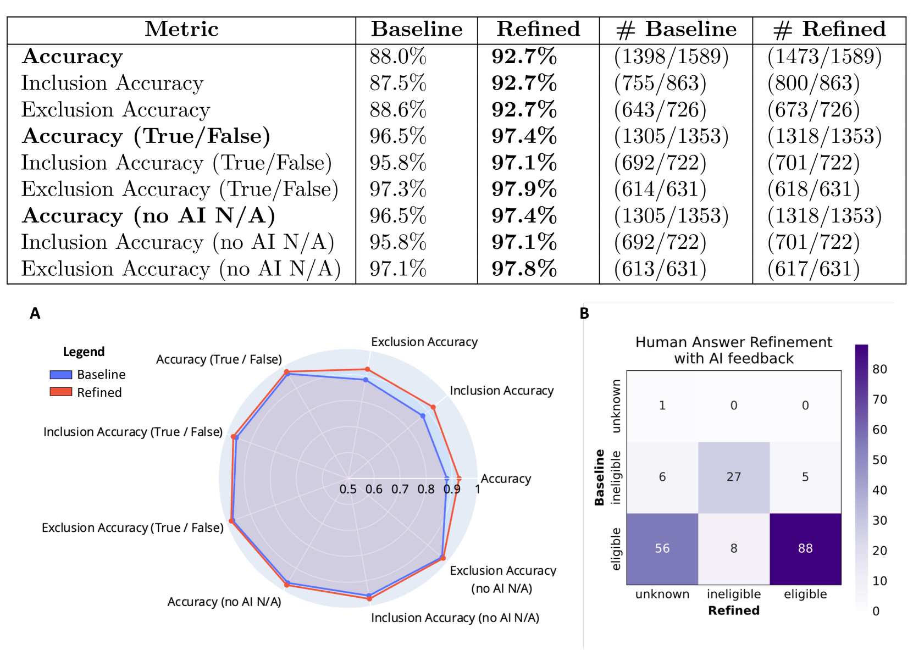
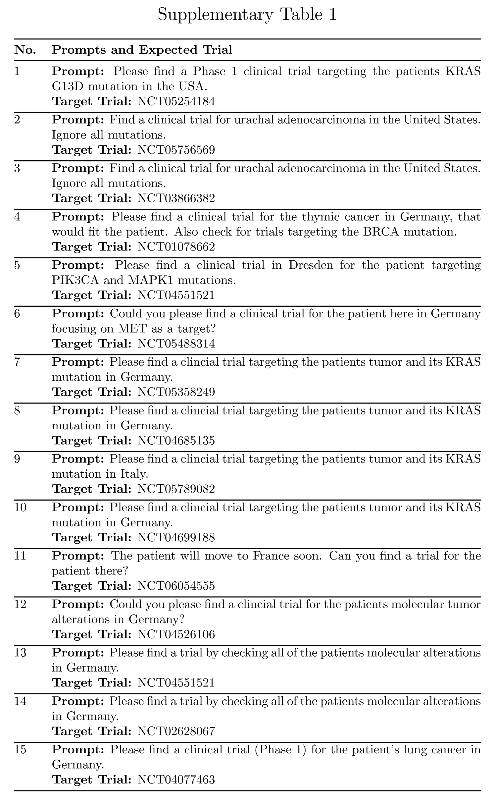
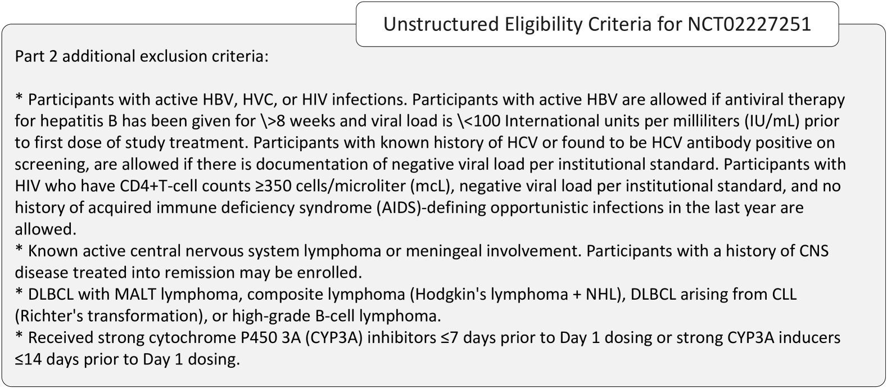
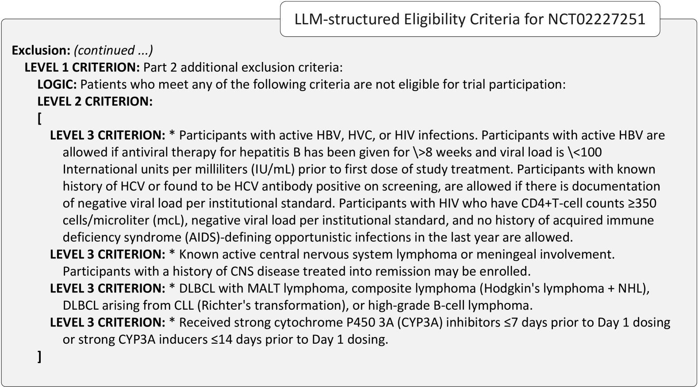
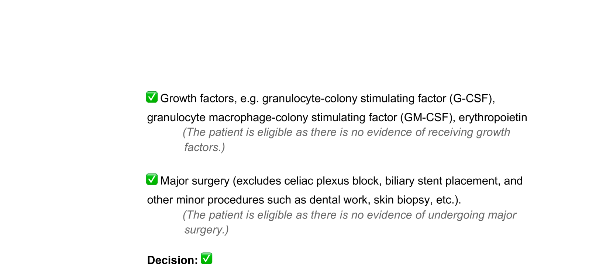
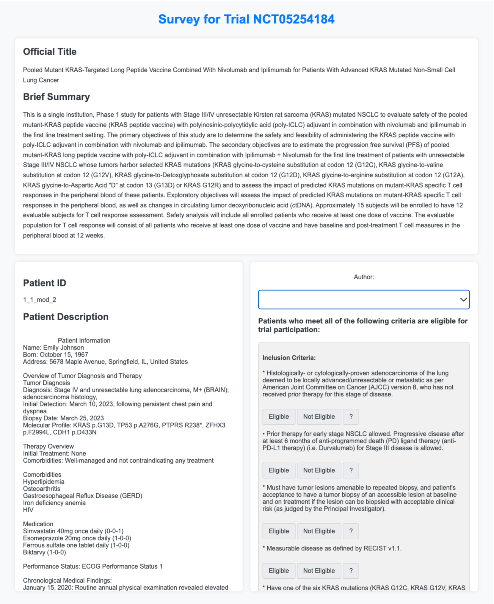

# 大型语言模型实现端到端临床试验匹配

发布时间：2024年07月18日

`LLM应用` `临床试验`

> End-To-End Clinical Trial Matching with Large Language Models

# 摘要

> 将癌症患者与临床试验精准匹配，是推动治疗进步和提升患者护理的关键。然而，医疗文档格式的不统一和试验资格标准的复杂性，使得这一过程对医生而言既棘手又耗时。我们探索了利用大型语言模型（LLMs）自动化这一全流程的可能性——从在clinicaltrials.gov的海量肿瘤学相关试验中筛选出相关试验，到实现标准级别的患者资格匹配。通过GPT-4o和合成电子健康记录（EHRs）的实验，我们方法在93.3%的情况下成功识别出候选试验，并在标准级别匹配中达到88.0%的初步准确率，与人类专家的基线相媲美。进一步分析LLM反馈发现，39.3%最初被判定为不正确的标准实则模糊或标注有误，经调整后，模型总准确率提升至92.7%。综上所述，我们构建了一个高精度的LLMs端到端临床试验匹配系统，不仅在筛选和匹配效率上超越了专业医生，而且该系统可自主运行或接受人工监督，适用范围广泛，为现实场景中的患者-试验匹配提供了可扩展的优化方案。

> Matching cancer patients to clinical trials is essential for advancing treatment and patient care. However, the inconsistent format of medical free text documents and complex trial eligibility criteria make this process extremely challenging and time-consuming for physicians. We investigated whether the entire trial matching process - from identifying relevant trials among 105,600 oncology-related clinical trials on clinicaltrials.gov to generating criterion-level eligibility matches - could be automated using Large Language Models (LLMs). Using GPT-4o and a set of 51 synthetic Electronic Health Records (EHRs), we demonstrate that our approach identifies relevant candidate trials in 93.3% of cases and achieves a preliminary accuracy of 88.0% when matching patient-level information at the criterion level against a baseline defined by human experts. Utilizing LLM feedback reveals that 39.3% criteria that were initially considered incorrect are either ambiguous or inaccurately annotated, leading to a total model accuracy of 92.7% after refining our human baseline. In summary, we present an end-to-end pipeline for clinical trial matching using LLMs, demonstrating high precision in screening and matching trials to individual patients, even outperforming the performance of qualified medical doctors. Our fully end-to-end pipeline can operate autonomously or with human supervision and is not restricted to oncology, offering a scalable solution for enhancing patient-trial matching in real-world settings.

[Arxiv](https://arxiv.org/abs/2407.13463)