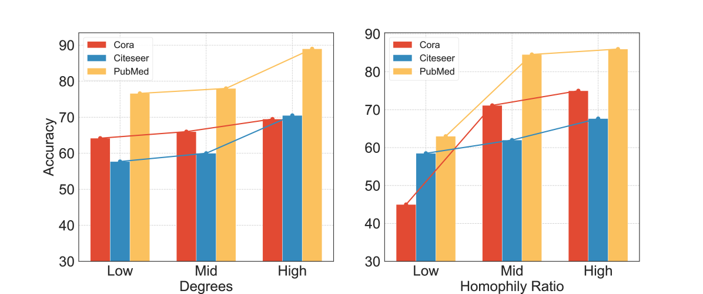
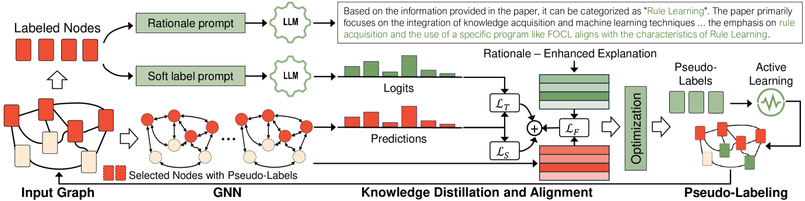
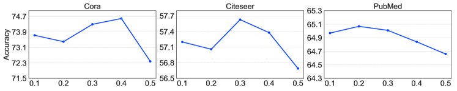
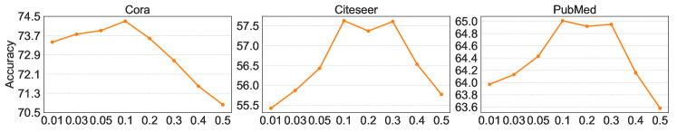
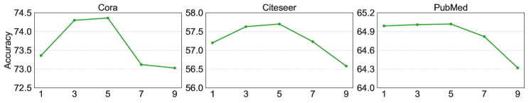
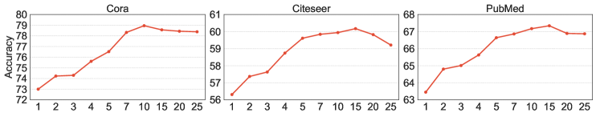

# 主动从大型语言模型中提炼知识，以提升数据有限的图神经网络性能。

发布时间：2024年07月18日

`LLM应用` `社交网络分析` `生物信息学`

> Enhancing Data-Limited Graph Neural Networks by Actively Distilling Knowledge from Large Language Models

# 摘要

> 图表在社交网络分析、生物信息学和推荐系统等多个领域的内容分析中扮演着关键角色。节点分类作为这一领域的基本任务，通常依赖于图神经网络 (GNN)。尽管现实中少样本节点分类任务普遍，但传统 GNN 在标记节点稀缺时仍显不足。为此，研究者们探索了图元学习、迁移学习及基于大型语言模型 (LLM) 的多种策略。然而，这些方法或需依赖基础类别的先验知识，或未能充分挖掘未标记节点的潜力，甚至可能忽视了 LLM 的零-shot 能力。本文中，我们创新地将 LLM 与 GNN 融合，不仅发挥 LLM 的零-shot 推理优势，更通过基于 Graph-LLM 的主动学习模式，显著提升了 GNN 的性能。实验结果显示，在标记数据极为有限的情况下，我们的模型在节点分类准确性上大幅领先现有技术。

> Graphs have emerged as critical data structures for content analysis in various domains, such as social network analysis, bioinformatics, and recommendation systems. Node classification, a fundamental task in this context, is typically tackled using graph neural networks (GNNs). Unfortunately, conventional GNNs still face challenges in scenarios with few labeled nodes, despite the prevalence of few-shot node classification tasks in real-world applications. To address this challenge, various approaches have been proposed, including graph meta-learning, transfer learning, and methods based on Large Language Models (LLMs). However, traditional meta-learning and transfer learning methods often require prior knowledge from base classes or fail to exploit the potential advantages of unlabeled nodes. Meanwhile, LLM-based methods may overlook the zero-shot capabilities of LLMs and rely heavily on the quality of generated contexts. In this paper, we propose a novel approach that integrates LLMs and GNNs, leveraging the zero-shot inference and reasoning capabilities of LLMs and employing a Graph-LLM-based active learning paradigm to enhance GNNs' performance. Extensive experiments demonstrate the effectiveness of our model in improving node classification accuracy with considerably limited labeled data, surpassing state-of-the-art baselines by significant margins.

[Arxiv](https://arxiv.org/abs/2407.13989)