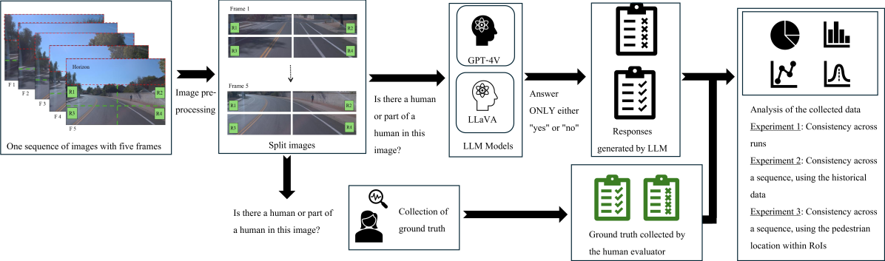
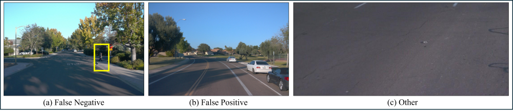
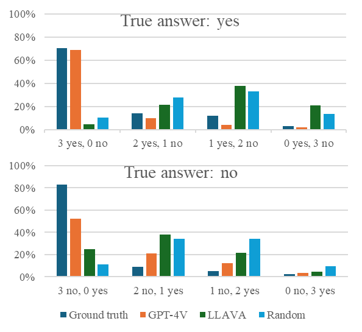
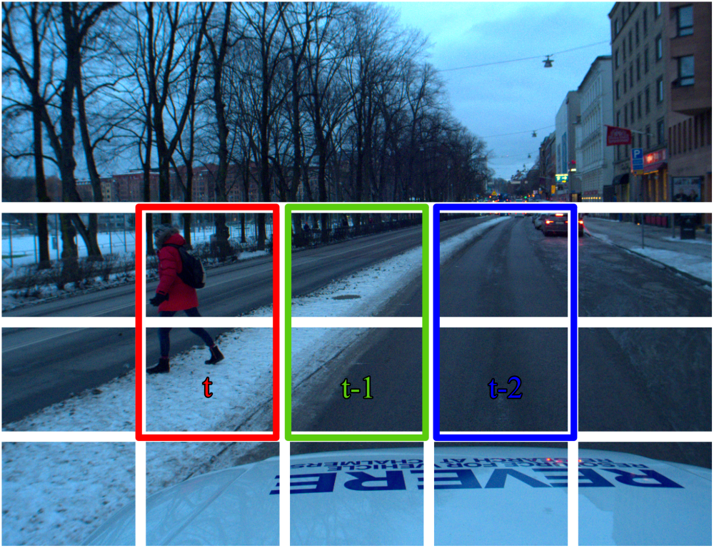

# 提升 LLM 在感知任务中的信任度评估与增强

发布时间：2024年07月18日

`LLM应用` `人工智能`

> Evaluating and Enhancing Trustworthiness of LLMs in Perception Tasks

# 摘要

> 现代的先进驾驶辅助系统（ADAS），如自适应巡航控制和后碰撞警告，正逐渐普及于各类车辆。在车辆上集成能够处理多种数据类型的多模态大型语言模型（LLM），有望大幅提升乘客体验。然而，LLM的幻觉问题仍待解决。本文针对基于视觉数据的行人检测与定位，系统评估了三种幻觉检测策略，并应用于两个顶尖LLM（GPT-4V和LLaVA）及两个数据集（Waymo/美国和PREPER CITY/瑞典）。结果表明，尽管LLM能详尽描述交通场景，但在对象定位等深入分析中仍显不足。进一步实验显示，当前专有LLM的性能远超开放LLM，而基于投票的一致性增强技术（如BO3方法）对减少幻觉效果有限。通过结合历史信息扩展幻觉检测，则能有效提升检测准确性。

> Today's advanced driver assistance systems (ADAS), like adaptive cruise control or rear collision warning, are finding broader adoption across vehicle classes. Integrating such advanced, multimodal Large Language Models (LLMs) on board a vehicle, which are capable of processing text, images, audio, and other data types, may have the potential to greatly enhance passenger comfort. Yet, an LLM's hallucinations are still a major challenge to be addressed. In this paper, we systematically assessed potential hallucination detection strategies for such LLMs in the context of object detection in vision-based data on the example of pedestrian detection and localization. We evaluate three hallucination detection strategies applied to two state-of-the-art LLMs, the proprietary GPT-4V and the open LLaVA, on two datasets (Waymo/US and PREPER CITY/Sweden). Our results show that these LLMs can describe a traffic situation to an impressive level of detail but are still challenged for further analysis activities such as object localization. We evaluate and extend hallucination detection approaches when applying these LLMs to video sequences in the example of pedestrian detection. Our experiments show that, at the moment, the state-of-the-art proprietary LLM performs much better than the open LLM. Furthermore, consistency enhancement techniques based on voting, such as the Best-of-Three (BO3) method, do not effectively reduce hallucinations in LLMs that tend to exhibit high false negatives in detecting pedestrians. However, extending the hallucination detection by including information from the past helps to improve results.

[Arxiv](https://arxiv.org/abs/2408.01433)