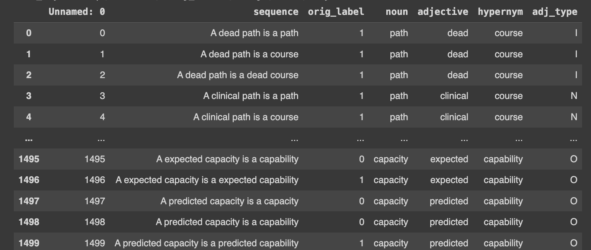

# 构建思维之桥：探索认知架构的组合性

发布时间：2024年07月18日

`LLM理论` `人工智能` `语言模型`

> From Words to Worlds: Compositionality for Cognitive Architectures

# 摘要

> 大型语言模型（LLM）虽为高效连接系统，但其组合性是否更胜一筹？这或许正是其卓越表现的秘密之一。我们深入分析了四个LLM家族（涵盖12个模型）及三大任务类别，甚至引入了一项新任务。研究发现，LLM在组合策略学习上呈现出微妙关系：规模扩张虽能提升组合能力，指令调优却常适得其反。这种矛盾现象，为我们如何更好地开发与人类认知相契合的LLM提出了新的思考。

> Large language models (LLMs) are very performant connectionist systems, but do they exhibit more compositionality? More importantly, is that part of why they perform so well? We present empirical analyses across four LLM families (12 models) and three task categories, including a novel task introduced below. Our findings reveal a nuanced relationship in learning of compositional strategies by LLMs -- while scaling enhances compositional abilities, instruction tuning often has a reverse effect. Such disparity brings forth some open issues regarding the development and improvement of large language models in alignment with human cognitive capacities.

[Arxiv](https://arxiv.org/abs/2407.13419)